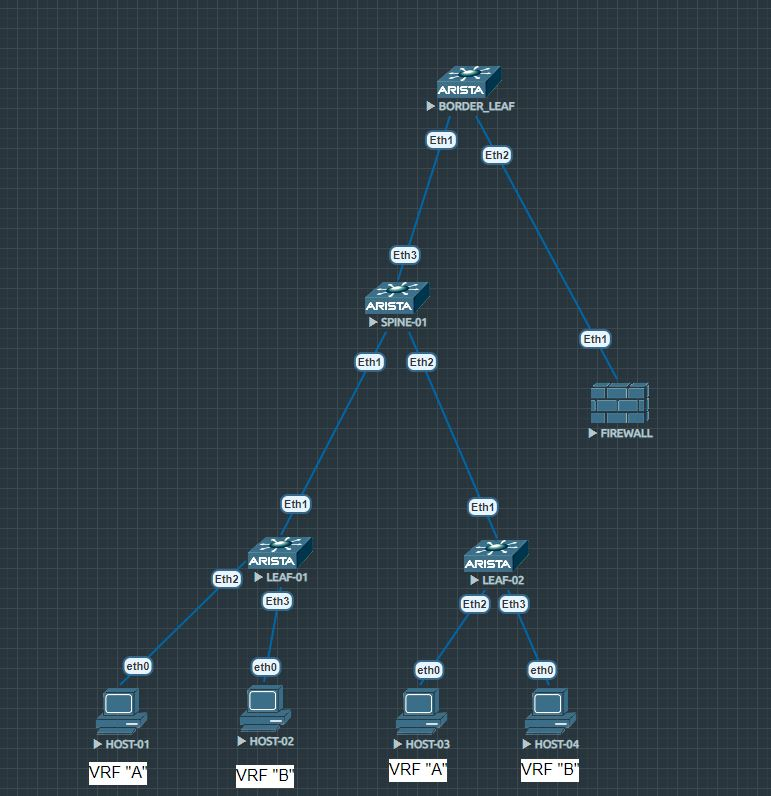

# VxLAN 4. Route-type 5

## Цель:

* Реализовать передачу суммарных префиксов через EVPN route-type 5

_В этой самостоятельной работе мы ожидаем, что вы самостоятельно:_

* Анонсируете суммарные префиксы клиентов в Overlay сеть
* Настроите маршрутизацию между клиентами через суммарный префикс
* План работы, адресное пространство, схема сети, настройки - зафиксируете в документации

## План работы:

_Схема сети будет выглядеть так:_



_В этой схеме у нас по легенде будет два VRF, хосты в которых будут общаться между собой через Firewall (тоже arista vEOS). Host-01 и host-03 находятся в одном VRF, в одном vlan и, следовательно, будут доступны друг другу через L2VNI. Host-02 и host-04 находятся в одном VRF, но в разных широковещательных доменах, их мы соберем через L3VNI. Ну и наконец VRF'ы "A" и "B" будут видеть друг друга через Firewall. Чуть ниже станет понятнее, как это организовать_

## Базовые настройки

<br/>

* Spine-01

```
interface Ethernet1
   description leaf-01
   no switchport
   ip address 169.254.0.0/31
   ip ospf area 0.0.0.0

interface Ethernet2
   description leaf-02
   no switchport
   ip address 169.254.0.2/31
   ip ospf area 0.0.0.0

interface Ethernet3
   description border_leaf-01
   no switchport
   ip address 169.254.0.4/31
   ip ospf area 0.0.0.0

interface Loopback0
   description router-id
   ip address 10.0.2.1/32
   ip ospf area 0.0.0.0

ip routing

mpls ip

peer-filter LEAF_AS_RANGE
   10 match as-range 65000-65010 result accept

router bgp 65000
   router-id 10.0.2.1
   bgp listen range 10.0.0.0/16 peer-group OVERLAY peer-filter LEAF_AS_RANGE
   neighbor OVERLAY peer group
   neighbor OVERLAY update-source Loopback0
   neighbor OVERLAY route-reflector-client
   neighbor OVERLAY send-community
   
   address-family evpn
      neighbor OVERLAY activate
   
   address-family ipv4
      no neighbor OVERLAY activate

router ospf 1
   router-id 10.0.2.1
```

_В этот раз я использую OSPF (все в backbone area) для Underlay и IBGP для Overlay. Как видно из конфига выше - Spine-01 является Route Reflector'ом в этой топологии. Лупбеки разлетаются по фабрике благодаря OSPF, а VTEP'ы обмениваются NLRI по MPBGP EVPN. На спайне нет других настроек, кроме приведенных выше_

* Leaf-01

```
vlan 10
   name PROD

vlan 20
   name DEV

vrf instance A

vrf instance B

interface Ethernet1
   description spine-01
   no switchport
   ip address 169.254.0.1/31
   ip ospf area 0.0.0.0

interface Ethernet2
   switchport access vlan 10

interface Ethernet3
   switchport access vlan 20

interface Loopback0
   description router-id
   ip address 10.0.1.1/32
   ip ospf area 0.0.0.0

interface Loopback1
   description vtep
   ip address 10.0.1.10/32
   ip ospf area 0.0.0.0

interface Vlan10
   vrf A
   ip address virtual 192.168.0.1/24

interface Vlan20
   vrf B
   ip address virtual 192.168.1.1/24

interface Vxlan1
   vxlan source-interface Loopback1
   vxlan vlan 10 vni 100
   vxlan vlan 20 vni 200
   vxlan vrf A vni 5000
   vxlan vrf B vni 7500

ip virtual-router mac-address 00:00:11:11:22:22

ip routing
ip routing vrf A
ip routing vrf B

mpls ip

router bgp 65000
   router-id 10.0.1.1
   neighbor OVERLAY peer group
   neighbor OVERLAY remote-as 65000
   neighbor OVERLAY update-source Loopback0
   neighbor OVERLAY send-community
   neighbor 10.0.2.1 peer group OVERLAY
   
   vlan 10
      rd 10.0.1.10:100
      route-target both 100:10
      redistribute learned
   
   vlan 20
      rd 10.0.1.10:200
      route-target both 200:20
      redistribute learned
   
   address-family evpn
      neighbor OVERLAY activate
   
   address-family ipv4
      no neighbor OVERLAY activate
   
   vrf A
      rd 10.0.1.1:5000
      route-target import evpn 5000:500
      route-target export evpn 5000:500
   
   vrf B
      rd 10.0.1.1:7500
      route-target import evpn 7500:750
      route-target export evpn 7500:750

router ospf 1
   router-id 10.0.1.1
   passive-interface Ethernet2
   passive-interface Ethernet3
```

* Leaf-02

```
vlan 10
   name PROD

vlan 30
   name STAGE

vrf instance A

vrf instance B

interface Ethernet1
   description spine-01
   no switchport
   ip address 169.254.0.3/31
   ip ospf area 0.0.0.0

interface Ethernet2
   switchport access vlan 10

interface Ethernet3
   switchport access vlan 30

interface Loopback0
   description router-id
   ip address 10.0.1.2/32
   ip ospf area 0.0.0.0

interface Loopback1
   description vtep
   ip address 10.0.1.20/32
   ip ospf area 0.0.0.0

interface Vlan10
   vrf A
   ip address virtual 192.168.0.1/24

interface Vlan30
   vrf B
   ip address virtual 192.168.2.1/24

interface Vxlan1
   vxlan source-interface Loopback1
   vxlan vlan 10 vni 100
   vxlan vlan 30 vni 300
   vxlan vrf A vni 5000
   vxlan vrf B vni 7500

ip virtual-router mac-address 00:00:11:11:22:22

ip routing
ip routing vrf A
ip routing vrf B

mpls ip

router bgp 65000
   router-id 10.0.1.2
   neighbor OVERLAY peer group
   neighbor OVERLAY remote-as 65000
   neighbor OVERLAY update-source Loopback0
   neighbor OVERLAY send-community
   neighbor 10.0.2.1 peer group OVERLAY
   
   vlan 10
      rd 10.0.1.20:100
      route-target both 100:10
      redistribute learned
   
   vlan 30
      rd 10.0.1.20:300
      route-target both 300:30
      redistribute learned
   
   address-family evpn
      neighbor OVERLAY activate
   
   address-family ipv4
      no neighbor OVERLAY activate
   
   vrf A
      rd 10.0.1.2:5000
      route-target import evpn 5000:500
      route-target export evpn 5000:500
   
   vrf B
      rd 10.0.1.2:7500
      route-target import evpn 7500:750
      route-target export evpn 7500:750

router ospf 1
   router-id 10.0.1.2
   passive-interface Ethernet2
   passive-interface Ethernet3
```

_В приведенных выше конфигах нет ничего из того, что я делал в лабе "Vxlan L3VNI". Тут есть необходимые настройки для обмена трафиком между host-01 и host-03, а также между host-02 и host-04. Проверим связность_

* с host-01 пингуем host-03

```
VPCS> show ip

NAME        : VPCS[1]
IP/MASK     : 192.168.0.2/24
GATEWAY     : 192.168.0.1
DNS         :
MAC         : 00:50:79:66:68:07
LPORT       : 20000
RHOST:PORT  : 127.0.0.1:30000
MTU         : 1500

VPCS> ping 192.168.0.3

84 bytes from 192.168.0.3 icmp_seq=1 ttl=64 time=18.318 ms
84 bytes from 192.168.0.3 icmp_seq=2 ttl=64 time=15.351 ms
84 bytes from 192.168.0.3 icmp_seq=3 ttl=64 time=11.949 ms
84 bytes from 192.168.0.3 icmp_seq=4 ttl=64 time=12.816 ms
84 bytes from 192.168.0.3 icmp_seq=5 ttl=64 time=10.646 ms
```

* с host-02 пингуем host-04

```
VPCS> show ip

NAME        : VPCS[1]
IP/MASK     : 192.168.1.2/24
GATEWAY     : 192.168.1.1
DNS         :
MAC         : 00:50:79:66:68:08
LPORT       : 20000
RHOST:PORT  : 127.0.0.1:30000
MTU         : 1500

VPCS> ping 192.168.2.2

84 bytes from 192.168.2.2 icmp_seq=1 ttl=62 time=13.945 ms
84 bytes from 192.168.2.2 icmp_seq=2 ttl=62 time=16.739 ms
84 bytes from 192.168.2.2 icmp_seq=3 ttl=62 time=12.348 ms
84 bytes from 192.168.2.2 icmp_seq=4 ttl=62 time=14.742 ms
84 bytes from 192.168.2.2 icmp_seq=5 ttl=62 time=12.514 ms
```

## Настройки для route-type 5 (IP-prefix)

_Здесь у нас появляется Borderleaf и Firewall. Задумка следующая: так как это два разных VRF'а, нужно иметь возможность контроллировать хождение трафика между ними. В такой топологии привычнее представить, что каждый VRF это отдельный клиент, но так как конкретно в этой лабе у нас нет возможности сделать Firewall в "зоне клиента", то применим отдельный "железный" Firewall. В рамках лабораторной работы фильтровать трафик я не буду, но такая возможность есть_

_Borderleaf устанавливает соседство по Overlay и благодаря настроенному L3VNI с route-target import/export политикой получает arp записи от leaf-01/02, а дальше уже транслирует их на Firewall, НО уже в агегированном до /24 виде. В качестве альтернативы команде "allowas-in" я использую локальную подмену AS при пиринге с Firewall'ом, это позволит "разворачивать" маршруты обратно в фабрику. В результате до leaf-01/02 приходят уже анонсы с /24 маской, что позволит хостам из разных VRF обмениваться трафиком_

## ___Зачем это все нужно?___

_Вообще, все будет работать и без агрегации префиксов и использования route-type 5, так как Borderleaf все равно будет отправлять на Firewall route-type 2 (ip-mac), а тот благополучно поделится ими через второй Dot1q интерфейс. Но если представить реальную ситуацию, при которой в одном vlan вполне может быть тысяча и больше хостов, это может сулить проблемы, так как эти arp записи также занимают место в TCAM памяти, да и выглядит это не совсем удобно. И решая эту проблему в рамках лабораторной работы я буду применять агрегацию префиксов и передачу их в виде route-type 5 маршрутов_

* Borderleaf

```
vrf instance A

vrf instance B

interface Ethernet1
   description spine-01
   no switchport
   ip address 169.254.0.5/31
   ip ospf area 0.0.0.0

interface Ethernet2
   description firewall-01
   no switchport

interface Ethernet2.100
   encapsulation dot1q vlan 100
   vrf A
   ip address 169.254.0.7/31

interface Ethernet2.200
   encapsulation dot1q vlan 200
   vrf B
   ip address 169.254.0.9/31

interface Loopback0
   description router-id
   ip address 10.0.3.1/32
   ip ospf area 0.0.0.0

interface Loopback1
   description vtep
   ip address 10.0.3.10/32
   ip ospf area 0.0.0.0

interface Vxlan1
   vxlan source-interface Loopback1
   vxlan vrf A vni 5000
   vxlan vrf B vni 7500

ip virtual-router mac-address 00:00:11:11:22:22

ip routing
ip routing vrf A
ip routing vrf B

mpls ip

router bgp 65000
   router-id 10.0.3.1
   neighbor OVERLAY peer group
   neighbor OVERLAY remote-as 65000
   neighbor OVERLAY update-source Loopback0
   neighbor OVERLAY send-community
   neighbor 10.0.2.1 peer group OVERLAY
   
   address-family evpn
      neighbor OVERLAY activate
   
   address-family ipv4
      no neighbor OVERLAY activate
   
   vrf A
      rd 10.0.3.10:5000
      route-target import evpn 5000:500
      route-target export evpn 5000:500
      neighbor 169.254.0.6 remote-as 4259905000
      neighbor 169.254.0.6 local-as 4259840100 no-prepend replace-as
      aggregate-address 192.168.0.0/24 summary-only
   
   vrf B
      rd 10.0.3.10:7500
      route-target import evpn 7500:750
      route-target export evpn 7500:750
      neighbor 169.254.0.8 remote-as 4259905000
      neighbor 169.254.0.8 local-as 4259840200 no-prepend replace-as
      aggregate-address 192.168.1.0/24 summary-only
      aggregate-address 192.168.2.0/24 summary-only

router ospf 1
   router-id 1.0.3.1
   passive-interface Ethernet2
   passive-interface Ethernet3
```

* Firewall

```
interface Ethernet1
   no switchport
!
interface Ethernet1.100
   encapsulation dot1q vlan 100
   ip address 169.254.0.6/31
!
interface Ethernet1.200
   encapsulation dot1q vlan 200
   ip address 169.254.0.8/31

interface Loopback0
   description router-id
   ip address 10.0.4.1/32

ip routing

mpls ip

router bgp 4259905000
   router-id 10.0.4.1
   neighbor 169.254.0.7 remote-as 4259840100
   neighbor 169.254.0.9 remote-as 4259840200
```

_Получается, что получив анонс от соседа, Firewall отправляет этот анонс другому (по его мнению) соседу. Ведь для него это EBGP с двумя разными AS. А Borderleaf, получив такой маршрут от соседа, по политике route-target export evpn уже отправляет апдейт лифам через спайн_

_Если сейчас посмотреть на вывод команды show ip bgp summary на Firewall, то он окажется пустым, ведь Borderleaf при "молчании" хостов может изучить только imet (route-type 3), иными словами подписку на BUM трафик в определенных VNI. А такие машруты он не отправляет в сторону Firewall, так как они пирятся в address-family ipv4, а для такого типа маршрутов нужно EVPN_

```
firewall-01#sh ip bgp summary
BGP summary information for VRF default
Router identifier 10.0.4.1, local AS number 4259905000
Neighbor Status Codes: m - Under maintenance
  Neighbor    V AS           MsgRcvd   MsgSent  InQ OutQ  Up/Down State   PfxRcd PfxAcc
  169.254.0.7 4 4259840100       236       247    0    0 01:16:31 Estab   0      0
  169.254.0.9 4 4259840200       246       241    0    0 01:16:25 Estab   0      0
```

_Однако, после обмена трафиком между хостами с разных VRF здесь должны появиться /24 префиксы, проверим_

* с host-01 пингуем host-02 и host-04

```
VPCS> show ip

NAME        : VPCS[1]
IP/MASK     : 192.168.0.2/24
GATEWAY     : 192.168.0.1
DNS         :
MAC         : 00:50:79:66:68:07
LPORT       : 20000
RHOST:PORT  : 127.0.0.1:30000
MTU         : 1500

VPCS> ping 192.168.1.2

84 bytes from 192.168.1.2 icmp_seq=1 ttl=59 time=32.932 ms
84 bytes from 192.168.1.2 icmp_seq=2 ttl=59 time=25.375 ms
84 bytes from 192.168.1.2 icmp_seq=3 ttl=59 time=29.875 ms
84 bytes from 192.168.1.2 icmp_seq=4 ttl=59 time=28.580 ms
84 bytes from 192.168.1.2 icmp_seq=5 ttl=59 time=30.418 ms

VPCS> ping 192.168.2.2

84 bytes from 192.168.2.2 icmp_seq=1 ttl=59 time=29.331 ms
84 bytes from 192.168.2.2 icmp_seq=2 ttl=59 time=26.177 ms
84 bytes from 192.168.2.2 icmp_seq=3 ttl=59 time=26.627 ms
84 bytes from 192.168.2.2 icmp_seq=4 ttl=59 time=28.398 ms
84 bytes from 192.168.2.2 icmp_seq=5 ttl=59 time=28.717 ms
```

_Как видим, связность между хостами из разных VRF появилась, что и являлось целью лабораторной. Проверим теперь выводы команд_

* На Borderleaf

```
borderleaf-01#sh bgp evpn
BGP routing table information for VRF default
Router identifier 10.0.3.1, local AS number 65000
Route status codes: s - suppressed, * - valid, > - active, E - ECMP head, e - ECMP
                    S - Stale, c - Contributing to ECMP, b - backup
                    % - Pending BGP convergence
Origin codes: i - IGP, e - EGP, ? - incomplete
AS Path Attributes: Or-ID - Originator ID, C-LST - Cluster List, LL Nexthop - Link Local Nexthop

          Network                Next Hop              Metric  LocPref Weight  Path
 * >     RD: 10.0.1.10:100 mac-ip 0050.7966.6807
                                 10.0.1.10             -       100     0       i Or-ID: 10.0.1.1 C-LST: 10.0.2.1
 * >     RD: 10.0.1.10:100 mac-ip 0050.7966.6807 192.168.0.2
                                 10.0.1.10             -       100     0       i Or-ID: 10.0.1.1 C-LST: 10.0.2.1
 * >     RD: 10.0.1.10:200 mac-ip 0050.7966.6808
                                 10.0.1.10             -       100     0       i Or-ID: 10.0.1.1 C-LST: 10.0.2.1
 * >     RD: 10.0.1.10:200 mac-ip 0050.7966.6808 192.168.1.2
                                 10.0.1.10             -       100     0       i Or-ID: 10.0.1.1 C-LST: 10.0.2.1
 * >     RD: 10.0.1.20:100 mac-ip 0050.7966.6809
                                 10.0.1.20             -       100     0       i Or-ID: 10.0.1.2 C-LST: 10.0.2.1
 * >     RD: 10.0.1.20:100 mac-ip 0050.7966.6809 192.168.0.3
                                 10.0.1.20             -       100     0       i Or-ID: 10.0.1.2 C-LST: 10.0.2.1
 * >     RD: 10.0.1.20:300 mac-ip 0050.7966.680a
                                 10.0.1.20             -       100     0       i Or-ID: 10.0.1.2 C-LST: 10.0.2.1
 * >     RD: 10.0.1.20:300 mac-ip 0050.7966.680a 192.168.2.2
                                 10.0.1.20             -       100     0       i Or-ID: 10.0.1.2 C-LST: 10.0.2.1
 * >     RD: 10.0.1.10:100 imet 10.0.1.10
                                 10.0.1.10             -       100     0       i Or-ID: 10.0.1.1 C-LST: 10.0.2.1
 * >     RD: 10.0.1.10:200 imet 10.0.1.10
                                 10.0.1.10             -       100     0       i Or-ID: 10.0.1.1 C-LST: 10.0.2.1
 * >     RD: 10.0.1.20:100 imet 10.0.1.20
                                 10.0.1.20             -       100     0       i Or-ID: 10.0.1.2 C-LST: 10.0.2.1
 * >     RD: 10.0.1.20:300 imet 10.0.1.20
                                 10.0.1.20             -       100     0       i Or-ID: 10.0.1.2 C-LST: 10.0.2.1
 * >     RD: 10.0.3.10:5000 ip-prefix 192.168.0.0/24
                                 -                     -       -       0       i
 * >     RD: 10.0.3.10:7500 ip-prefix 192.168.0.0/24
                                 -                     -       100     0       4259905000 4259840100 i
 * >     RD: 10.0.3.10:5000 ip-prefix 192.168.1.0/24
                                 -                     -       100     0       4259905000 4259840200 i
 * >     RD: 10.0.3.10:7500 ip-prefix 192.168.1.0/24
                                 -                     -       -       0       i
 * >     RD: 10.0.3.10:5000 ip-prefix 192.168.2.0/24
                                 -                     -       100     0       4259905000 4259840200 i
 * >     RD: 10.0.3.10:7500 ip-prefix 192.168.2.0/24
                                 -                     -       -       0       i
```

```
borderleaf-01#sh bgp evpn route-type ip-prefix ipv4
BGP routing table information for VRF default
Router identifier 10.0.3.1, local AS number 65000
Route status codes: s - suppressed, * - valid, > - active, E - ECMP head, e - ECMP
                    S - Stale, c - Contributing to ECMP, b - backup
                    % - Pending BGP convergence
Origin codes: i - IGP, e - EGP, ? - incomplete
AS Path Attributes: Or-ID - Originator ID, C-LST - Cluster List, LL Nexthop - Link Local Nexthop

          Network                Next Hop              Metric  LocPref Weight  Path
 * >     RD: 10.0.3.10:5000 ip-prefix 192.168.0.0/24
                                 -                     -       -       0       i
 * >     RD: 10.0.3.10:7500 ip-prefix 192.168.0.0/24
                                 -                     -       100     0       4259905000 4259840100 i
 * >     RD: 10.0.3.10:5000 ip-prefix 192.168.1.0/24
                                 -                     -       100     0       4259905000 4259840200 i
 * >     RD: 10.0.3.10:7500 ip-prefix 192.168.1.0/24
                                 -                     -       -       0       i
 * >     RD: 10.0.3.10:5000 ip-prefix 192.168.2.0/24
                                 -                     -       100     0       4259905000 4259840200 i
 * >     RD: 10.0.3.10:7500 ip-prefix 192.168.2.0/24
                                 -                     -       -       0       i
```

* На Firewall

```
firewall-01#sh ip bgp
BGP routing table information for VRF default
Router identifier 10.0.4.1, local AS number 4259905000
Route status codes: s - suppressed, * - valid, > - active, E - ECMP head, e - ECMP
                    S - Stale, c - Contributing to ECMP, b - backup, L - labeled-unicast
                    % - Pending BGP convergence
Origin codes: i - IGP, e - EGP, ? - incomplete
RPKI Origin Validation codes: V - valid, I - invalid, U - unknown
AS Path Attributes: Or-ID - Originator ID, C-LST - Cluster List, LL Nexthop - Link Local Nexthop

          Network                Next Hop              Metric  AIGP       LocPref Weight  Path
 * >      192.168.0.0/24         169.254.0.7           0       -          100     0       4259840100 i
 * >      192.168.1.0/24         169.254.0.9           0       -          100     0       4259840200 i
 * >      192.168.2.0/24         169.254.0.9           0       -          100     0       4259840200 i
```

_Все успешно работает. Конфиги будут лежать_ [здесь](https://github.com/dontmesswithnets/study_otus/tree/main/Fouth_month/configs)