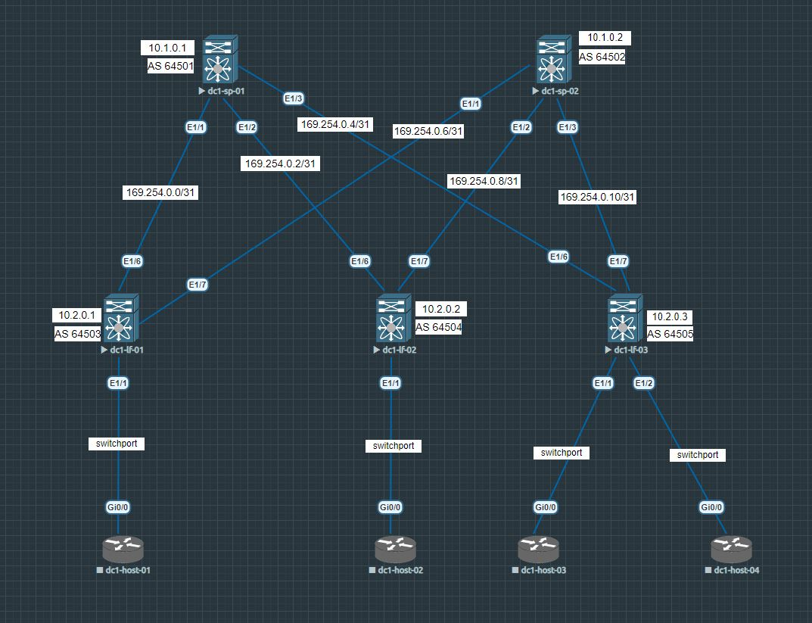

# Underlay. EBGP
## **Цель:**
_Настроить **EBGP** для **Underlay** сети_

_В этой самостоятельной работе мы ожидаем, что вы самостоятельно:_
- настроите EBGP в Underlay сети, для IP связности между всеми устройствами NXOS
- составите план работы, адресное пространство, схему сети, настройки

__Напомню, что сейчас схема выглядит так__ 

## **План работы**
__На интерфейсах между Underlay устройствами мы используем /31 адреса. На лупбеке настроен /32 адрес__

### **Со стороны спайнов**

* Сейчас интерфейсы настроены следующим образом (пример для dc1-sp-01)
```
interface Ethernet1/1
  description dc1-lf-01 Eth1/6
  no switchport
  no ip redirects
  ip address 169.254.0.0/31
  no shutdown
```
```
interface Ethernet1/2
  description dc1-lf-02 Eth1/6
  no switchport
  no ip redirects
  ip address 169.254.0.2/31
  no shutdown
```
```
interface Ethernet1/3
  description dc1-lf-03 Eth1/6
  no switchport
  no ip redirects
  ip address 169.254.0.4/31
  no shutdown
```
Loopback 0
```
interface loopback0
  description router-id
  ip address 10.1.0.1/32
```
* На dc1-sp-02 интерфейсы настроены аналогично (отличаются лишь последние октеты в IP адресе)

### **Со стороны лифов**

* _Настройки интерфейсов следующие_ (пример для dc1-lf-01)
```
interface Ethernet1/6
  description dc1-sp-01 Eth1/1
  no switchport
  no ip redirects
  ip address 169.254.0.1/31
  no shutdown
```
```
interface Ethernet1/7
  description dc1-sp-02 Eth1/1
  no switchport
  no ip redirects
  ip address 169.254.0.7/31
  no shutdown
```
* На dc1-lf-02 и dc1-lf-03 интерфейсы настроены аналогично (отличаются лишь последние октеты в IP адресе)

### __Проверим базовую IP связность по протоколу ICMP между dc1-sp-01 и dc1-lf-01__

```
dc1-sp-01# ping 169.254.0.1
PING 169.254.0.1 (169.254.0.1): 56 data bytes
64 bytes from 169.254.0.1: icmp_seq=0 ttl=254 time=11.236 ms
64 bytes from 169.254.0.1: icmp_seq=1 ttl=254 time=2.171 ms
64 bytes from 169.254.0.1: icmp_seq=2 ttl=254 time=2.934 ms
64 bytes from 169.254.0.1: icmp_seq=3 ttl=254 time=2.229 ms
64 bytes from 169.254.0.1: icmp_seq=4 ttl=254 time=2.407 ms

--- 169.254.0.1 ping statistics ---
5 packets transmitted, 5 packets received, 0.00% packet loss
round-trip min/avg/max = 2.171/4.195/11.236 ms
```
__Теперь нужно настроить IP связность между всеми Underlay устройствами с помощью протокола EBGP__
* Включаем функцию BGP на NXOS, создаем процесс BGP и задаем AS (пример для dc1-sp-01)
```
feature bgp
router bgp 64501
```
* Также мы задаем router-id для процесса BGP и прописываем правила для address-family ipv4 unicast, в которых указываем анонсировать  IP адрес 10.1.0.1 (пример для dc1-sp-01)
```
  address-family ipv4 unicast
    network 10.1.0.1/32
```
* _Далее мы задаем соседей, для_ dc1-sp-01 это dc1-lf-01/02/03
```
  neighbor 169.254.0.1
    remote-as 64503
    description dc1-lf-01
    address-family ipv4 unicast
  neighbor 169.254.0.3
    remote-as 64504
    description dc1-lf-02
    address-family ipv4 unicast
  neighbor 169.254.0.5
    remote-as 64505
    description dc1-lf-03
    address-family ipv4 unicast
```
* Для соседей мы указываем их IP адрес, на который будет устанавливаться BGP соседство на 179 TCP порт, номер их автономной системы (в качестве лабораторной работы берем 16-битные номера AS), задаем описание и говорим свитчу, что к этим соседям необходимо применить политики address-family unicast

__Сейчас команда *show ip bgp summary* показывает, что все соседства в состоянии idle, это значит, что нет базовой IP связности, не удается установить TCP сессию на 179 порт, процесс BGP не запущен на соседе или при обмене OPEN сообщениями были обнаружены ошибки конфигурации__

```
dc1-sp-01# sh ip bgp summary
BGP summary information for VRF default, address family IPv4 Unicast
BGP router identifier 10.1.0.1, local AS number 64501
BGP table version is 3, IPv4 Unicast config peers 3, capable peers 0
1 network entries and 1 paths using 240 bytes of memory
BGP attribute entries [1/168], BGP AS path entries [0/0]
BGP community entries [0/0], BGP clusterlist entries [0/0]

Neighbor        V    AS MsgRcvd MsgSent   TblVer  InQ OutQ Up/Down  State/PfxRcd
169.254.0.1     4 64503       0       0        0    0    0 00:33:35 Idle
169.254.0.3     4 64504       0       0        0    0    0 00:31:52 Idle
169.254.0.5     4 64505       0       0        0    0    0 00:31:25 Idle
```
__А команда *show ip bgp* показывает единственный известный протоколу BGP маршрут, который мы сами же и проанонсировали командой__ ***network***

```
dc1-sp-01# sh ip bgp
BGP routing table information for VRF default, address family IPv4 Unicast
BGP table version is 3, Local Router ID is 10.1.0.1
Status: s-suppressed, x-deleted, S-stale, d-dampened, h-history, *-valid, >-best
Path type: i-internal, e-external, c-confed, l-local, a-aggregate, r-redist, I-i
njected
Origin codes: i - IGP, e - EGP, ? - incomplete, | - multipath, & - backup, 2 - b
est2

   Network            Next Hop            Metric     LocPrf     Weight Path
*>l10.1.0.1/32        0.0.0.0                           100      32768 i
```

__После того как мы настроили протокол BGP на всех остальных нексусах вывод команды *show ip bgp summary* выглядит так__

```
dc1-sp-01# sh ip bgp summary
BGP summary information for VRF default, address family IPv4 Unicast
BGP router identifier 10.1.0.1, local AS number 64501
BGP table version is 13, IPv4 Unicast config peers 3, capable peers 3
5 network entries and 7 paths using 1440 bytes of memory
BGP attribute entries [7/1176], BGP AS path entries [6/48]
BGP community entries [0/0], BGP clusterlist entries [0/0]

Neighbor        V    AS MsgRcvd MsgSent   TblVer  InQ OutQ Up/Down  State/PfxRcd
169.254.0.1     4 64503      13      11       13    0    0 00:05:59 2
169.254.0.3     4 64504      26      24       13    0    0 00:18:30 2
169.254.0.5     4 64505       9       7       13    0    0 00:01:33 2
```

* На dc1-sp-02

```
dc1-sp-02# sh ip bgp summary
BGP summary information for VRF default, address family IPv4 Unicast
BGP router identifier 10.1.0.2, local AS number 64502
BGP table version is 18, IPv4 Unicast config peers 3, capable peers 3
5 network entries and 13 paths using 2160 bytes of memory
BGP attribute entries [13/2184], BGP AS path entries [12/132]
BGP community entries [0/0], BGP clusterlist entries [0/0]

Neighbor        V    AS MsgRcvd MsgSent   TblVer  InQ OutQ Up/Down  State/PfxRcd
169.254.0.7     4 64503      15      11       18    0    0 00:05:38 4
169.254.0.9     4 64504      22      18       18    0    0 00:13:12 4
169.254.0.11    4 64505      11       7       18    0    0 00:01:06 4
```

__Стоит заметить, что на dc1-sp-01 и dc1-sp-02 различается количество маршрутов, изученное через протокол **BGP**. Об этом подробно поговорим чуть дальше на примере__

* На dc1-lf-01

```
dc1-lf-01# sh ip bgp summary
BGP summary information for VRF default, address family IPv4 Unicast
BGP router identifier 10.2.0.1, local AS number 64503
BGP table version is 8, IPv4 Unicast config peers 2, capable peers 2
5 network entries and 9 paths using 1680 bytes of memory
BGP attribute entries [9/1512], BGP AS path entries [8/80]
BGP community entries [0/0], BGP clusterlist entries [0/0]

Neighbor        V    AS MsgRcvd MsgSent   TblVer  InQ OutQ Up/Down  State/PfxRcd
169.254.0.0     4 64501      16      12        8    0    0 00:06:18 4
169.254.0.6     4 64502      16      12        8    0    0 00:06:22 4
```

* На dc1-lf-02

```
dc1-lf-02# sh ip bgp summary
BGP summary information for VRF default, address family IPv4 Unicast
BGP router identifier 10.2.0.2, local AS number 64504
BGP table version is 9, IPv4 Unicast config peers 2, capable peers 2
5 network entries and 7 paths using 1440 bytes of memory
BGP attribute entries [7/1176], BGP AS path entries [6/52]
BGP community entries [0/0], BGP clusterlist entries [0/0]

Neighbor        V    AS MsgRcvd MsgSent   TblVer  InQ OutQ Up/Down  State/PfxRcd
169.254.0.2     4 64501      27      24        9    0    0 00:18:55 3
169.254.0.8     4 64502      22      19        9    0    0 00:14:01 3
```

* На dc1-lf-03

```
dc1-lf-03# sh ip bgp summary
BGP summary information for VRF default, address family IPv4 Unicast
BGP router identifier 10.2.0.3, local AS number 64505
BGP table version is 8, IPv4 Unicast config peers 2, capable peers 2
5 network entries and 9 paths using 1680 bytes of memory
BGP attribute entries [9/1512], BGP AS path entries [8/80]
BGP community entries [0/0], BGP clusterlist entries [0/0]

Neighbor        V    AS MsgRcvd MsgSent   TblVer  InQ OutQ Up/Down  State/PfxRcd
169.254.0.4     4 64501      12       8        8    0    0 00:02:04 4
169.254.0.10    4 64502      12       8        8    0    0 00:02:02 4
```

### **Почему разное количество маршрутов? Разберем на примере центрального свитча dc1-lf-02**

__Если посмотреть на вывод команды ***sh ip bgp*** на dc1-lf-01 и dc1-lf-03 мы видим, что от каждого соседа они получают по 4 маршрута, в то время как dc1-lf-02 всего по 3. Причина кроется в том, что по протоколу BGP пиры делятся только лучшими маршрутами, а также не анонсируруют в соседа маршруты, которые от него же и получены__

* Здесь мы можем видеть, что маршрут до 10.1.0.1 dc1-lf-01 получает как от самого dc1-sp-01 c AS-Path 64501 i, так и от dc1-sp-o2 с AS-Path 64502 64504 64501 i. Это происходит потому, что dc1-sp-02 считает такой маршрут до 10.1.0.1 лучшим, а соответственно, анонсирует его своим соседям. Аналогично с маршрутом до 10.1.0.2 от соседа dc1-sp-01 c AS-Path 64501 64504 64502 i, который dc1-sp-01 считает лучшим.

```
dc1-lf-01# sh ip bgp
BGP routing table information for VRF default, address family IPv4 Unicast
BGP table version is 8, Local Router ID is 10.2.0.1
Status: s-suppressed, x-deleted, S-stale, d-dampened, h-history, *-valid, >-best
Path type: i-internal, e-external, c-confed, l-local, a-aggregate, r-redist, I-i
njected
Origin codes: i - IGP, e - EGP, ? - incomplete, | - multipath, & - backup, 2 - b
est2

   Network            Next Hop            Metric     LocPrf     Weight Path
* e10.1.0.1/32        169.254.0.6                                    0 64502 645
04 64501 i
*>e                   169.254.0.0                                    0 64501 i
*>e10.1.0.2/32        169.254.0.6                                    0 64502 i
* e                   169.254.0.0                                    0 64501 645
04 64502 i
*>l10.2.0.1/32        0.0.0.0                           100      32768 i
* e10.2.0.2/32        169.254.0.6                                    0 64502 645
04 i
*>e                   169.254.0.0                                    0 64501 645
04 i
*>e10.2.0.3/32        169.254.0.0                                    0 64501 645
05 i
* e                   169.254.0.6                                    0 64502 645
05 i
```

* А вот здесь мы видим, что dc1-lf-02 не получает по два маршрута до 10.1.0.1 и 10.1.0.2 от своих соседей. Так происходит потому, что dc1-sp-01 и dc1-sp-02 считают лучшими машруты друг до друга именно через dc1-lf-02, то есть этот маршрут пришел к ним от dc1-lf-02, соответственно, поэтому, они не отправляют такой маршрут к нему обратно.

```
dc1-lf-02# sh ip bgp
BGP routing table information for VRF default, address family IPv4 Unicast
BGP table version is 9, Local Router ID is 10.2.0.2
Status: s-suppressed, x-deleted, S-stale, d-dampened, h-history, *-valid, >-best
Path type: i-internal, e-external, c-confed, l-local, a-aggregate, r-redist, I-i
njected
Origin codes: i - IGP, e - EGP, ? - incomplete, | - multipath, & - backup, 2 - b
est2

   Network            Next Hop            Metric     LocPrf     Weight Path
*>e10.1.0.1/32        169.254.0.2                                    0 64501 i
*>e10.1.0.2/32        169.254.0.8                                    0 64502 i
*>e10.2.0.1/32        169.254.0.2                                    0 64501 645
03 i
* e                   169.254.0.8                                    0 64502 645
03 i
*>l10.2.0.2/32        0.0.0.0                           100      32768 i
*>e10.2.0.3/32        169.254.0.2                                    0 64501 645
05 i
* e                   169.254.0.8                                    0 64502 645
05 i
```

* Здесь ситуация аналогичная с dc1-lf-01

```
dc1-lf-03# sh ip bgp
BGP routing table information for VRF default, address family IPv4 Unicast
BGP table version is 8, Local Router ID is 10.2.0.3
Status: s-suppressed, x-deleted, S-stale, d-dampened, h-history, *-valid, >-best
Path type: i-internal, e-external, c-confed, l-local, a-aggregate, r-redist, I-i
njected
Origin codes: i - IGP, e - EGP, ? - incomplete, | - multipath, & - backup, 2 - b
est2

   Network            Next Hop            Metric     LocPrf     Weight Path
*>e10.1.0.1/32        169.254.0.4                                    0 64501 i
* e                   169.254.0.10                                   0 64502 645
04 64501 i
* e10.1.0.2/32        169.254.0.4                                    0 64501 645
04 64502 i
*>e                   169.254.0.10                                   0 64502 i
*>e10.2.0.1/32        169.254.0.4                                    0 64501 645
03 i
* e                   169.254.0.10                                   0 64502 645
03 i
*>e10.2.0.2/32        169.254.0.4                                    0 64501 645
04 i
* e                   169.254.0.10                                   0 64502 645
04 i
*>l10.2.0.3/32        0.0.0.0                           100      32768 i
```

* Для dc1-sp-01

```
dc1-sp-01# sh ip bgp
BGP routing table information for VRF default, address family IPv4 Unicast
BGP table version is 13, Local Router ID is 10.1.0.1
Status: s-suppressed, x-deleted, S-stale, d-dampened, h-history, *-valid, >-best
Path type: i-internal, e-external, c-confed, l-local, a-aggregate, r-redist, I-i
njected
Origin codes: i - IGP, e - EGP, ? - incomplete, | - multipath, & - backup, 2 - b
est2

   Network            Next Hop            Metric     LocPrf     Weight Path
*>l10.1.0.1/32        0.0.0.0                           100      32768 i
*>e10.1.0.2/32        169.254.0.3                                    0 64504 645
02 i
* e                   169.254.0.1                                    0 64503 645
02 i
* e                   169.254.0.5                                    0 64505 645
02 i
*>e10.2.0.1/32        169.254.0.1                                    0 64503 i
*>e10.2.0.2/32        169.254.0.3                                    0 64504 i
*>e10.2.0.3/32        169.254.0.5                                    0 64505 i
```

* Для dc1-sp-02

```
dc1-sp-02# sh ip bgp
BGP routing table information for VRF default, address family IPv4 Unicast
BGP table version is 31, Local Router ID is 10.1.0.2
Status: s-suppressed, x-deleted, S-stale, d-dampened, h-history, *-valid, >-best
Path type: i-internal, e-external, c-confed, l-local, a-aggregate, r-redist, I-i
njected
Origin codes: i - IGP, e - EGP, ? - incomplete, | - multipath, & - backup, 2 - b
est2

   Network            Next Hop            Metric     LocPrf     Weight Path
*>e10.1.0.1/32        169.254.0.9                                    0 64504 645
01 i
* e                   169.254.0.7                                    0 64503 645
01 i
* e                   169.254.0.11                                   0 64505 645
01 i
*>l10.1.0.2/32        0.0.0.0                           100      32768 i
*>e10.2.0.1/32        169.254.0.7                                    0 64503 i
* e                   169.254.0.9                                    0 64504 645
01 64503 i
* e                   169.254.0.11                                   0 64505 645
01 64503 i
*>e10.2.0.2/32        169.254.0.9                                    0 64504 i
* e                   169.254.0.7                                    0 64503 645
01 64504 i
* e                   169.254.0.11                                   0 64505 645
01 64504 i
*>e10.2.0.3/32        169.254.0.11                                   0 64505 i
* e                   169.254.0.7                                    0 64503 645
01 64505 i
* e                   169.254.0.9                                    0 64504 645
01 64505 i

```

__Посмротрим на итоговую таблицу маршрутизации, известную через протокол BGP__ (на dc1-sp-01)

```
dc1-sp-01# sh ip route bgp-64501
IP Route Table for VRF "default"
'*' denotes best ucast next-hop
'**' denotes best mcast next-hop
'[x/y]' denotes [preference/metric]
'%<string>' in via output denotes VRF <string>

10.1.0.2/32, ubest/mbest: 1/0
    *via 169.254.0.3, [20/0], 00:15:44, bgp-64501, external, tag 64504
10.2.0.1/32, ubest/mbest: 1/0
    *via 169.254.0.1, [20/0], 00:09:36, bgp-64501, external, tag 64503
10.2.0.2/32, ubest/mbest: 1/0
    *via 169.254.0.3, [20/0], 00:22:11, bgp-64501, external, tag 64504
10.2.0.3/32, ubest/mbest: 1/0
    *via 169.254.0.5, [20/0], 00:05:09, bgp-64501, external, tag 64505
```

__Проверим IP связность между dc1-sp-01 и dc1-sp-02, которые не имеют прямых линков друг с другом__

```
dc1-sp-01# ping 10.1.0.2 source 10.1.0.1
PING 10.1.0.2 (10.1.0.2) from 10.1.0.1: 56 data bytes
64 bytes from 10.1.0.2: icmp_seq=0 ttl=253 time=20.571 ms
64 bytes from 10.1.0.2: icmp_seq=1 ttl=253 time=5.933 ms
64 bytes from 10.1.0.2: icmp_seq=2 ttl=253 time=4.405 ms
64 bytes from 10.1.0.2: icmp_seq=3 ttl=253 time=4.691 ms
64 bytes from 10.1.0.2: icmp_seq=4 ttl=253 time=4.503 ms

--- 10.1.0.2 ping statistics ---
5 packets transmitted, 5 packets received, 0.00% packet loss
round-trip min/avg/max = 4.405/8.02/20.571 ms
```

__В случае, если нам нужно имитировать ситуацию с Link State протоколами, то есть все устройства знают всю топологию сети в ЦОД - воспользуемся инструментами ip prefix-list и route-map, а также функцией редистрибьюции на address-family ipv4 unicast__

__Выполним соответствующие настройки__

* Тут мы создаем ip prefix-list и разрешаем в нем сеть 169.254.0.0/24, затем мы матчим этот префикс в route-map

```
ip prefix-list direct seq 5 permit 169.254.0.0/24 le 32
route-map DIRECT permit 10
  match ip address prefix-list direct
```

__После необходимо применить этот route-map в address-family ipv4 unicast глобально для всего BGP процесса__

* Здесь мы говорим свитчу редистрибьютить все directly connected сети, если они удовлетворяют правилам примененного route-map
```
  address-family ipv4 unicast
    redistribute direct route-map DIRECT
```

__После того, как мы выполнили аналогичные настройки на всех остальных свитчах, итоговая таблица маршрутизации стала выглядеть так__ (на dc1-sp-01)

```
dc1-sp-01(config-router-af)# sh ip bgp
BGP routing table information for VRF default, address family IPv4 Unicast
BGP table version is 26, Local Router ID is 10.1.0.1
Status: s-suppressed, x-deleted, S-stale, d-dampened, h-history, *-valid, >-best
Path type: i-internal, e-external, c-confed, l-local, a-aggregate, r-redist, I-i
njected
Origin codes: i - IGP, e - EGP, ? - incomplete, | - multipath, & - backup, 2 - b
est2

   Network            Next Hop            Metric     LocPrf     Weight Path
*>l10.1.0.1/32        0.0.0.0                           100      32768 i
*>e10.1.0.2/32        169.254.0.3                                    0 64504 645
02 i
* e                   169.254.0.1                                    0 64503 645
02 i
* e                   169.254.0.5                                    0 64505 645
02 i
*>e10.2.0.1/32        169.254.0.1                                    0 64503 i
*>e10.2.0.2/32        169.254.0.3                                    0 64504 i
*>e10.2.0.3/32        169.254.0.5                                    0 64505 i
*>r169.254.0.0/31     0.0.0.0                  0        100      32768 ?
* e                   169.254.0.1              0                     0 64503 ?
*>r169.254.0.2/31     0.0.0.0                  0        100      32768 ?
* e                   169.254.0.3              0                     0 64504 ?
*>r169.254.0.4/31     0.0.0.0                  0        100      32768 ?
* e                   169.254.0.5              0                     0 64505 ?
*>e169.254.0.6/31     169.254.0.1              0                     0 64503 ?
* e                   169.254.0.3                                    0 64504 645
02 ?
* e                   169.254.0.5                                    0 64505 645
02 ?
* e169.254.0.8/31     169.254.0.1                                    0 64503 645
02 ?
*>e                   169.254.0.3              0                     0 64504 ?
* e                   169.254.0.5                                    0 64505 645
02 ?
* e169.254.0.10/31    169.254.0.1                                    0 64503 645
02 ?
* e                   169.254.0.3                                    0 64504 645
02 ?
*>e                   169.254.0.5              0                     0 64505 ?
```

### __Таким образом мы обеспечили динамическое распространение маршрутной информации в пределах нашего вымышленного ЦОД посредством протокола BGP__

Все конфиги [здесь](https://github.com/dontmesswithnets/study_otus/tree/main/Second_month/lab_2/configs)