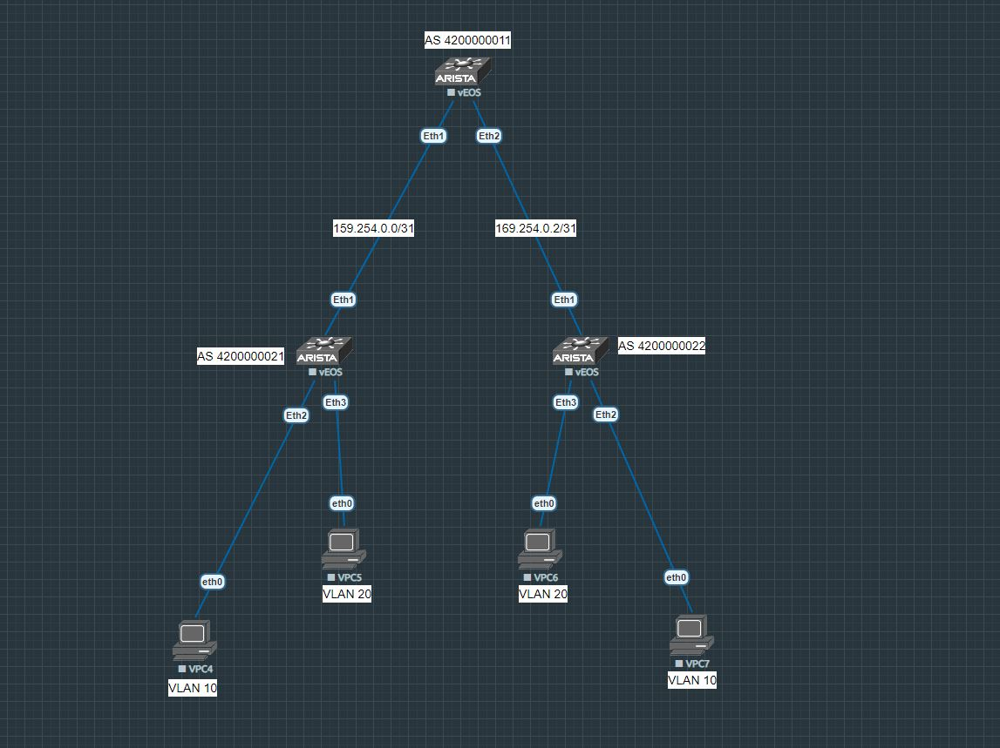

# VxLAN. EVPN L2
## **Цель:**
_Настроить Overlay на основе __VxLAN EVPN__ для L2 связанности между клиентами_

_В этой самостоятельной работе мы ожидаем, что вы самостоятельно:_
* Настроите BGP peering между Leaf и Spine в AF l2vpn evpn
* Настроите связанность между клиентами в первой зоне

_Наша схема стенда выглядит так_

 

_В сехме участвуют:_
* Spine-01 (AS 4200000011, Loopback 1.1.1.1)
* Leaf-01 (AS 4200000021, Loopback 1.1.1.2)
* Leaf-02 (AS 4200000022, Loopback 1.1.1.3)
* VPCS4 (ip 192.168.0.2/24, vlan 10)
* VPCS5 (ip 192.168.0.102/24, vlan 20)
* VPCS6 (ip 192.168.0.103/24, vlan 20)
* VPCS7 (ip 192.168.0.3/24, vlan 10)

<br/>

## **План работы**
<br/>

__На интерфейсах между Underlay устройствами мы используем /31 адреса. На лупбеке настроен /32 адрес__

_Со стороны спайна_

```
spine-01#sh run int eth 1-2
interface Ethernet1
   description leaf-01
   no switchport
   ip address 169.254.0.0/31
interface Ethernet2
   description leaf-02
   no switchport
   ip address 169.254.0.2/31
interface Loopback0
   ip address 1.1.1.1/32
```
_Со стороны лифов_

```
leaf-01#sh run int eth 1-3
interface Ethernet1
   description spine-01
   no switchport
   ip address 169.254.0.1/31
interface Ethernet2
   description server-PROD
   switchport access vlan 10
interface Ethernet3
   description server-DEV
   switchport access vlan 20
interface Loopback0
   ip address 1.1.1.2/32

```

```
leaf-02#sh run int eth 1-3
interface Ethernet1
   description spine-01
   no switchport
   ip address 169.254.0.3/31
interface Ethernet2
   description server-PROD
   switchport access vlan 10
interface Ethernet3
   description server-DEV
   switchport access vlan 20
interface Loopback0
   ip address 1.1.1.3/32

```

### __Проверим базовую IP связность по протоколу ICMP между spine-01 и leaf-01__
<br/>

```
spine-01#ping 169.254.0.1
PING 169.254.0.1 (169.254.0.1) 72(100) bytes of data.
80 bytes from 169.254.0.1: icmp_seq=1 ttl=64 time=4.09 ms
80 bytes from 169.254.0.1: icmp_seq=2 ttl=64 time=2.93 ms
80 bytes from 169.254.0.1: icmp_seq=3 ttl=64 time=2.21 ms
80 bytes from 169.254.0.1: icmp_seq=4 ttl=64 time=1.97 ms
80 bytes from 169.254.0.1: icmp_seq=5 ttl=64 time=2.03 ms

--- 169.254.0.1 ping statistics ---
5 packets transmitted, 5 received, 0% packet loss, time 18ms
rtt min/avg/max/mdev = 1.977/2.651/4.091/0.797 ms, ipg/ewma 4.592/3.326 ms
```
### __Включим на Arista необходимые нам функции__

```
service routing protocols model multi-agent

ip routing

mpls ip
```

### __Теперь нужно сконфигурировать prefix-list, route-map и peer-filter, они понадобятся нам в дальнейшей настройке EBGP__

_Со стороны спайна_

```
ip prefix-list LOOPBACKS seq 10 permit 1.1.1.0/24 le 32

route-map LOOPBACKS permit 10
   match ip address prefix-list LOOPBACKS

peer-filter LEAF_AS_RANGE
   10 match as-range 4200000000-4200000099 result accept
```
### __Переходим к настройке EBGP на Underlay__

_Со стороны спайна (тут у нас спайн работает в "пассивном" режиме и только слушает 179 TCP порт, то есть сам по себе не отправляет TCP SYN). Для этого мы используем команду bgp listen range и указываем ранее созданный peer-filter. Также мы создаем peer-group и говорим вносить в нее подпадающих под нужные правила лифы. Ну и в конце даем команду редистрибьютить адреса loopback_
```
router bgp 4200000011
   router-id 1.1.1.1
   bgp listen range 169.254.0.0/24 peer-group LEAF_UNDERLAY peer-filter LEAF_AS_RANGE
   neighbor LEAF_UNDERLAY peer group
   redistribute connected route-map LOOPBACKS
```
### __На данном этапе этого достаточно и можем перейти к аналогичным настройкам на лифах__

_Prefix-list и route-map будут аналогичными_ (peer-filter на лифах не будет, так как они являются инициаторами установления соседства и на них задается конкретная AS у соседа)

```
ip prefix-list LOOPBACKS seq 10 permit 1.1.1.0/24 le 32

route-map LOOPBACKS permit 10
   match ip address prefix-list LOOPBACKS
```

_Теперь настройка Underlay EBGP. Тут мы также создаем peer-group, указываем конкретный адрес и автономную систему и даем команду редистрибьютить адреса loopback_

_На leaf-01_
```
router bgp 4200000021
   router-id 1.1.1.2
   neighbor SPINE_UNDERLAY peer group
   neighbor 169.254.0.0 peer group SPINE_UNDERLAY
   neighbor 169.254.0.0 remote-as 4200000011
   redistribute connected route-map LOOPBACKS
```
_То же самое на leaf-02_
```
router bgp 4200000022
   router-id 1.1.1.3
   neighbor SPINE_UNDERLAY peer group
   neighbor 169.254.0.2 peer group SPINE_UNDERLAY
   neighbor 169.254.0.2 remote-as 4200000011
   redistribute connected route-map LOOPBACKS
```
**После этого базовое EBGP соседство на уровне Underlay должно установиться. Проверим**

```
spine-01#sh ip bgp summary
BGP summary information for VRF default
Router identifier 1.1.1.1, local AS number 4200000011
Neighbor Status Codes: m - Under maintenance
  Neighbor    V AS           MsgRcvd   MsgSent  InQ OutQ  Up/Down State   PfxRcd PfxAcc
  169.254.0.1 4 4200000021       114       116    0    0 01:32:06 Estab   1      1
  169.254.0.3 4 4200000022       110       110    0    0 01:28:40 Estab   1      1
spine-01#sh ip bgp
BGP routing table information for VRF default
Router identifier 1.1.1.1, local AS number 4200000011
Route status codes: s - suppressed, * - valid, > - active, E - ECMP head, e - ECMP
                    S - Stale, c - Contributing to ECMP, b - backup, L - labeled-unicast
                    % - Pending BGP convergence
Origin codes: i - IGP, e - EGP, ? - incomplete
RPKI Origin Validation codes: V - valid, I - invalid, U - unknown
AS Path Attributes: Or-ID - Originator ID, C-LST - Cluster List, LL Nexthop - Link Local Nexthop

          Network                Next Hop              Metric  AIGP       LocPref Weight  Path
 * >      1.1.1.1/32             -                     -       -          -       0       i
 * >      1.1.1.2/32             169.254.0.1           0       -          100     0       4200000021 i
 * >      1.1.1.3/32             169.254.0.3           0       -          100     0       4200000022 i

leaf-01#sh ip bgp summary
BGP summary information for VRF default
Router identifier 1.1.1.2, local AS number 4200000021
Neighbor Status Codes: m - Under maintenance
  Neighbor    V AS           MsgRcvd   MsgSent  InQ OutQ  Up/Down State   PfxRcd PfxAcc
  169.254.0.0 4 4200000011       117       115    0    0 01:32:19 Estab   2      2
leaf-01#sh ip bgp
BGP routing table information for VRF default
Router identifier 1.1.1.2, local AS number 4200000021
Route status codes: s - suppressed, * - valid, > - active, E - ECMP head, e - ECMP
                    S - Stale, c - Contributing to ECMP, b - backup, L - labeled-unicast
                    % - Pending BGP convergence
Origin codes: i - IGP, e - EGP, ? - incomplete
RPKI Origin Validation codes: V - valid, I - invalid, U - unknown
AS Path Attributes: Or-ID - Originator ID, C-LST - Cluster List, LL Nexthop - Link Local Nexthop

          Network                Next Hop              Metric  AIGP       LocPref Weight  Path
 * >      1.1.1.1/32             169.254.0.0           0       -          100     0       4200000011 i
 * >      1.1.1.2/32             -                     -       -          -       0       i
 * >      1.1.1.3/32             169.254.0.0           0       -          100     0       4200000011 4200000022 i

leaf-02#sh ip bgp summary
BGP summary information for VRF default
Router identifier 1.1.1.3, local AS number 4200000022
Neighbor Status Codes: m - Under maintenance
  Neighbor    V AS           MsgRcvd   MsgSent  InQ OutQ  Up/Down State   PfxRcd PfxAcc
  169.254.0.2 4 4200000011       110       110    0    0 01:29:10 Estab   2      2
leaf-02#sh ip bgp
BGP routing table information for VRF default
Router identifier 1.1.1.3, local AS number 4200000022
Route status codes: s - suppressed, * - valid, > - active, E - ECMP head, e - ECMP
                    S - Stale, c - Contributing to ECMP, b - backup, L - labeled-unicast
                    % - Pending BGP convergence
Origin codes: i - IGP, e - EGP, ? - incomplete
RPKI Origin Validation codes: V - valid, I - invalid, U - unknown
AS Path Attributes: Or-ID - Originator ID, C-LST - Cluster List, LL Nexthop - Link Local Nexthop

          Network                Next Hop              Metric  AIGP       LocPref Weight  Path
 * >      1.1.1.1/32             169.254.0.2           0       -          100     0       4200000011 i
 * >      1.1.1.2/32             169.254.0.2           0       -          100     0       4200000011 4200000021 i
 * >      1.1.1.3/32             -                     -       -          -       0       i
```
**Теперь можем проверить IP связность между loopback интерфейсами, в дальнейшем они будут использоваться как адреса VTEP'ов, следовательно сетевая связность между этими адресами играет ключевую роль в VxLAN технологии**

_Пропингуем со спайна один из лифов по его loopback адресу с указанием source, а именно адресом своего loopback_
```
spine-01#ping 1.1.1.3 source 1.1.1.1
PING 1.1.1.3 (1.1.1.3) from 1.1.1.1 : 72(100) bytes of data.
80 bytes from 1.1.1.3: icmp_seq=1 ttl=64 time=7.43 ms
80 bytes from 1.1.1.3: icmp_seq=2 ttl=64 time=4.17 ms
80 bytes from 1.1.1.3: icmp_seq=3 ttl=64 time=5.03 ms
80 bytes from 1.1.1.3: icmp_seq=4 ttl=64 time=3.51 ms
80 bytes from 1.1.1.3: icmp_seq=5 ttl=64 time=3.14 ms

--- 1.1.1.3 ping statistics ---
5 packets transmitted, 5 received, 0% packet loss, time 39ms
rtt min/avg/max/mdev = 3.142/4.661/7.434/1.529 ms, ipg/ewma 9.993/5.966 ms
```
*Связность появилась. Можем приступить к настройке vlan, а затем интерфейса Vxlan*
```
vlan 10
   name PROD

vlan 20
   name DEV
```
*Вланы мы создали, теперь создаем интерфейс Vxlan1 и настраиваем соответствующим образом*
```
interface Vxlan1
   vxlan source-interface Loopback0
   vxlan udp-port 4789
   vxlan vlan 10 vni 10010
   vxlan vlan 20 vni 10020
```
*Выше мы указали свитчу, что локальный VTEP должен работать на адресе loopback, вторая строчка создается по умолчанию, даже если ее не прописывать, а последние две говорят о том, что каждый из вланов сопоставляется определенному VNI (Vxlan network identifier), который должен уникальным во всей фабрике*

**Переходим к настройке Overlay EBGP**

_Для этого вносим соответствующие дополнения в конфигурацию уже существующего инстанса BGP_

_Со стороны спайна_
```
router bgp 4200000011
   bgp listen range 1.1.1.0/24 peer-group LEAF_OVERLAY peer-filter LEAF_AS_RANGE
   neighbor LEAF_OVERLAY peer group
   neighbor LEAF_OVERLAY update-source Loopback0
   neighbor LEAF_OVERLAY ebgp-multihop 2
   neighbor LEAF_OVERLAY send-community
   
   address-family evpn
      neighbor LEAF_OVERLAY activate
   
   address-family ipv4
      no neighbor LEAF_OVERLAY activate
```
_Выше мы указали свитчу слушать 179 TCP порт в определенном IP диапазоне и вносить в peer-group соседей, чьи номера AS удовлетворяют требованиям. Далее мы указали, что устанавливать соседство необходимо с адреса loopback, увеличили TTL на единицу, так как при маршрктизации с физического интерфейса на loopback TTL будет уменьшен на единицу. Также мы дали команду посылать community и активировали peer group в address-family EVPN_

_На лифах нужно будет вдобавок создать MAC-VRF'ы и настроить на них RD и RT, а также дать команду редистрибьютить выученные на Dataplane MAC адреса_
```
router bgp 4200000021
   neighbor SPINE_OVERLAY peer group
   neighbor SPINE_OVERLAY update-source Loopback0
   neighbor SPINE_OVERLAY ebgp-multihop 2
   neighbor SPINE_OVERLAY send-community
   neighbor 1.1.1.1 peer group SPINE_OVERLAY
   neighbor 1.1.1.1 remote-as 4200000011
   
   vlan 10
      rd 1.1.1.2:10010
      route-target both 1:10010
      redistribute learned
   
   vlan 20
      rd 1.1.1.2:10020
      route-target both 1:10020
      redistribute learned
   
   address-family evpn
      neighbor SPINE_OVERLAY activate
   
   address-family ipv4
      no neighbor SPINE_OVERLAY activate
```
```
router bgp 4200000022
   neighbor SPINE_OVERLAY peer group
   neighbor SPINE_OVERLAY update-source Loopback0
   neighbor SPINE_OVERLAY ebgp-multihop 2
   neighbor SPINE_OVERLAY send-community
   neighbor 1.1.1.1 peer group SPINE_OVERLAY
   neighbor 1.1.1.1 remote-as 4200000011
   
   vlan 10
      rd 1.1.1.3:10010
      route-target both 1:10010
      redistribute learned
   
   vlan 20
      rd 1.1.1.3:10020
      route-target both 1:10020
      redistribute learned
   
   address-family evpn
      neighbor SPINE_OVERLAY activate
   
   address-family ipv4
      no neighbor SPINE_OVERLAY activate
```

**На этом настройки завершены. Можно проверить пингом между VPCS**
```
VPCS> ip 192.168.0.2/24 192.168.0.1
Checking for duplicate address...
PC1 : 192.168.0.2 255.255.255.0 gateway 192.168.0.1

VPCS> save
Saving startup configuration to startup.vpc
.  done

VPCS> ping 192.168.0.3

84 bytes from 192.168.0.3 icmp_seq=1 ttl=64 time=19.077 ms
84 bytes from 192.168.0.3 icmp_seq=2 ttl=64 time=17.256 ms
84 bytes from 192.168.0.3 icmp_seq=3 ttl=64 time=17.500 ms
84 bytes from 192.168.0.3 icmp_seq=4 ttl=64 time=22.573 ms
84 bytes from 192.168.0.3 icmp_seq=5 ttl=64 time=20.140 ms

VPCS> ping 192.168.0.102

host (192.168.0.102) not reachable
```
```
VPCS> ip 192.168.0.102/24 192.168.0.1
Checking for duplicate address...
PC1 : 192.168.0.102 255.255.255.0 gateway 192.168.0.1

VPCS> save
Saving startup configuration to startup.vpc
.  done

VPCS> ping 192.168.0.103

84 bytes from 192.168.0.103 icmp_seq=1 ttl=64 time=17.235 ms
84 bytes from 192.168.0.103 icmp_seq=2 ttl=64 time=21.621 ms
84 bytes from 192.168.0.103 icmp_seq=3 ttl=64 time=16.893 ms
84 bytes from 192.168.0.103 icmp_seq=4 ttl=64 time=17.160 ms
84 bytes from 192.168.0.103 icmp_seq=5 ttl=64 time=23.118 ms

VPCS> ping 192.168.0.3

host (192.168.0.3) not reachable
```
**Можем также посмотреть на установившиеся EBGP сесссии на уровне Overlay и анонсируемые через него MAC адреса**
```
spine-01#sh bgp evpn summary
BGP summary information for VRF default
Router identifier 1.1.1.1, local AS number 4200000011
Neighbor Status Codes: m - Under maintenance
  Neighbor V AS           MsgRcvd   MsgSent  InQ OutQ  Up/Down State   PfxRcd PfxAcc
  1.1.1.2  4 4200000021       468       469    0    0 06:27:09 Estab   4      4
  1.1.1.3  4 4200000022       466       463    0    0 06:23:44 Estab   4      4
```
```
spine-01#sh bgp evpn
BGP routing table information for VRF default
Router identifier 1.1.1.1, local AS number 4200000011
Route status codes: s - suppressed, * - valid, > - active, E - ECMP head, e - ECMP
                    S - Stale, c - Contributing to ECMP, b - backup
                    % - Pending BGP convergence
Origin codes: i - IGP, e - EGP, ? - incomplete
AS Path Attributes: Or-ID - Originator ID, C-LST - Cluster List, LL Nexthop - Link Local Nexthop

          Network                Next Hop              Metric  LocPref Weight  Path
 * >     RD: 1.1.1.2:10010 mac-ip 0050.7966.6804
                                 1.1.1.2               -       100     0       4200000021 i
 * >     RD: 1.1.1.2:10020 mac-ip 0050.7966.6805
                                 1.1.1.2               -       100     0       4200000021 i
 * >     RD: 1.1.1.3:10020 mac-ip 0050.7966.6806
                                 1.1.1.3               -       100     0       4200000022 i
 * >     RD: 1.1.1.3:10010 mac-ip 0050.7966.6807
                                 1.1.1.3               -       100     0       4200000022 i
 * >     RD: 1.1.1.2:10010 imet 1.1.1.2
                                 1.1.1.2               -       100     0       4200000021 i
 * >     RD: 1.1.1.2:10020 imet 1.1.1.2
                                 1.1.1.2               -       100     0       4200000021 i
 * >     RD: 1.1.1.3:10010 imet 1.1.1.3
                                 1.1.1.3               -       100     0       4200000022 i
 * >     RD: 1.1.1.3:10020 imet 1.1.1.3
                                 1.1.1.3               -       100     0       4200000022 i
```
_На лифах_
```
leaf-01#sh bgp evpn summary
BGP summary information for VRF default
Router identifier 1.1.1.2, local AS number 4200000021
Neighbor Status Codes: m - Under maintenance
  Neighbor V AS           MsgRcvd   MsgSent  InQ OutQ  Up/Down State   PfxRcd PfxAcc
  1.1.1.1  4 4200000011       470       469    0    0 06:28:01 Estab   4      4
leaf-01#sh bgp evpn
BGP routing table information for VRF default
Router identifier 1.1.1.2, local AS number 4200000021
Route status codes: s - suppressed, * - valid, > - active, E - ECMP head, e - ECMP
                    S - Stale, c - Contributing to ECMP, b - backup
                    % - Pending BGP convergence
Origin codes: i - IGP, e - EGP, ? - incomplete
AS Path Attributes: Or-ID - Originator ID, C-LST - Cluster List, LL Nexthop - Link Local Nexthop

          Network                Next Hop              Metric  LocPref Weight  Path
 * >     RD: 1.1.1.2:10010 mac-ip 0050.7966.6804
                                 -                     -       -       0       i
 * >     RD: 1.1.1.2:10020 mac-ip 0050.7966.6805
                                 -                     -       -       0       i
 * >     RD: 1.1.1.3:10020 mac-ip 0050.7966.6806
                                 1.1.1.3               -       100     0       4200000011 4200000022 i
 * >     RD: 1.1.1.3:10010 mac-ip 0050.7966.6807
                                 1.1.1.3               -       100     0       4200000011 4200000022 i
 * >     RD: 1.1.1.3:10010 imet 1.1.1.3
                                 1.1.1.3               -       100     0       4200000011 4200000022 i
 * >     RD: 1.1.1.3:10020 imet 1.1.1.3
                                 1.1.1.3               -       100     0       4200000011 4200000022 i
 * >     RD: 1.1.1.2:10010 imet 1.1.1.2
                                 -                     -       -       0       i
 * >     RD: 1.1.1.2:10020 imet 1.1.1.2
                                 -                     -       -       0       i
```
```
leaf-02#sh bgp evpn summary
BGP summary information for VRF default
Router identifier 1.1.1.3, local AS number 4200000022
Neighbor Status Codes: m - Under maintenance
  Neighbor V AS           MsgRcvd   MsgSent  InQ OutQ  Up/Down State   PfxRcd PfxAcc
  1.1.1.1  4 4200000011       465       467    0    0 06:24:49 Estab   4      4
leaf-02#sh bgp evpn
BGP routing table information for VRF default
Router identifier 1.1.1.3, local AS number 4200000022
Route status codes: s - suppressed, * - valid, > - active, E - ECMP head, e - ECMP
                    S - Stale, c - Contributing to ECMP, b - backup
                    % - Pending BGP convergence
Origin codes: i - IGP, e - EGP, ? - incomplete
AS Path Attributes: Or-ID - Originator ID, C-LST - Cluster List, LL Nexthop - Link Local Nexthop

          Network                Next Hop              Metric  LocPref Weight  Path
 * >     RD: 1.1.1.2:10010 mac-ip 0050.7966.6804
                                 1.1.1.2               -       100     0       4200000011 4200000021 i
 * >     RD: 1.1.1.2:10020 mac-ip 0050.7966.6805
                                 1.1.1.2               -       100     0       4200000011 4200000021 i
 * >     RD: 1.1.1.3:10020 mac-ip 0050.7966.6806
                                 -                     -       -       0       i
 * >     RD: 1.1.1.3:10010 mac-ip 0050.7966.6807
                                 -                     -       -       0       i
 * >     RD: 1.1.1.2:10010 imet 1.1.1.2
                                 1.1.1.2               -       100     0       4200000011 4200000021 i
 * >     RD: 1.1.1.2:10020 imet 1.1.1.2
                                 1.1.1.2               -       100     0       4200000011 4200000021 i
 * >     RD: 1.1.1.3:10010 imet 1.1.1.3
                                 -                     -       -       0       i
 * >     RD: 1.1.1.3:10020 imet 1.1.1.3
                                 -                     -       -       0       i
```
_На лифах также можно посмотреть таблицу MAC адресов, которые были изучены в процессе обмена трафиком между VPCS_
```
leaf-01#sh vxlan address-table
          Vxlan Mac Address Table
----------------------------------------------------------------------

VLAN  Mac Address     Type      Prt  VTEP             Moves   Last Move
----  -----------     ----      ---  ----             -----   ---------
  10  0050.7966.6807  EVPN      Vx1  1.1.1.3          1       0:02:55 ago
  20  0050.7966.6806  EVPN      Vx1  1.1.1.3          1       0:02:58 ago
Total Remote Mac Addresses for this criterion: 2
```
```
leaf-02#sh vxlan address-table
          Vxlan Mac Address Table
----------------------------------------------------------------------

VLAN  Mac Address     Type      Prt  VTEP             Moves   Last Move
----  -----------     ----      ---  ----             -----   ---------
  10  0050.7966.6804  EVPN      Vx1  1.1.1.2          1       0:03:12 ago
  20  0050.7966.6805  EVPN      Vx1  1.1.1.2          1       0:03:10 ago
Total Remote Mac Addresses for this criterion: 2
```
**В процесса лабораторной работы был настроен Vxlan EVPN VLAN based, о чем также свидетельствует вывод команды на лифе**
```
leaf-02#sh bgp evpn instance
EVPN instance: VLAN 10
  Route distinguisher: 1.1.1.3:10010
  Route target import: Route-Target-AS:1:10010
  Route target export: Route-Target-AS:1:10010
  Service interface: VLAN-based
  Local IP address: 1.1.1.3
  Encapsulation type: VXLAN
EVPN instance: VLAN 20
  Route distinguisher: 1.1.1.3:10020
  Route target import: Route-Target-AS:1:10020
  Route target export: Route-Target-AS:1:10020
  Service interface: VLAN-based
  Local IP address: 1.1.1.3
  Encapsulation type: VXLAN
```
<br/>

## UPDATE

### Решил дополнить модель взаимодействия еще одним способом, а именно _Vlan-aware-bundle_

*В этом случае нам не придется писать отдельную конфигурацию под каждый MAC-VRF. Вланы по прежнему будут примаплены каждый к своему VNI, однако, у них у всех будет общий MAC-VRF, а значит, route-distinguisher и route-target тоже будут общими. Здесь появляется в этот раз НЕ нулевое поле значения Ethernet tag ID, по нему собственно VTEP и будет понимать как их различать*

Для настройки необходимо:

* удаляем ранее созданные MAC-VRF'ы на VTEP'ах

```
leaf-01(config)#router bgp 4200000021
leaf-01(config-router-bgp)#no vlan 10
leaf-01(config-router-bgp)#no vlan 20

leaf-02(config)#router bgp 4200000022
leaf-02(config-router-bgp)#no vlan 10
leaf-02(config-router-bgp)#no vlan 20
```

* создаем один общий MAC-VRF, задаем RD, RT и вносим необходимые вланы

```
leaf-01(config-router-bgp)#vlan-aware-bundle BUNDLE
leaf-01(config-macvrf-BUNDLE)#rd 1.1.1.2:1
leaf-01(config-macvrf-BUNDLE)#route-target both 1:1
leaf-01(config-macvrf-BUNDLE)#vlan 10, 20
leaf-01(config-macvrf-BUNDLE)#redistribute learned

leaf-02(config-router-bgp)#vlan-aware-bundle BUNDLE
leaf-02(config-macvrf-BUNDLE)#rd 1.1.1.3:1
leaf-02(config-macvrf-BUNDLE)#route-target both 1:1
leaf-02(config-macvrf-BUNDLE)#vlan 10, 20
leaf-02(config-macvrf-BUNDLE)#redistribute learned
```

* После этого проверим тип инстанса и связь между хостами

```
leaf-01#sh bgp evpn instance
EVPN instance: VLAN-aware bundle BUNDLE
  Route distinguisher: 1.1.1.2:1
  Route target import: Route-Target-AS:1:1
  Route target export: Route-Target-AS:1:1
  Service interface: VLAN-aware bundle
  Local IP address: 1.1.1.2
  Encapsulation type: VXLAN

leaf-02#sh bgp evpn instance
EVPN instance: VLAN-aware bundle BUNDLE
  Route distinguisher: 1.1.1.3:1
  Route target import: Route-Target-AS:1:1
  Route target export: Route-Target-AS:1:1
  Service interface: VLAN-aware bundle
  Local IP address: 1.1.1.3
  Encapsulation type: VXLAN
```

* для спайна в такой конфигурации в настройках ничего менять не нужно

```
PC1 : 192.168.0.102 255.255.255.0 gateway 192.168.0.1

VPCS> ping 192.168.0.103

84 bytes from 192.168.0.103 icmp_seq=1 ttl=64 time=11.431 ms
84 bytes from 192.168.0.103 icmp_seq=2 ttl=64 time=78.869 ms
84 bytes from 192.168.0.103 icmp_seq=3 ttl=64 time=26.293 ms
84 bytes from 192.168.0.103 icmp_seq=4 ttl=64 time=29.141 ms
84 bytes from 192.168.0.103 icmp_seq=5 ttl=64 time=27.710 ms

PC1 : 192.168.0.2 255.255.255.0 gateway 192.168.0.1

VPCS> ping 192.168.0.3

84 bytes from 192.168.0.3 icmp_seq=1 ttl=64 time=16.019 ms
84 bytes from 192.168.0.3 icmp_seq=2 ttl=64 time=19.116 ms
84 bytes from 192.168.0.3 icmp_seq=3 ttl=64 time=30.577 ms
84 bytes from 192.168.0.3 icmp_seq=4 ttl=64 time=18.575 ms
84 bytes from 192.168.0.3 icmp_seq=5 ttl=64 time=23.432 ms
```

*Такой способ взаимодействия значительно упрощает конфигурацию на VTEP'aх, однако, Vlan-based способ на сегодняшний день остается более популярным засчет большей поддержки вендорами*

Все конфиги устройств лежат [здесь](https://github.com/dontmesswithnets/study_otus/tree/main/Third_month/lab_1/configs)
