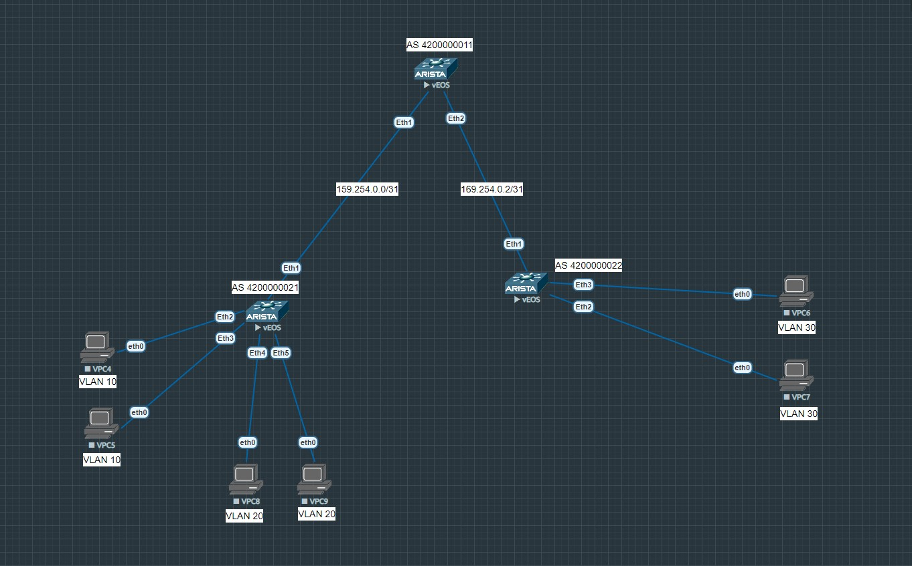

# VxLAN. EVPN L3
## **Цель:**
_Настроить Overlay на основе __VxLAN EVPN__ для L3 связанности между клиентами_

_В этой самостоятельной работе мы ожидаем, что вы самостоятельно:_
* Настроите каждого клиента в своем VNI
* Настроите маршрутизацию между клиентами

_Для решения этой задачи я немного обновил нашу схему, выглядит она так_



_На схеме выше у нас 2 VTEP'а, это leaf-01 и leaf-02. Слева у нас два влана и по два хоста в каждом из них. Справа также два влана, в которых по два хоста. Хосты в пределах одного влана за одним VTEP должны общаться между через switchport интерфейсы без вмешательства Vxlan, хосты в разных вланах, но за одним VTEP должны общаться через SVI интерфейсы. Хосты в одном влане, но за разными VTEP должны общаться через L2VNI EVPN, а хосты в разных вланах и за разными VTEP должны общаться через L3VNI EVPN_

<br/>

## План работы

<br/>

_На данный момент ethernet интерфейсы и loopback настроены аналогично предыдущей_ [лабе](https://github.com/dontmesswithnets/study_otus/tree/main/Third_month/lab_1)

_Интерфейсы на leaf-01, которые смотрят на хосты настроены в режиме switchport mode access и находятся в вланах 10 и 20, соответственно. Интерфейсы на leaf-02 настроены аналогично, кроме вланов - там 10 и 30. Все остальные порты, включая на spine-01, настроены в режиме L3 и имеют адресацию /31_

_Сейчас видим, что prod-01 может пинговать prod-02, так как они находятся в одном широковещательном домене, организованном через vlan 10_

```
PC1 : 192.168.0.2 255.255.255.0 gateway 192.168.0.1

VPCS> ping 192.168.0.3

84 bytes from 192.168.0.3 icmp_seq=1 ttl=64 time=9.704 ms
84 bytes from 192.168.0.3 icmp_seq=2 ttl=64 time=8.482 ms
84 bytes from 192.168.0.3 icmp_seq=3 ttl=64 time=15.347 ms
84 bytes from 192.168.0.3 icmp_seq=4 ttl=64 time=8.611 ms
84 bytes from 192.168.0.3 icmp_seq=5 ttl=64 time=8.514 ms
```

_На остальных хостах ситуация аналогичная. Далее для того, чтобы организовать L2 связность между prod-01/02 и prod-03/04 необходимо настроить маршрутизацию между VTEP. Для этого настроим Underlay и Overlay EBGP между ними. Тут мы настраиваем как в предыдущей лабе "L2VNI"_

* На leaf-01

```
ip prefix-list LOOPBACKS seq 5 permit 1.1.1.0/24 le 32

route-map LOOPBACKS permit 10
   match ip address prefix-list LOOPBACKS

interface Vxlan1
   vxlan source-interface Loopback0
   vxlan udp-port 4789
   vxlan vlan 10 vni 10010
   vxlan vlan 20 vni 10020

router bgp 4200000021
   router-id 1.1.1.2
   neighbor SPINE_OVERLAY peer group
   neighbor SPINE_OVERLAY update-source Loopback0
   neighbor SPINE_OVERLAY ebgp-multihop 2
   neighbor SPINE_OVERLAY send-community
   neighbor SPINE_UNDERLAY peer group
   neighbor 1.1.1.1 peer group SPINE_OVERLAY
   neighbor 1.1.1.1 remote-as 4200000011
   neighbor 169.254.0.0 peer group SPINE_UNDERLAY
   neighbor 169.254.0.0 remote-as 4200000011
   redistribute connected route-map LOOPBACKS
   !
   vlan 10
      rd 1.1.1.2:10010
      route-target both 1:10010
      redistribute learned
   !
   vlan 20
      rd 1.1.1.2:10020
      route-target both 1:10020
      redistribute learned
   !
   address-family evpn
      neighbor SPINE_OVERLAY activate
   !
   address-family ipv4
      no neighbor SPINE_OVERLAY activate
```

* На leaf-02

```
ip prefix-list LOOPBACKS seq 5 permit 1.1.1.0/24 le 32

route-map LOOPBACKS permit 10
   match ip address prefix-list LOOPBACKS

interface Vxlan1
   vxlan source-interface Loopback0
   vxlan udp-port 4789
   vxlan vlan 10 vni 10010
   vxlan vlan 30 vni 10030

router bgp 4200000022
   router-id 1.1.1.3
   neighbor SPINE_OVERLAY peer group
   neighbor SPINE_OVERLAY update-source Loopback0
   neighbor SPINE_OVERLAY ebgp-multihop 2
   neighbor SPINE_OVERLAY send-community
   neighbor SPINE_UNDERLAY peer group
   neighbor 1.1.1.1 peer group SPINE_OVERLAY
   neighbor 1.1.1.1 remote-as 4200000011
   neighbor 169.254.0.2 peer group SPINE_UNDERLAY
   neighbor 169.254.0.2 remote-as 4200000011
   redistribute connected route-map LOOPBACKS
   !
   vlan 10
      rd 1.1.1.3:10010
      route-target both 1:10010
      redistribute learned
   !
   vlan 30
      rd 1.1.1.2:10030
      route-target both 1:10030
      redistribute learned
   !
   address-family evpn
      neighbor SPINE_OVERLAY activate
   !
   address-family ipv4
      no neighbor SPINE_OVERLAY activate
```

* На spine-01

```
ip prefix-list LOOPBACKS seq 5 permit 1.1.1.0/24 le 32

mpls ip

route-map LOOPBACKS permit 10
   match ip address prefix-list LOOPBACKS

peer-filter LEAF_AS_RANGE
   10 match as-range 4200000000-4200000099 result accept

router bgp 4200000011
   router-id 1.1.1.1
   bgp listen range 1.1.1.0/24 peer-group LEAF_OVERLAY peer-filter LEAF_AS_RANGE
   bgp listen range 169.254.0.0/24 peer-group LEAF_UNDERLAY peer-filter LEAF_AS_RANGE
   neighbor LEAF_OVERLAY peer group
   neighbor LEAF_OVERLAY update-source Loopback0
   neighbor LEAF_OVERLAY ebgp-multihop 2
   neighbor LEAF_OVERLAY send-community
   neighbor LEAF_UNDERLAY peer group
   redistribute connected route-map LOOPBACKS
   
   address-family evpn
      neighbor LEAF_OVERLAY activate
   
   address-family ipv4
      no neighbor LEAF_OVERLAY activate
```

_После этого можно проверять связность хостов в одном влане, но за разными VTEP'ами_

```
VPCS> ping 192.168.0.4

84 bytes from 192.168.0.4 icmp_seq=1 ttl=64 time=20.128 ms
84 bytes from 192.168.0.4 icmp_seq=2 ttl=64 time=22.582 ms
84 bytes from 192.168.0.4 icmp_seq=3 ttl=64 time=28.212 ms
84 bytes from 192.168.0.4 icmp_seq=4 ttl=64 time=35.310 ms
84 bytes from 192.168.0.4 icmp_seq=5 ttl=64 time=35.010 ms
```

_Теперь на очереди создание VRF и SVI-интерфейсов. Тут необходимо отметить, что у SVI-интерфейсов будут виртуальные IP адреса, а также один виртуальный MAC адрес на весь MLS коммутатор. Нужно это для того, чтобы на ARP запросы хостов коммуаторы отвечали с одними и теми же IP/MAC. В сценарии миграции ВМ в пределах фабрики это будет необходимо для "бесшовного" переезда_

* На leaf-01

```
leaf-01(config)#vrf instance clients
leaf-01(config-vrf-clients)#ip routing vrf clients

leaf-01(config)#interface vlan 10
leaf-01(config-if-Vl10)#vrf clients
leaf-01(config-if-Vl10)#ip address virtual 192.168.0.1/24

leaf-01(config)#int vlan 20
leaf-01(config-if-Vl20)#vrf clients
leaf-01(config-if-Vl20)#ip address virtual 192.168.1.1/24

leaf-01(config)#ip virtual-router mac-address 00:00:11:11:22:22
```

* На leaf-02

```
leaf-02(config)#vrf instance clients
leaf-02(config-vrf-clients)#ip routing vrf clients

leaf-02(config)#interface vlan 10
leaf-02(config-if-Vl10)#vrf clients
leaf-02(config-if-Vl10)#ip address virtual 192.168.0.1/24

leaf-02(config-if-Vl10)#interface vlan 30
leaf-02(config-if-Vl30)#vrf clients
leaf-02(config-if-Vl30)#ip address virtual 192.168.2.1/24

leaf-02(config)#ip virtual-router mac-address 00:00:11:11:22:22
```

_Проверяем, что связь между разными вланами в пределах одного VTEP появилась_

```
VPCS> ping 192.168.1.2

84 bytes from 192.168.1.2 icmp_seq=1 ttl=63 time=12.850 ms
84 bytes from 192.168.1.2 icmp_seq=2 ttl=63 time=7.867 ms
84 bytes from 192.168.1.2 icmp_seq=3 ttl=63 time=7.774 ms
84 bytes from 192.168.1.2 icmp_seq=4 ttl=63 time=8.882 ms
84 bytes from 192.168.1.2 icmp_seq=5 ttl=63 time=8.187 ms
```

_Теперь осталось настроить L3 VNI. Для этого добавляем привязку VRF к номеру L3 VNI, затем добавляем IP-VRF в конфигурацию BGP_

* На leaf-01

```
leaf-01(config)#interface vxlan 1
leaf-01(config-if-Vx1)#vxlan vrf clients vni 5000
leaf-01(config-if-Vx1)#exit
leaf-01(config)#router bgp 4200000021
leaf-01(config-router-bgp)#vrf clients
leaf-01(config-router-bgp-vrf-clients)#rd 1.1.1.2:5000
leaf-01(config-router-bgp-vrf-clients)#route-target export evpn 1:5000
leaf-01(config-router-bgp-vrf-clients)#route-target import evpn 1:5000
leaf-01(config-router-bgp-vrf-clients)#end
```

* На leaf-02

```
leaf-02(config)#int vxlan 1
leaf-02(config-if-Vx1)#vxlan vrf clients vni 5000
leaf-02(config-if-Vx1)#exit
leaf-02(config)#router bgp 4200000022
leaf-02(config-router-bgp)#vrf clients
leaf-02(config-router-bgp-vrf-clients)#rd 1.1.1.3:5000
leaf-02(config-router-bgp-vrf-clients)#route-target export evpn 1:5000
leaf-02(config-router-bgp-vrf-clients)#route-target import evpn 1:5000
leaf-02(config-router-bgp-vrf-clients)#end
```

_Теперь можно проверить, что связность между хостами в разных вланах и разных VTEP появилась_

```
VPCS> ping 192.168.2.2

192.168.2.2 icmp_seq=1 timeout
84 bytes from 192.168.2.2 icmp_seq=2 ttl=62 time=32.456 ms
84 bytes from 192.168.2.2 icmp_seq=3 ttl=62 time=28.968 ms
84 bytes from 192.168.2.2 icmp_seq=4 ttl=62 time=27.173 ms
84 bytes from 192.168.2.2 icmp_seq=5 ttl=62 time=25.167 ms
```

_Таким образом мы настроили L3VNI EVPN в рамках нашего вымышленного ЦОД, состоящим из 8 VPCS, 1 SPINE и 2 LEAF_

Конфигурация устройств [здесь](https://github.com/dontmesswithnets/study_otus/tree/main/Third_month/lab_2/configs)