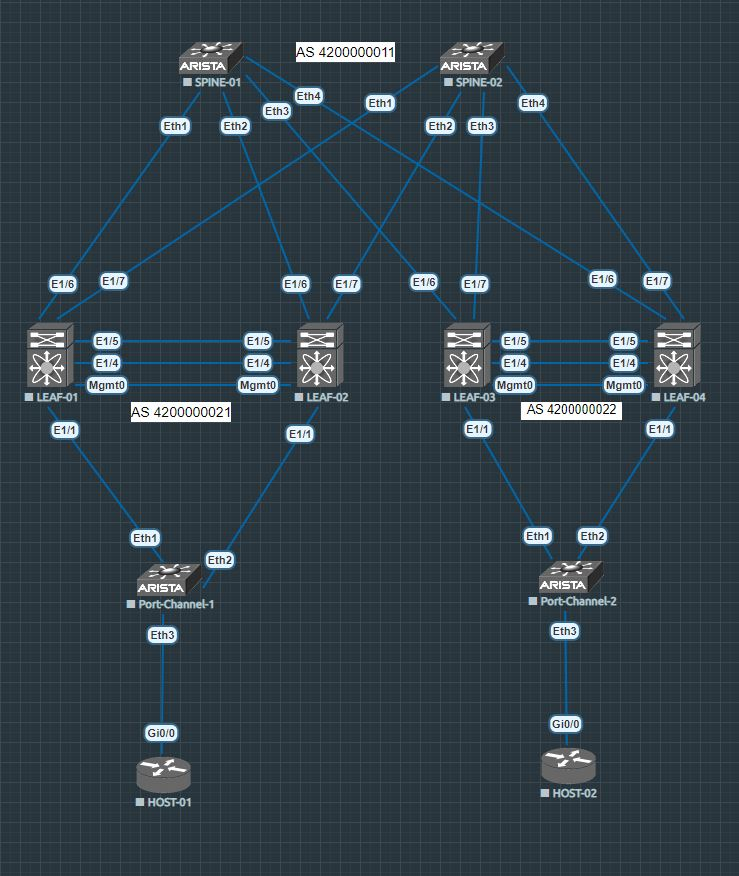
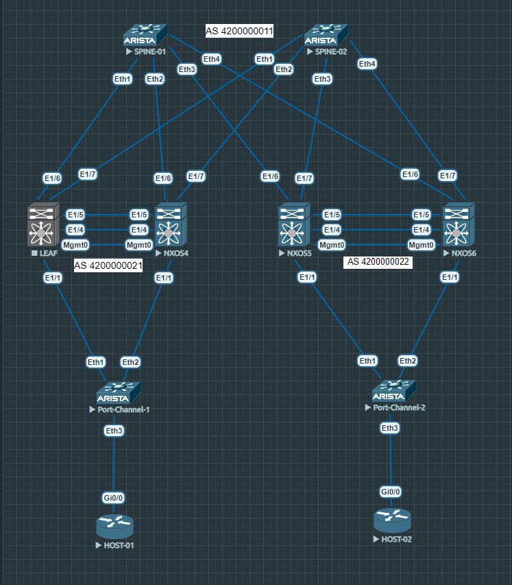

# VxLAN 3. VPC

## Цель:
* Настроить отказоустойчивое подключение клиентов с использованием VPC

*В этой самостоятельной работе мы ожидаем, что вы самостоятельно:*

* Подключите клиентов 2-я линками к различным Leaf
* Настроите агрегированный канал со стороны клиента
* Настроите VPC для работы в Overlay сети
* План работы, адресное пространство, схема сети, настройки - зафиксируете в документации

## План работы:

*Схема сети будет выглядеть так:*



_В этой схеме две аристы внизу (port-channel-1 и port-channel-2) нужны исключительно для настройки агрегированного канала, так как подружить Cisco vIOS Router с NXOS я в лабораторном стенде я не смог._

_Ниже два этих самых Cisco роутера (host-01 и host-02) играют роль клиентов, на них будут настроены Dot1Q интерфейсы с IP адресами для проверки связности._

_Две пары нексусов используем в качестве лифов, они будут собраны в VPC домены._

_Сверху две аристы выступают в качестве спайнов, на них будет настроено лишь ipv4 BGP соседство._

<br/>

## Приступим к настройкам

_Начнем со спайнов наверху, так как настройки идентичные (отличаются лишь IP адреса на интерфейсах Ethernet и loopback), то приведу пример настроек для spine-01_

```
localhost(config)#ip routing
localhost(config)#hostname spine-01
spine-01(config)#int eth 1
spine-01(config-if-Et1)#description leaf-1.1
spine-01(config-if-Et1)#no switchport
spine-01(config-if-Et1)#ip address 169.254.0.0/31
spine-01(config-if-Et1)#no shutdown
spine-01(config-if-Et1)#int eth 2
spine-01(config-if-Et2)#description leaf-1.2
spine-01(config-if-Et2)#no switchport
spine-01(config-if-Et2)#ip address 169.254.0.2/31
spine-01(config-if-Et2)#no shutdown
spine-01(config-if-Et2)#int eth 3
spine-01(config-if-Et3)#description leaf-2.1
spine-01(config-if-Et3)#no switchport
spine-01(config-if-Et3)#ip address 169.254.0.4/31
spine-01(config-if-Et3)#no shutdown
spine-01(config-if-Et3)#int eth 4
spine-01(config-if-Et4)#description leaf-2.2
spine-01(config-if-Et4)#no switchport
spine-01(config-if-Et4)#ip address 169.254.0.6/31
spine-01(config-if-Et4)#no shutdown
spine-01(config-if-Et4)#exit
spine-01(config)#peer-filter LEAF_AS_RANGE
result accept g-peer-filter-LEAF_AS_RANGE)#match as-range 4200000020-4200000030 result accept
spine-01(config-peer-filter-LEAF_AS_RANGE)#exit
spine-01(config)#interface loopback 0
spine-01(config-if-Lo0)#description router-id
spine-01(config-if-Lo0)#ip address 2.2.2.1/32
spine-01(config-if-Lo0)#exit
spine-01(config)#router bgp 4200000011
spine-01(config-router-bgp)#router-id 2.2.2.1
RLAY peer-filter LEAF_AS_RANGE  listen range 169.254.0.0/24 peer-group LEAF_UNDERLAY peer-filter LEAF_AS_RANGE
spine-01(config-router-bgp)#neighbor LEAF_UNDERLAY peer group
```

## **Теперь лифы**

_Для начала выполним базовые настройки и установим BGP соседство со спайнами в address-family ipv4 unicast (приведу пример для пары лифов leaf-1.1 и leaf-1.2, на leaf-2.1 и leaf-2.2 все идентично)_

* для leaf-1.1

```
switch(config)# hostname leaf-1.1
leaf-1.1(config)# feature vpc
leaf-1.1(config)# feature lacp
leaf-1.1(config)# feature bgp
leaf-1.1(config)# feature nv overlay
leaf-1.1(config)# feature vn-segment-vlan-based
leaf-1.1(config)# nv overlay evpn

leaf-1.1(config)# int eth 1/6
leaf-1.1(config-if)# description spine-01
leaf-1.1(config-if)# no switchport
leaf-1.1(config-if)# ip address 169.254.0.1/31
leaf-1.1(config-if)# no shutdown
leaf-1.1(config-if)# int eth 1/7
leaf-1.1(config-if)# description spine-02
leaf-1.1(config-if)# no switchport
leaf-1.1(config-if)# ip address 169.254.1.1/31
leaf-1.1(config-if)# no shutdown
leaf-1.1(config-if)# interface loopback 0
leaf-1.1(config-if)# description router-id
leaf-1.1(config-if)# ip address 3.3.3.1/32
leaf-1.1(config-if)# router bgp 4200000021
leaf-1.1(config-router)# router-id 3.3.3.1
leaf-1.1(config-router)# neighbor 169.254.0.0 remote-as 4200000011
leaf-1.1(config-router-neighbor)# address-family ipv4 unicast
leaf-1.1(config-router-neighbor-af)# neighbor 169.254.0.2 remote-as 4200000011
leaf-1.1(config-router-neighbor)# address-family ipv4 unicast
leaf-1.1(config-router-neighbor-af)# end
```

* для leaf-1.2

```
switch(config)# hostname leaf-1.2
leaf-1.2(config)# feature vpc
leaf-1.2(config)# feature lacp
leaf-1.2(config)# feature bgp
leaf-1.2(config)# feature nv overlay
leaf-1.2(config)# feature vn-segment-vlan-based
leaf-1.2(config)# nv overlay evpn

leaf-1.2(config)# int eth 1/6
leaf-1.2(config-if)# description spine-01
leaf-1.2(config-if)# no switchport
leaf-1.2(config-if)# ip address 169.254.0.3/31
leaf-1.2(config-if)# no shutdown
leaf-1.2(config-if)# int eth 1/7
leaf-1.2(config-if)# description spine-02
leaf-1.2(config-if)# no switchport
leaf-1.2(config-if)# ip address 169.254.1.3/31
leaf-1.2(config-if)# no shutdown
leaf-1.2(config-if)# interface loopback 0
leaf-1.2(config-if)# description router-id
leaf-1.2(config-if)# ip address 3.3.3.2/32
leaf-1.2(config-if)# router bgp 4200000021
leaf-1.2(config-router)# router-id 3.3.3.2
leaf-1.2(config-router)# neighbor 169.254.0.2 remote-as 4200000011
leaf-1.2(config-router-neighbor)# address-family ipv4 unicast
leaf-1.2(config-router-neighbor-af)# neighbor 169.254.1.2 remote-as 4200000011
leaf-1.2(config-router-neighbor)# address-family ipv4 unicast
leaf-1.2(config-router-neighbor-af)# end
```

_После этого видим, что в ipv4 соседство установилось_

```
spine-01#sh ip bgp summary
BGP summary information for VRF default
Router identifier 2.2.2.1, local AS number 4200000011
Neighbor Status Codes: m - Under maintenance
  Neighbor         V  AS           MsgRcvd   MsgSent  InQ OutQ  Up/Down State   PfxRcd PfxAcc
  169.254.0.1      4  4200000021         7         7    0    0 00:03:52 Estab   0      0
  169.254.0.3      4  4200000021         4         4    0    0 00:00:32 Estab   0      0
```

_Никакой маршрутной информацией мы пока не делились, так что счетчик префиксов равен нулю_

_После настройки второй пары лифов, снова проверим ipv4 соседство на спайнах_

```
spine-01#sh ip bgp summary
BGP summary information for VRF default
Router identifier 2.2.2.1, local AS number 4200000011
Neighbor Status Codes: m - Under maintenance
  Neighbor         V  AS           MsgRcvd   MsgSent  InQ OutQ  Up/Down State   PfxRcd PfxAcc
  169.254.0.1      4  4200000021        28        28    0    0 00:24:58 Estab   0      0
  169.254.0.3      4  4200000021        25        25    0    0 00:21:38 Estab   0      0
  169.254.0.5      4  4200000022         6         6    0    0 00:02:52 Estab   0      0
  169.254.0.7      4  4200000022         4         4    0    0 00:00:18 Estab   0      0
```

<br/>

## Пора переходить к настройке VPC домена на лифах

_Необходимые фичи мы уже включили вначале, так что осталось поднять сам VPC_

* для начала настроим mgmt интерфейсы, которые "смотрят друг на друга"

```
leaf-1.1(config)# interface mgmt 0
leaf-1.1(config-if)# ip address 10.0.0.1/30
leaf-1.1(config-if)# no shutdown
```

* после аналогичной настройки со стороны leaf-1.2 (там 10.0.0.2/30), можем проверить связность

```
leaf-1.1(config-if)# ping 10.0.0.2 vrf Management
PING 10.0.0.2 (10.0.0.2): 56 data bytes
36 bytes from 10.0.0.1: Destination Host Unreachable
Request 0 timed out
64 bytes from 10.0.0.2: icmp_seq=1 ttl=254 time=3.375 ms
64 bytes from 10.0.0.2: icmp_seq=2 ttl=254 time=1.982 ms
64 bytes from 10.0.0.2: icmp_seq=3 ttl=254 time=1.179 ms
64 bytes from 10.0.0.2: icmp_seq=4 ttl=254 time=1.684 ms

--- 10.0.0.2 ping statistics ---
5 packets transmitted, 4 packets received, 20.00% packet loss
round-trip min/avg/max = 1.179/2.055/3.375 ms
```

_На первой паре лифов мы будем использовать домен 10, а на второй домен 20. Нам понадобится настроить peer-keepalive для соседей, а также vpc peer-link между ними, который будет строиться на port-channel и состоять из двух Ethernet интерфейсов_

```
leaf-1.1(config)# vpc domain 10
leaf-1.1(config-vpc-domain)# role priority 10
leaf-1.1(config-vpc-domain)# peer-keepalive destination 10.0.0.2 source 10.0.0.1
leaf-1.1(config)# int eth 1/4-5
leaf-1.1(config-if-range)# description vpc-peer-link
leaf-1.1(config-if-range)# switchport
leaf-1.1(config-if-range)# channel-group 4 mode active
leaf-1.1(config-if-range)# no shutdown
leaf-1.1(config-if-range)# interface port-channel 4
leaf-1.1(config-if)# description vpc-peer-link (eth1/4-5)
leaf-1.1(config-if)# switchport mode trunk
leaf-1.1(config-if)# vpc peer-link
leaf-1.1(config-if)# no shutdown
leaf-1.1(config-if)# exit

leaf-1.1(config)# show vpc brief
Legend:
                (*) - local vPC is down, forwarding via vPC peer-link

vPC domain id                     : 10
Peer status                       : peer adjacency formed ok
vPC keep-alive status             : peer is alive
Configuration consistency status  : success
Per-vlan consistency status       : success
Type-2 consistency status         : success
vPC role                          : primary
Number of vPCs configured         : 0
Peer Gateway                      : Disabled
Dual-active excluded VLANs        : -
Graceful Consistency Check        : Enabled
Auto-recovery status              : Disabled
Delay-restore status              : Timer is off.(timeout = 30s)
Delay-restore SVI status          : Timer is on.(timeout = 10s, 6s left)
Operational Layer3 Peer-router    : Disabled
Virtual-peerlink mode             : Disabled

vPC Peer-link status
---------------------------------------------------------------------
id    Port   Status Active vlans
--    ----   ------ -------------------------------------------------
1     Po4    up     1
```

_Видим, что свитчи подружились, и VPC соседство успешно поднялось (настройки для leaf-1.2 идентичны)_

_Настроим VPC в сторону клиента_

* пример для leaf-1.1

```
leaf-1.1(config)# int eth 1/1
leaf-1.1(config-if)# description to-host-01
leaf-1.1(config-if)# switchport
leaf-1.1(config-if)# channel-group 10 mode active
leaf-1.1(config-if)# no shutdown
leaf-1.1(config-if)# interface port-channel 10
leaf-1.1(config-if)# description to-host-01
leaf-1.1(config-if)# switchport mode trunk
leaf-1.1(config-if)# vpc 10
leaf-1.1(config-if)# no shutdown
```

_После аналогичной настройки со стороны leaf-1.2, настраиваем port-channel со стороны Arista_

```
localhost(config)#vlan 10
localhost(config-vlan-10)#name CLIENT
localhost(config-vlan-10)#int eth 1-2
localhost(config-if-Et1-2)#description to-leafs
localhost(config-if-Et1-2)#switchport
localhost(config-if-Et1-2)#channel-group 4 mode active
localhost(config-if-Et1-2)#no shutdown
localhost(config-if-Et1-2)#interface port-Channel 4
localhost(config-if-Po4)#description to-leafs
localhost(config-if-Po4)#switchport mode trunk
localhost(config-if-Po4)#switchport trunk allowed vlan 10
localhost(config-if-Po4)#no shutdown
localhost(config-if-Po4)#end
```

_На этом моменте я вспомнил, что нужно добавить и разрешить vlan 10 со стороны лифов, исправляем это_

```
leaf-1.1(config)# vlan 10
leaf-1.1(config-vlan)# name CLIENT
leaf-1.1(config-vlan)# vn-segment 1010
leaf-1.1(config-vlan)# interface port-channel 10
leaf-1.1(config-if)# switchport trunk allowed vlan 10
leaf-1.1(config-if)# sh run int po 10

!Command: show running-config interface port-channel10
!Running configuration last done at: Fri Jan  6 08:43:16 2023
!Time: Fri Jan  6 08:43:23 2023

version 9.3(10) Bios:version

interface port-channel10
  description to-host-01
  switchport mode trunk
  switchport trunk allowed vlan 10
  vpc 10
```

_Vn-segment я настроил просто заранее для EVPN_

_На нексусах все поднялось_

```
leaf-1.1# sh vpc brief
Legend:
                (*) - local vPC is down, forwarding via vPC peer-link

vPC domain id                     : 10
Peer status                       : peer adjacency formed ok
vPC keep-alive status             : peer is alive
Configuration consistency status  : success
Per-vlan consistency status       : success
Type-2 consistency status         : success
vPC role                          : primary
Number of vPCs configured         : 1
Peer Gateway                      : Disabled
Dual-active excluded VLANs        : -
Graceful Consistency Check        : Enabled
Auto-recovery status              : Disabled
Delay-restore status              : Timer is off.(timeout = 30s)
Delay-restore SVI status          : Timer is off.(timeout = 10s)
Operational Layer3 Peer-router    : Disabled
Virtual-peerlink mode             : Disabled

vPC Peer-link status
---------------------------------------------------------------------
id    Port   Status Active vlans
--    ----   ------ -------------------------------------------------
1     Po4    up     1,10


vPC status
----------------------------------------------------------------------------
Id    Port          Status Consistency Reason                Active vlans
--    ------------  ------ ----------- ------                ---------------
10    Po10          up     success     success               10
```

_Проверяем, что на аристе тоже все поднялось_

```
localhost#sh int sta
Port       Name     Status       Vlan     Duplex Speed  Type            Flags Encapsulation
Et1        to-leafs connected    in Po4   full   10G    EbraTestPhyPort
Et2        to-leafs connected    in Po4   full   10G    EbraTestPhyPort
Et3                 connected    1        full   10G    EbraTestPhyPort
Et4                 connected    1        full   10G    EbraTestPhyPort
Et5                 connected    1        full   10G    EbraTestPhyPort
Et6                 connected    1        full   10G    EbraTestPhyPort
Et7                 connected    1        full   10G    EbraTestPhyPort
Et8                 connected    1        full   10G    EbraTestPhyPort
Ma1                 connected    routed   a-full a-1G   10/100/1000
Po4        to-leafs connected    trunk    full   20G    N/A
```

_Проделаем все тоже самое для второй пары лифов и аристы, а затем проверим_

```
leaf-2.1# sh vpc brief
Legend:
                (*) - local vPC is down, forwarding via vPC peer-link

vPC domain id                     : 20
Peer status                       : peer adjacency formed ok
vPC keep-alive status             : peer is alive
Configuration consistency status  : success
Per-vlan consistency status       : success
Type-2 consistency status         : success
vPC role                          : primary
Number of vPCs configured         : 1
Peer Gateway                      : Disabled
Dual-active excluded VLANs        : -
Graceful Consistency Check        : Enabled
Auto-recovery status              : Disabled
Delay-restore status              : Timer is off.(timeout = 30s)
Delay-restore SVI status          : Timer is off.(timeout = 10s)
Operational Layer3 Peer-router    : Disabled
Virtual-peerlink mode             : Disabled

vPC Peer-link status
---------------------------------------------------------------------
id    Port   Status Active vlans
--    ----   ------ -------------------------------------------------
1     Po4    up     1,10


vPC status
----------------------------------------------------------------------------
Id    Port          Status Consistency Reason                Active vlans
--    ------------  ------ ----------- ------                ---------------
10    Po10          up     success     success               10
```

<br/>

## Пришло время для настройки Overlay на лифах

_Для начала добавим второй интерфейс loopback для роли vtep, а также проанонсируем их в BGP. Первый нам понадобится для установления соседства на уровне Overlay, а со второго мы будем устанавливать NVE соседство_

```
leaf-1.1(config)# interface loopback 1
leaf-1.1(config-if)# description vtep
leaf-1.1(config-if)# ip address 1.1.1.10/32
leaf-1.1(config-if)# ip address 1.1.1.1/32 secondary

leaf-1.1(config)# ip prefix-list LOOPBACKS seq 5 permit 1.1.1.0/24 eq 32
leaf-1.1(config)# ip prefix-list LOOPBACKS seq 10 permit 3.3.3.0/24 eq 32
leaf-1.1(config)# route-map LOOPBACKS permit 10
leaf-1.1(config-route-map)# match ip address prefix-list LOOPBACKS
```

_Видим, что все нужные нам адреса стали известны_

```
leaf-1.1(config)# sh ip bgp
BGP routing table information for VRF default, address family IPv4 Unicast
BGP table version is 12, Local Router ID is 3.3.3.1
Status: s-suppressed, x-deleted, S-stale, d-dampened, h-history, *-valid, >-best
Path type: i-internal, e-external, c-confed, l-local, a-aggregate, r-redist, I-i
njected
Origin codes: i - IGP, e - EGP, ? - incomplete, | - multipath, & - backup, 2 - b
est2

   Network            Next Hop            Metric     LocPrf     Weight Path
*>r1.1.1.1/32         0.0.0.0                  0        100      32768 ?
* e1.1.1.2/32         169.254.1.0                                    0 420000001
1 4200000022 ?
*>e                   169.254.0.0                                    0 420000001
1 4200000022 ?
*>r1.1.1.10/32        0.0.0.0                  0        100      32768 ?
* e1.1.1.20/32        169.254.1.0                                    0 420000001
1 4200000022 ?
*>e                   169.254.0.0                                    0 420000001
1 4200000022 ?
* e1.1.1.21/32        169.254.1.0                                    0 420000001
1 4200000022 ?
*>e                   169.254.0.0                                    0 420000001
1 4200000022 ?
*>r3.3.3.1/32         0.0.0.0                  0        100      32768 ?
* e3.3.3.3/32         169.254.0.0                                    0 420000001
1 4200000022 ?
*>e                   169.254.1.0                                    0 420000001
1 4200000022 ?
* e3.3.3.4/32         169.254.1.0                                    0 420000001
1 4200000022 ?
*>e                   169.254.0.0                                    0 420000001
1 4200000022 ?
```

_Теперь можно устанавливать l2vpn EVPN соседство_

```
leaf-1.1(config)# router bgp 4200000021
leaf-1.1(config-router)# neighbor 3.3.3.3 remote-as 4200000022
leaf-1.1(config-router-neighbor)# ebgp-multihop 3
leaf-1.1(config-router-neighbor)# update-source loopback 0
leaf-1.1(config-router-neighbor)# address-family l2vpn evpn
leaf-1.1(config-router-neighbor-af)# send-community
leaf-1.1(config-router-neighbor-af)# send-community extended

leaf-1.1(config-router)# neighbor 3.3.3.4 remote-as 4200000022
leaf-1.1(config-router-neighbor)# ebgp-multihop 3
leaf-1.1(config-router-neighbor)# update-source loopback 0
leaf-1.1(config-router-neighbor)# address-family l2vpn evpn
leaf-1.1(config-router-neighbor-af)# send-community
leaf-1.1(config-router-neighbor-af)# send-community extended
leaf-1.1(config-router-neighbor-af)# end
```

_После выполнения аналогичных настроек на остальных трех лифах можем проверить соседство_

```
leaf-1.1# sh bgp l2vpn evpn summary
BGP summary information for VRF default, address family L2VPN EVPN
BGP router identifier 3.3.3.1, local AS number 4200000021
BGP table version is 4, L2VPN EVPN config peers 2, capable peers 2
0 network entries and 0 paths using 0 bytes of memory
BGP attribute entries [0/0], BGP AS path entries [0/0]
BGP community entries [0/0], BGP clusterlist entries [0/0]

Neighbor        V    AS MsgRcvd MsgSent   TblVer  InQ OutQ Up/Down  State/PfxRcd
3.3.3.3         4 4200000022
                              7      11        4    0    0 00:01:22 0
3.3.3.4         4 4200000022
                              6      10        4    0    0 00:00:29 0
```

_Теперь настроим EVPN и интерфейс NVE_

```
leaf-1.1(config)# evpn
leaf-1.1(config-evpn)# vni 1010 l2
leaf-1.1(config-evpn-evi)# rd 1.1.1.10:1010
leaf-1.1(config-evpn-evi)# route-target both 1010:10
leaf-1.1(config-evpn-evi)# end
```

```
leaf-1.1(config)# interface nve 1
leaf-1.1(config-if-nve)# host-reachability protocol bgp
leaf-1.1(config-if-nve)# source-interface loopback 1
leaf-1.1(config-if-nve)# member vni 1010
leaf-1.1(config-if-nve-vni)# ingress-replication protocol bgp
leaf-1.1(config-if-nve-vni)# exit
leaf-1.1(config-if-nve)# no shutdown
leaf-1.1(config-if-nve)# end
```

_Проверим анонсы в l2vpn EVPN_

```
leaf-1.1# sh bgp l2vpn evpn
BGP routing table information for VRF default, address family L2VPN EVPN
BGP table version is 15, Local Router ID is 3.3.3.1
Status: s-suppressed, x-deleted, S-stale, d-dampened, h-history, *-valid, >-best
Path type: i-internal, e-external, c-confed, l-local, a-aggregate, r-redist, I-i
njected
Origin codes: i - IGP, e - EGP, ? - incomplete, | - multipath, & - backup, 2 - b
est2

   Network            Next Hop            Metric     LocPrf     Weight Path
Route Distinguisher: 1.1.1.10:1010    (L2VNI 1010)
*>l[3]:[0]:[32]:[1.1.1.1]/88
                      1.1.1.1                           100      32768 i
* e[3]:[0]:[32]:[1.1.1.2]/88
                      1.1.1.2                                        0 420000002
2 i
*>e                   1.1.1.2                                        0 420000002
2 i

Route Distinguisher: 1.1.1.20:1010
*>e[3]:[0]:[32]:[1.1.1.2]/88
                      1.1.1.2                                        0 420000002
2 i

Route Distinguisher: 1.1.1.21:1010
*>e[3]:[0]:[32]:[1.1.1.2]/88
                      1.1.1.2                                        0 420000002
2 i
```

<br/>

## Осталось всего лишь настроить клиентов

_Это хосты host-01 и host-02_

* для host-01

```
Router#conf t
Router(config)#int gigabitEthernet 0/0
Router(config-if)#no shutdown
Router(config-if)#exit
Router(config)#interface gigabitEthernet 0/0.10
Router(config-subif)#encapsulation dot1Q 10
Router(config-subif)#ip address 192.168.0.1 255.255.255.0
Router(config-subif)#end
```

* для host-02

```
Router#conf t
Router(config)#int gigabitEthernet 0/0
Router(config-if)#no shutdown
Router(config-if)#exit
Router(config)#interface gigabitEthernet 0/0.10
Router(config-subif)#encapsulation dot1Q 10
Router(config-subif)#ip address 192.168.0.2 255.255.255.0
Router(config-subif)#end
```

<br/>

## После этого все должно заработать_

<br/>

```
Router#ping 192.168.0.2
Type escape sequence to abort.
Sending 5, 100-byte ICMP Echos to 192.168.0.2, timeout is 2 seconds:
.!!!!
Success rate is 80 percent (4/5), round-trip min/avg/max = 13/17/23 ms

Router#ping 192.168.0.1
Type escape sequence to abort.
Sending 5, 100-byte ICMP Echos to 192.168.0.1, timeout is 2 seconds:
!!!!!
Success rate is 100 percent (5/5), round-trip min/avg/max = 12/14/22 ms
```

_Снова проверим анонсы по l2vpn EVPN на лифах_

```
leaf-1.1# sh bgp l2vpn evpn
BGP routing table information for VRF default, address family L2VPN EVPN
BGP table version is 20, Local Router ID is 3.3.3.1
Status: s-suppressed, x-deleted, S-stale, d-dampened, h-history, *-valid, >-best
Path type: i-internal, e-external, c-confed, l-local, a-aggregate, r-redist, I-i
njected
Origin codes: i - IGP, e - EGP, ? - incomplete, | - multipath, & - backup, 2 - b
est2

   Network            Next Hop            Metric     LocPrf     Weight Path
Route Distinguisher: 1.1.1.10:1010    (L2VNI 1010)
*>l[2]:[0]:[0]:[48]:[5010.0007.0000]:[0]:[0.0.0.0]/216
                      1.1.1.1                           100      32768 i
* e[2]:[0]:[0]:[48]:[5010.0008.0000]:[0]:[0.0.0.0]/216
                      1.1.1.2                                        0 420000002
2 i
*>e                   1.1.1.2                                        0 420000002
2 i
*>l[3]:[0]:[32]:[1.1.1.1]/88
                      1.1.1.1                           100      32768 i
* e[3]:[0]:[32]:[1.1.1.2]/88
                      1.1.1.2                                        0 420000002
2 i
*>e                   1.1.1.2                                        0 420000002
2 i

Route Distinguisher: 1.1.1.20:1010
*>e[2]:[0]:[0]:[48]:[5010.0008.0000]:[0]:[0.0.0.0]/216
                      1.1.1.2                                        0 420000002
2 i
*>e[3]:[0]:[32]:[1.1.1.2]/88
                      1.1.1.2                                        0 420000002
2 i

Route Distinguisher: 1.1.1.21:1010
*>e[2]:[0]:[0]:[48]:[5010.0008.0000]:[0]:[0.0.0.0]/216
                      1.1.1.2                                        0 420000002
2 i
*>e[3]:[0]:[32]:[1.1.1.2]/88
                      1.1.1.2                                        0 420000002
2 i

leaf-1.1# sh bgp l2vpn evpn summary
BGP summary information for VRF default, address family L2VPN EVPN
BGP router identifier 3.3.3.1, local AS number 4200000021
BGP table version is 20, L2VPN EVPN config peers 2, capable peers 2
8 network entries and 10 paths using 1712 bytes of memory
BGP attribute entries [5/860], BGP AS path entries [1/6]
BGP community entries [0/0], BGP clusterlist entries [0/0]

Neighbor        V    AS MsgRcvd MsgSent   TblVer  InQ OutQ Up/Down  State/PfxRcd
3.3.3.3         4 4200000022
                             38      41       20    0    0 00:23:38 2
3.3.3.4         4 4200000022
                             38      38       20    0    0 00:22:45 2
leaf-1.1# ^C
leaf-1.1# sh nve peers
Interface Peer-IP                                 State LearnType Uptime   Route
r-Mac
--------- --------------------------------------  ----- --------- -------- -----
------------
nve1      1.1.1.2                                 Up    CP        00:26:23 n/a
```

<br/>

## Так как мы тут настраивали VPC, то для наглядности протестируем падение primary VPC ноды в левой паре лифов (leaf-1.1 и leaf-1.2)

* Выключаем ноду



<br/>

* Ждем какое-то время, затем смотрим на leaf-1.2 состояние VPC домена_

```
leaf-1.2# show vpc brief
Legend:
                (*) - local vPC is down, forwarding via vPC peer-link

vPC domain id                     : 10
Peer status                       : peer link is down
vPC keep-alive status             : Suspended (Destination IP not reachable)
Configuration consistency status  : success
Per-vlan consistency status       : success
Type-2 consistency status         : success
vPC role                          : secondary, operational primary
Number of vPCs configured         : 1
Peer Gateway                      : Disabled
Dual-active excluded VLANs        : -
Graceful Consistency Check        : Enabled
Auto-recovery status              : Disabled
Delay-restore status              : Timer is off.(timeout = 30s)
Delay-restore SVI status          : Timer is off.(timeout = 10s)
Operational Layer3 Peer-router    : Disabled
Virtual-peerlink mode             : Disabled

vPC Peer-link status
---------------------------------------------------------------------
id    Port   Status Active vlans
--    ----   ------ -------------------------------------------------
1     Po4    down   -


vPC status
----------------------------------------------------------------------------
Id    Port          Status Consistency Reason                Active vlans
--    ------------  ------ ----------- ------                ---------------
10    Po10          up     success     success               10
```

_Смотрим статусы портов_

```
Eth1/4        vpc-peer-link      suspended trunk     auto    auto    10g
Eth1/5        vpc-peer-link      suspended trunk     auto    auto    10g

Port          Name               Status    Vlan      Duplex  Speed   Type
--------------------------------------------------------------------------------
Po4           vpc-peer-link (Eth noOperMem trunk     auto    auto    --
Po10          to-host-01         connected trunk     full    1000    --
```

_Видим, что secondary нода стала operational primary, а также вывела интерфейсы в suspended, однако связность host-01 и host-02 восстановилась спустя некоторое время_

```
Router#ping 192.168.0.2
Type escape sequence to abort.
Sending 5, 100-byte ICMP Echos to 192.168.0.2, timeout is 2 seconds:
.....
Success rate is 0 percent (0/5)
Router#ping 192.168.0.2
Type escape sequence to abort.
Sending 5, 100-byte ICMP Echos to 192.168.0.2, timeout is 2 seconds:
!!!!!
Success rate is 100 percent (5/5), round-trip min/avg/max = 13/16/25 ms
```

_Во всем остальном падение leaf-1.1 никого больше не коснулось, за исключением того, что анонс адреса 1.1.1.10 пропал из таблиц маршрутизации_


