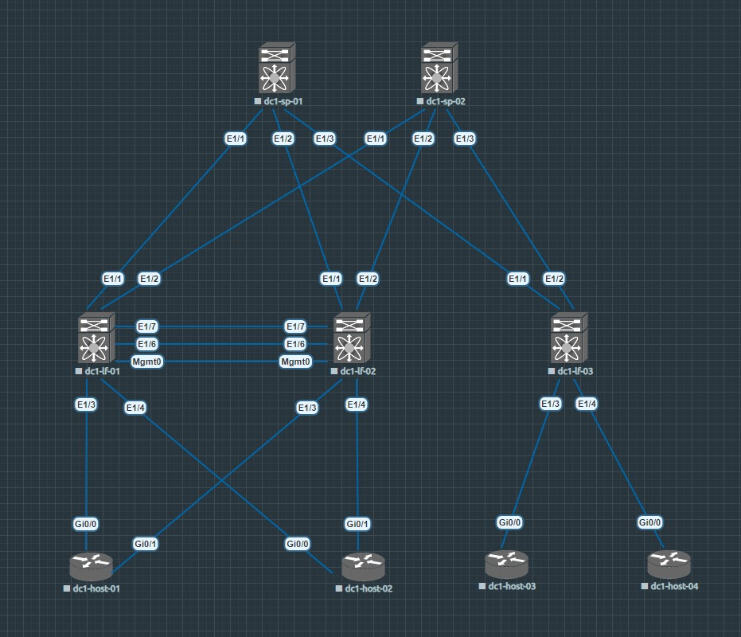
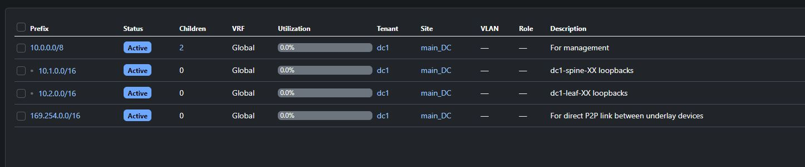
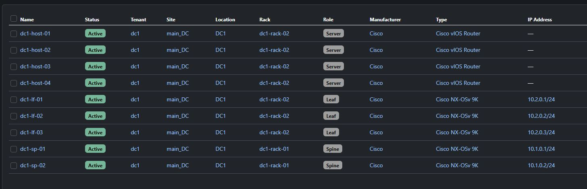

# Домашняя работа __Дизайн сетей ЦОД__

## Проектирование адресного пространства

_В этой домашней работе я моделирую вымышленный ЦОД и подключаю устройства, следуя архитектуре фабрики CLOS, иными словами LEAF - SPINE. По размерам, естественно это никакой ЦОД не напоминает, разые что micro POD (point of delivery)_

### Топология __CLOS__

_На схеме выше у нас 4 хоста, 3 лифа и два спайна. Лифы dc1-lf-01 и dc1-lf-02 находятся друг с другом в VPC паре, то есть для хостов dc1-host-01 и dc1-host-02 выступают в роли одного логического устройства. Хосты dc1-host-03 и dc1-host-04 подключены к одному лифу - dc1-lf-03_

### Адресное пространство или IP план для __Underlay__

_Выше я спроектировал типовой IP план для очень небольшой фабрики. Документацию веду в NetBox_

### Список устройств 

_Список устройств также представлен в NetBox_

### Таким образом первоначальное проектирование нашего мини ЦОДа было выполнено