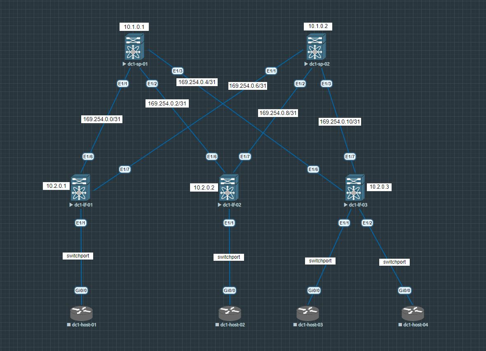

# Underlay. OSPF
## **Цель:**
_Настроить **OSPF** для **Underlay** сети_

_В этой самостоятельной работе мы ожидаем, что вы самостоятельно:_
- настроите OSPF в Underlay сети, для IP связности между всеми устройствами NXOS
- составите план работы, адресное пространство, схему сети, настройки
  
## **План работы**
_На интерфейсах между __Underlay__ устройствами будем использовать __/31__ адреса. На лупбеке присвоим __/32__ адрес_

### **Со стороны спайнов**

* _Настроим интерфейсы_ (пример для dc1-sp-01)
```
interface Ethernet1/1
  description dc1-lf-01 Eth1/6
  no switchport
  no ip redirects
  ip address 169.254.0.0/31
  no shutdown
```
```
interface Ethernet1/2
  description dc1-lf-02 Eth1/6
  no switchport
  no ip redirects
  ip address 169.254.0.2/31
  no shutdown
```
```
interface Ethernet1/3
  description dc1-lf-03 Eth1/6
  no switchport
  no ip redirects
  ip address 169.254.0.4/31
  no shutdown
```
Loopback 0
```
interface loopback0
  ip address 10.1.0.1/32
```
* _Аналогично настроим на_ dc1-sp-02 (отличаться будут лишь последние октеты в IP адресе)

### **Со стороны лифов**

* _Настроим интерфейсы_ (пример для dc1-lf-01)
```
interface Ethernet1/6
  description dc1-sp-01 Eth1/1
  no switchport
  no ip redirects
  ip address 169.254.0.1/31
  no shutdown
```
```
interface Ethernet1/7
  description dc1-sp-02 Eth1/1
  no switchport
  no ip redirects
  ip address 169.254.0.7/31
  no shutdown
```
* _Аналогично настроим на_ dc1-lf-02 и dc1-lf-03 (отличаться будут лишь последние октеты в IP адресе)

### **Проверим базовую IP связность по протоколу ICMP между dc1-sp-01 и dc1-lf-01**

```
dc1-sp-01# ping 169.254.0.1
PING 169.254.0.1 (169.254.0.1): 56 data bytes
64 bytes from 169.254.0.1: icmp_seq=0 ttl=254 time=11.236 ms
64 bytes from 169.254.0.1: icmp_seq=1 ttl=254 time=2.171 ms
64 bytes from 169.254.0.1: icmp_seq=2 ttl=254 time=2.934 ms
64 bytes from 169.254.0.1: icmp_seq=3 ttl=254 time=2.229 ms
64 bytes from 169.254.0.1: icmp_seq=4 ttl=254 time=2.407 ms

--- 169.254.0.1 ping statistics ---
5 packets transmitted, 5 packets received, 0.00% packet loss
round-trip min/avg/max = 2.171/4.195/11.236 ms
```

___Теперь нужно настроить IP связность между всеми Underlay устройствами с помощью протокола OSPF___
* _Включаем функцию OSPF на NXOS, создаем OSPF instance и назначаем Router-id_ (пример для dc1-sp-01)
```
feature ospf
router ospf Underlay
  router-id 10.1.0.1
```
* _Включаем логирование **OSPF** состояний соседства, а также уводим по умолчанию все порты в **passive default**_
```
log-adjacency-changes
passive-interface default
```
* _Далее точечно разрешаем обмениваться маршрутной информацией и включаем интерфейсы в **area 0**_ (пример для dc1-sp-1). _Для этого добавляем эти две строчки в конфигурацию всех L3 интерфейсов_ (кроме loopback 0, там только вторую)
```
  no ip ospf passive-interface
  ip router ospf Underlay area 0.0.0.0
```

### **Теперь можем посмотреть соседства и таблицу маршрутизации для OSPF instance**

```
dc1-sp-01(config-router)# show ip ospf neighbors
 OSPF Process ID Underlay VRF default
 Total number of neighbors: 3
 Neighbor ID     Pri State            Up Time  Address         Interface
 10.2.0.1          1 FULL/DR          00:28:41 169.254.0.1     Eth1/1
 10.2.0.2          1 FULL/DR          00:29:09 169.254.0.3     Eth1/2
 10.2.0.3          1 FULL/DR          00:29:14 169.254.0.5     Eth1/3
```
```
dc1-sp-01(config-router)# sh ip route ospf-Underlay
IP Route Table for VRF "default"
'*' denotes best ucast next-hop
'**' denotes best mcast next-hop
'[x/y]' denotes [preference/metric]
'%<string>' in via output denotes VRF <string>

10.1.0.2/32, ubest/mbest: 3/0
    *via 169.254.0.1, Eth1/1, [110/81], 00:29:34, ospf-Underlay, intra
    *via 169.254.0.3, Eth1/2, [110/81], 00:30:02, ospf-Underlay, intra
    *via 169.254.0.5, Eth1/3, [110/81], 00:30:02, ospf-Underlay, intra
10.2.0.1/32, ubest/mbest: 1/0
    *via 169.254.0.1, Eth1/1, [110/41], 00:29:34, ospf-Underlay, intra
10.2.0.2/32, ubest/mbest: 1/0
    *via 169.254.0.3, Eth1/2, [110/41], 00:30:02, ospf-Underlay, intra
10.2.0.3/32, ubest/mbest: 1/0
    *via 169.254.0.5, Eth1/3, [110/41], 00:30:02, ospf-Underlay, intra
169.254.0.6/31, ubest/mbest: 1/0
    *via 169.254.0.1, Eth1/1, [110/80], 00:29:34, ospf-Underlay, intra
169.254.0.8/31, ubest/mbest: 1/0
    *via 169.254.0.3, Eth1/2, [110/80], 00:30:02, ospf-Underlay, intra
169.254.0.10/31, ubest/mbest: 1/0
    *via 169.254.0.5, Eth1/3, [110/80], 00:30:02, ospf-Underlay, intra
```
___На остальных аналогично___

_Теперь попробуем проверить IP связность между_ **dc1-lf-01** и **dc1-lf-03** _(между которыми нет прямого линка) через loopback интерфейсы_
* Для этого выполним команду **Ping**
```
dc1-lf-01# ping 10.2.0.3 source 10.2.0.1
PING 10.2.0.3 (10.2.0.3) from 10.2.0.1: 56 data bytes
64 bytes from 10.2.0.3: icmp_seq=0 ttl=253 time=16.037 ms
64 bytes from 10.2.0.3: icmp_seq=1 ttl=253 time=4.826 ms
64 bytes from 10.2.0.3: icmp_seq=2 ttl=253 time=10.998 ms
64 bytes from 10.2.0.3: icmp_seq=3 ttl=253 time=5.952 ms
64 bytes from 10.2.0.3: icmp_seq=4 ttl=253 time=5.185 ms

--- 10.2.0.3 ping statistics ---
5 packets transmitted, 5 packets received, 0.00% packet loss
round-trip min/avg/max = 4.826/8.599/16.037 ms
```
_Как видим, между всеми **Underlay** устройствами появилась IP связность благодаря настроенному протоколу **OSPF**_

_Топология_ **Underlay** _с указанием адресации на устройствах_ (включая loopback) 

_Полные конфиги устройств лежат_ [здесь](https://github.com/dontmesswithnets/study_otus/tree/main/home_work_2/configs)
