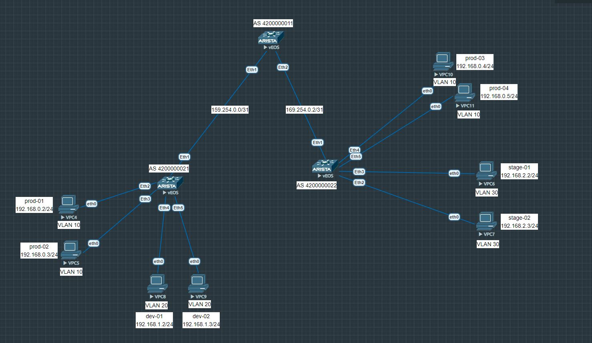
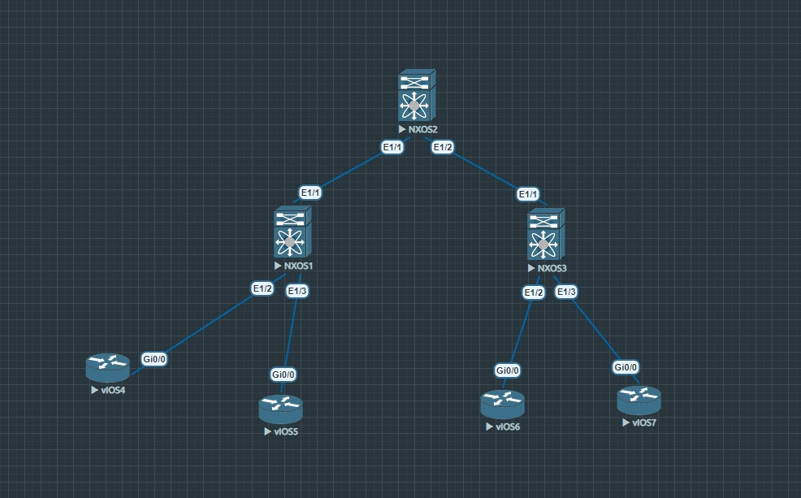

# VxLAN. EVPN L3
## **Цель:**
_Настроить Overlay на основе __VxLAN EVPN__ для L3 связанности между клиентами_

_В этой самостоятельной работе мы ожидаем, что вы самостоятельно:_
* Настроите каждого клиента в своем VNI
* Настроите маршрутизацию между клиентами

_Для решения этой задачи я немного обновил нашу схему, выглядит она так_



_На схеме выше у нас 2 VTEP'а, это leaf-01 и leaf-02. Слева у нас два влана и по два хоста в каждом из них. Справа также два влана, в которых по два хоста. Хосты в пределах одного влана за одним VTEP должны общаться между через switchport интерфейсы без вмешательства Vxlan, хосты в разных вланах, но за одним VTEP должны общаться через SVI интерфейсы. Хосты в одном влане, но за разными VTEP должны общаться через L2VNI EVPN, а хосты в разных вланах и за разными VTEP должны общаться через L3VNI EVPN_

<br/>

## План работы

<br/>

_На данный момент ethernet интерфейсы и loopback настроены аналогично предыдущей_ [лабе](https://github.com/dontmesswithnets/study_otus/tree/main/home_work_5)

_Интерфейсы на leaf-01, которые смотрят на хосты настроены в режиме switchport mode access и находятся в вланах 10 и 20, соответственно. Интерфейсы на leaf-02 настроены аналогично, кроме вланов - там 10 и 30. Все остальные порты, включая на spine-01, настроены в режиме L3 и имеют адресацию /31_

_Сейчас видим, что prod-01 может пинговать prod-02, так как они находятся в одном широковещательном домене, организованном через vlan 10_

```
PC1 : 192.168.0.2 255.255.255.0 gateway 192.168.0.1

VPCS> ping 192.168.0.3

84 bytes from 192.168.0.3 icmp_seq=1 ttl=64 time=9.704 ms
84 bytes from 192.168.0.3 icmp_seq=2 ttl=64 time=8.482 ms
84 bytes from 192.168.0.3 icmp_seq=3 ttl=64 time=15.347 ms
84 bytes from 192.168.0.3 icmp_seq=4 ttl=64 time=8.611 ms
84 bytes from 192.168.0.3 icmp_seq=5 ttl=64 time=8.514 ms
```

_На остальных хостах ситуация аналогичная. Далее для того, чтобы организовать L2 связность между prod-01/02 и prod-03/04 необходимо настроить маршрутизацию между VTEP. Для этого настроим Underlay и Overlay EBGP между ними. Тут мы настраиваем как в предыдущей лабе "L2VNI"_

* На leaf-01

```
ip prefix-list LOOPBACKS seq 5 permit 1.1.1.0/24 le 32

route-map LOOPBACKS permit 10
   match ip address prefix-list LOOPBACKS

interface Vxlan1
   vxlan source-interface Loopback0
   vxlan udp-port 4789
   vxlan vlan 10 vni 10010
   vxlan vlan 20 vni 10020

router bgp 4200000021
   router-id 1.1.1.2
   neighbor SPINE_OVERLAY peer group
   neighbor SPINE_OVERLAY update-source Loopback0
   neighbor SPINE_OVERLAY ebgp-multihop 2
   neighbor SPINE_OVERLAY send-community
   neighbor SPINE_UNDERLAY peer group
   neighbor 1.1.1.1 peer group SPINE_OVERLAY
   neighbor 1.1.1.1 remote-as 4200000011
   neighbor 169.254.0.0 peer group SPINE_UNDERLAY
   neighbor 169.254.0.0 remote-as 4200000011
   redistribute connected route-map LOOPBACKS
   !
   vlan 10
      rd 1.1.1.2:10010
      route-target both 1:10010
      redistribute learned
   !
   vlan 20
      rd 1.1.1.2:10020
      route-target both 1:10020
      redistribute learned
   !
   address-family evpn
      neighbor SPINE_OVERLAY activate
   !
   address-family ipv4
      no neighbor SPINE_OVERLAY activate
```

* На leaf-02

```
ip prefix-list LOOPBACKS seq 5 permit 1.1.1.0/24 le 32

route-map LOOPBACKS permit 10
   match ip address prefix-list LOOPBACKS

interface Vxlan1
   vxlan source-interface Loopback0
   vxlan udp-port 4789
   vxlan vlan 10 vni 10010
   vxlan vlan 30 vni 10030

router bgp 4200000022
   router-id 1.1.1.3
   neighbor SPINE_OVERLAY peer group
   neighbor SPINE_OVERLAY update-source Loopback0
   neighbor SPINE_OVERLAY ebgp-multihop 2
   neighbor SPINE_OVERLAY send-community
   neighbor SPINE_UNDERLAY peer group
   neighbor 1.1.1.1 peer group SPINE_OVERLAY
   neighbor 1.1.1.1 remote-as 4200000011
   neighbor 169.254.0.2 peer group SPINE_UNDERLAY
   neighbor 169.254.0.2 remote-as 4200000011
   redistribute connected route-map LOOPBACKS
   !
   vlan 10
      rd 1.1.1.3:10010
      route-target both 1:10010
      redistribute learned
   !
   vlan 30
      rd 1.1.1.2:10030
      route-target both 1:10030
      redistribute learned
   !
   address-family evpn
      neighbor SPINE_OVERLAY activate
   !
   address-family ipv4
      no neighbor SPINE_OVERLAY activate
```

* На spine-01

```
ip prefix-list LOOPBACKS seq 5 permit 1.1.1.0/24 le 32

mpls ip

route-map LOOPBACKS permit 10
   match ip address prefix-list LOOPBACKS

peer-filter LEAF_AS_RANGE
   10 match as-range 4200000000-4200000099 result accept

router bgp 4200000011
   router-id 1.1.1.1
   bgp listen range 1.1.1.0/24 peer-group LEAF_OVERLAY peer-filter LEAF_AS_RANGE
   bgp listen range 169.254.0.0/24 peer-group LEAF_UNDERLAY peer-filter LEAF_AS_RANGE
   neighbor LEAF_OVERLAY peer group
   neighbor LEAF_OVERLAY update-source Loopback0
   neighbor LEAF_OVERLAY ebgp-multihop 2
   neighbor LEAF_OVERLAY send-community
   neighbor LEAF_UNDERLAY peer group
   redistribute connected route-map LOOPBACKS
   
   address-family evpn
      neighbor LEAF_OVERLAY activate
   
   address-family ipv4
      no neighbor LEAF_OVERLAY activate
```

_После этого можно проверять связность хостов в одном влане, но за разными VTEP'ами_

```
VPCS> ping 192.168.0.4

84 bytes from 192.168.0.4 icmp_seq=1 ttl=64 time=20.128 ms
84 bytes from 192.168.0.4 icmp_seq=2 ttl=64 time=22.582 ms
84 bytes from 192.168.0.4 icmp_seq=3 ttl=64 time=28.212 ms
84 bytes from 192.168.0.4 icmp_seq=4 ttl=64 time=35.310 ms
84 bytes from 192.168.0.4 icmp_seq=5 ttl=64 time=35.010 ms
```

_Теперь на очереди создание VRF и SVI-интерфейсов. Тут необходимо отметить, что у SVI-интерфейсов будут виртуальные IP адреса, а также один виртуальный MAC адрес на весь MLS коммутатор. Нужно это для того, чтобы на ARP запросы хостов коммуаторы отвечали с одними и теми же IP/MAC. В сценарии миграции ВМ в пределах фабрики это будет необходимо для "бесшовного" переезда_

* На leaf-01

```
leaf-01(config)#vrf instance clients
leaf-01(config-vrf-clients)#ip routing vrf clients

leaf-01(config)#interface vlan 10
leaf-01(config-if-Vl10)#vrf clients
leaf-01(config-if-Vl10)#ip address virtual 192.168.0.1/24

leaf-01(config)#int vlan 20
leaf-01(config-if-Vl20)#vrf clients
leaf-01(config-if-Vl20)#ip address virtual 192.168.1.1/24

leaf-01(config)#ip virtual-router mac-address 00:00:11:11:22:22
```

* На leaf-02

```
leaf-02(config)#vrf instance clients
leaf-02(config-vrf-clients)#ip routing vrf clients

leaf-02(config)#interface vlan 10
leaf-02(config-if-Vl10)#vrf clients
leaf-02(config-if-Vl10)#ip address virtual 192.168.0.1/24

leaf-02(config-if-Vl10)#interface vlan 30
leaf-02(config-if-Vl30)#vrf clients
leaf-02(config-if-Vl30)#ip address virtual 192.168.2.1/24

leaf-02(config)#ip virtual-router mac-address 00:00:11:11:22:22
```

_Проверяем, что связь между разными вланами в пределах одного VTEP появилась_

```
VPCS> ping 192.168.1.2

84 bytes from 192.168.1.2 icmp_seq=1 ttl=63 time=12.850 ms
84 bytes from 192.168.1.2 icmp_seq=2 ttl=63 time=7.867 ms
84 bytes from 192.168.1.2 icmp_seq=3 ttl=63 time=7.774 ms
84 bytes from 192.168.1.2 icmp_seq=4 ttl=63 time=8.882 ms
84 bytes from 192.168.1.2 icmp_seq=5 ttl=63 time=8.187 ms
```

_Теперь осталось настроить L3 VNI. Для этого добавляем привязку VRF к номеру L3 VNI, затем добавляем IP-VRF в конфигурацию BGP_

* На leaf-01

```
leaf-01(config)#interface vxlan 1
leaf-01(config-if-Vx1)#vxlan vrf clients vni 5000
leaf-01(config-if-Vx1)#exit
leaf-01(config)#router bgp 4200000021
leaf-01(config-router-bgp)#vrf clients
leaf-01(config-router-bgp-vrf-clients)#rd 1.1.1.2:5000
leaf-01(config-router-bgp-vrf-clients)#route-target export evpn 1:5000
leaf-01(config-router-bgp-vrf-clients)#route-target import evpn 1:5000
leaf-01(config-router-bgp-vrf-clients)#end
```

* На leaf-02

```
leaf-02(config)#int vxlan 1
leaf-02(config-if-Vx1)#vxlan vrf clients vni 5000
leaf-02(config-if-Vx1)#exit
leaf-02(config)#router bgp 4200000022
leaf-02(config-router-bgp)#vrf clients
leaf-02(config-router-bgp-vrf-clients)#rd 1.1.1.3:5000
leaf-02(config-router-bgp-vrf-clients)#route-target export evpn 1:5000
leaf-02(config-router-bgp-vrf-clients)#route-target import evpn 1:5000
leaf-02(config-router-bgp-vrf-clients)#end
```

_Теперь можно проверить, что связность между хостами в разных вланах и разных VTEP появилась_

```
VPCS> ping 192.168.2.2

192.168.2.2 icmp_seq=1 timeout
84 bytes from 192.168.2.2 icmp_seq=2 ttl=62 time=32.456 ms
84 bytes from 192.168.2.2 icmp_seq=3 ttl=62 time=28.968 ms
84 bytes from 192.168.2.2 icmp_seq=4 ttl=62 time=27.173 ms
84 bytes from 192.168.2.2 icmp_seq=5 ttl=62 time=25.167 ms
```

_Таким образом мы настроили L3VNI EVPN в рамках нашего вымышленного ЦОД, состоящим из 8 VPCS, 1 SPINE и 2 LEAF_

Конфигурация устройств [здесь](https://github.com/dontmesswithnets/study_otus/tree/main/home_work_6/configs_arista)

<br/>

## Тоже самое на NXOS 9K

### Схему немного упростим, уменьшим количество хостов в два раза, а также используем Cisco vIOS роутеры вместо VPCS, линки от лифов до хостов настроим в режиме trunk



_Первым делом настроим хосты, затем создадим нужные вланы и разрешим их в транке до хостов_

_На схеме у нас 4 хоста, идем слева направо, первый в vlan 10, второй в vlan 20, третий в vlan 10, четвертый в vlan 30_

_Как и в случае с Arista первый и второй будут общаться через SVI интерфейсы, первый и третий через L2VNI, а первый и четвертый через L3VNI_

_Первый и третий в одном широковещателньом домене, во всех остальных случаях хосты должны идти через шлюз по умолчанию_

_Приведу пример настройки одного из хостов, на остальных все ровно аналогично, за исключением IP адреса в полсденем октете_

* для host-01

```
Router>en
Router#conf t
Router(config)#hostname host-01
host-01(config)#int gig 0/0
host-01(config-if)#no shutdown
host-01(config-if)#exit
host-01(config)#int gig 0/0.10
host-01(config-subif)#encapsulation dot1Q 10
host-01(config-subif)#ip address 192.168.0.100 255.255.255.0
host-01(config-subif)#exit
host-01(config)#ip route 0.0.0.0 0.0.0.0 192.168.0.1
host-01(config)#end
```

_Начнем с того, что настроим связность между host-01 и host-02 через L2VNI_

* необходимые фичи

```
leaf-01(config)# feature bgp
leaf-01(config)# feature nv overlay
leaf-01(config)# feature vn-segment-vlan-based
leaf-01(config)# feature interface-vlan
leaf-01(config)# feature fabric forwarding
leaf-01(config)# nv overlay evpn
```

* vlan'ы, порты, лупбеки

```
leaf-01(config)# vlan 10
leaf-01(config-vlan)# vn-segment 100
leaf-01(config-vlan)# name PROD
leaf-01(config-vlan)# vlan 20
leaf-01(config-vlan)# vn-segment 200
leaf-01(config-vlan)# name DEV
leaf-01(config-vlan)# interface eth 1/1
leaf-01(config-if)# no switchport
leaf-01(config-if)# no shutdown
leaf-01(config-if)# ip address 169.254.0.1/31
leaf-01(config-if)# description spine-01
leaf-01(config-if)# interface eth 1/2
leaf-01(config-if)# switchport
leaf-01(config-if)# switchport mode trunk
leaf-01(config-if)# switchport trunk allowed vlan 10
leaf-01(config-if)# description host-01
leaf-01(config-if)# no shutdown
leaf-01(config-if)# int eth 1/3
leaf-01(config-if)# switchport
leaf-01(config-if)# switchport mode trunk
leaf-01(config-if)# switchport trunk allowed vlan 20
leaf-01(config-if)# description host-02
leaf-01(config-if)# no shutdown
leaf-01(config-if)# interface loopback 0
leaf-01(config-if)# description router-id
leaf-01(config-if)# ip address 2.2.2.2/32
leaf-01(config-if)# no shutdown
leaf-01(config-if)# interface loopback 1
leaf-01(config-if)# description vtep
leaf-01(config-if)# ip address 2.2.2.20/32
leaf-01(config-if)# no shutdown
```

* на leaf-02

```
leaf-02(config)# vlan 10
leaf-02(config-vlan)# vn-segment 100
leaf-02(config-vlan)# name PROD
leaf-02(config-vlan)# vlan 30
leaf-02(config-vlan)# vn-segment 300
leaf-02(config-vlan)# name STAGE
leaf-02(config-vlan)# interface eth 1/1
leaf-02(config-if)# no switchport
leaf-02(config-if)# no shutdown
leaf-02(config-if)# ip address 169.254.0.3/31
leaf-02(config-if)# description spine-01
leaf-02(config-if)# int eth 1/2
leaf-02(config-if)# switchport
leaf-02(config-if)# switchport mode trunk
leaf-02(config-if)# switchport trunk allowed vlan 10
leaf-02(config-if)# description host-03
leaf-02(config-if)# no shutdown
leaf-02(config-if)# int eth 1/3
leaf-02(config-if)# switchport
leaf-02(config-if)# switchport mode trunk
leaf-02(config-if)# switchport trunk allowed vlan 30
leaf-02(config-if)# description host-04
leaf-02(config-if)# no shutdown
leaf-02(config-if)# interface loopback 0
leaf-02(config-if)# description router-id
leaf-02(config-if)# ip address 3.3.3.3/32
leaf-02(config-if)# no shutdown
leaf-02(config-if)# interface loopback 1
leaf-02(config-if)# description vtep
leaf-02(config-if)# ip address 3.3.3.30/32
leaf-02(config-if)# no shutdown
leaf-02(config-if)# exit
```

* на spine-01

```
spine-01(config)# int eth 1/1
spine-01(config-if)# description leaf-01
spine-01(config-if)# no switchport
spine-01(config-if)# no shutdown
spine-01(config-if)# ip address 169.254.0.0/31
spine-01(config-if)# int eth 1/2
spine-01(config-if)# description leaf-02
spine-01(config-if)# no switchport
spine-01(config-if)# no shutdown
spine-01(config-if)# ip address 169.254.0.2/31
spine-01(config-if)# exit
spine-01(config)# int loopback 0
spine-01(config-if)# description router-id
spine-01(config-if)# ip address 1.1.1.1/32
spine-01(config-if)# no shutdown
spine-01(config-if)# exit
spine-01(config)# ip prefix-list LOOPBACKS seq 5 permit 1.1.1.1/32
spine-01(config)# route-map LOOPBACKS permit 10
spine-01(config-route-map)# match ip address prefix-list LOOPBACKS
spine-01(config-route-map)# exit
spine-01(config)# route-map LEAF_AS_RANGE permit 10
spine-01(config-route-map)# match as-number 1-10
spine-01(config-route-map)# exit
spine-01(config)# route-map NEXT_HOP_UNCHANGE permit 10
spine-01(config-route-map)# set ip next-hop unchanged
spine-01(config-route-map)# exit
```

* BGP ipv4 unicast, анонсирование лупбеков

```
spine-01(config)# router bgp 1
spine-01(config-router)# router-id 1.1.1.1
spine-01(config-router)# neighbor 169.254.0.0/24 remote-as route-map LEAF_AS_RANGE
spine-01(config-router-neighbor)# address-family ipv4 unicast
spine-01(config-router-neighbor-af)# exit
spine-01(config-router-neighbor)# exit
spine-01(config-router)# address-family ipv4 unicast
spine-01(config-router-af)# redistribute direct route-map LOOPBACKS
```

```
leaf-01(config)# ip prefix-list LOOPBACKS seq 5 permit 2.2.2.0/24 eq 32
leaf-01(config)# route-map LOOPBACKS permit 10
leaf-01(config-route-map)# match ip address prefix-list LOOPBACKS
leaf-01(config-route-map)# exit
leaf-01(config)# router bgp 2
leaf-01(config-router)# router-id 2.2.2.2
leaf-01(config-router)# address-family ipv4 unicast
leaf-01(config-router-af)# redistribute direct route-map LOOPBACKS
leaf-01(config-router-af)# exit
leaf-01(config-router)# neighbor 169.254.0.0 remote-as 1
leaf-01(config-router-neighbor)# address-family ipv4 unicast
leaf-01(config-router-neighbor-af)# end
```

```
leaf-02(config)# ip prefix-list LOOPBACKS seq 5 permit 3.3.3.0/24 eq 32
leaf-02(config)# route-map LOOPBACKS permit 10
leaf-02(config-route-map)# match ip address prefix-list LOOPBACKS
leaf-02(config-route-map)# exit
leaf-02(config)# router bgp 3
leaf-02(config-router)# router-id 3.3.3.3
leaf-02(config-router)# address-family ipv4 unicast
leaf-02(config-router-af)# redistribute direct route-map LOOPBACKS
leaf-02(config-router-af)# exit
leaf-02(config-router)# nei
ethernet       port-channel   vlan
leaf-02(config-router)# nei
neighbor        neighbor-down
leaf-02(config-router)# neighbor 169.254.0.2 remote-as 1
leaf-02(config-router-neighbor)# address-family ipv4 unicast
leaf-02(config-router-neighbor-af)# end
```

_В итоге видим, что ipv4 соседство на spine-01 с обоими лифами поднялось_

```
spine-01# sh ip bgp summary
BGP summary information for VRF default, address family IPv4 Unicast
BGP router identifier 1.1.1.1, local AS number 1
BGP table version is 8, IPv4 Unicast config peers 3, capable peers 2
5 network entries and 5 paths using 1220 bytes of memory
BGP attribute entries [3/516], BGP AS path entries [2/12]
BGP community entries [0/0], BGP clusterlist entries [0/0]

Neighbor        V    AS MsgRcvd MsgSent   TblVer  InQ OutQ Up/Down  State/PfxRcd
169.254.0.1     4     2      12      11        8    0    0 00:05:44 2
169.254.0.3     4     3      11      10        8    0    0 00:04:06 2
spine-01# sh ip bgp
BGP routing table information for VRF default, address family IPv4 Unicast
BGP table version is 8, Local Router ID is 1.1.1.1
Status: s-suppressed, x-deleted, S-stale, d-dampened, h-history, *-valid, >-best
Path type: i-internal, e-external, c-confed, l-local, a-aggregate, r-redist, I-i
njected
Origin codes: i - IGP, e - EGP, ? - incomplete, | - multipath, & - backup, 2 - b
est2

   Network            Next Hop            Metric     LocPrf     Weight Path
*>r1.1.1.1/32         0.0.0.0                  0        100      32768 ?
*>e2.2.2.2/32         169.254.0.1              0                     0 2 ?
*>e2.2.2.20/32        169.254.0.1              0                     0 2 ?
*>e3.3.3.3/32         169.254.0.3              0                     0 3 ?
*>e3.3.3.30/32        169.254.0.3              0                     0 3 ?
```

_Далее на очереди настройка связности между host-01 и host-03. Для этого проделаем следующие настройки в указанном порядке:_

* настройка vlan на лифах и маппинг к VNI (уже настроено)
* настройка интерфейса NVE
* установление l2vpn EVPN соседства для анонсирования route-type-3 и поиска VTEP
* настройка части EVPN

```
leaf-01(config)# int nve 1
leaf-01(config-if-nve)# no shutdown
leaf-01(config-if-nve)# host-reachability protocol bgp
leaf-01(config-if-nve)# source-interface loopback 1
leaf-01(config-if-nve)# member vni 100
leaf-01(config-if-nve-vni)# ingress-replication protocol bgp
leaf-01(config-if-nve)# member vni 200
leaf-01(config-if-nve-vni)# ingress-replication protocol bgp
```

```
leaf-02(config)# int nve 1
leaf-02(config-if-nve)# no shutdown
leaf-02(config-if-nve)# host-reachability protocol bgp
leaf-02(config-if-nve)# source-interface loopback 1
leaf-02(config-if-nve)# member vni 100
leaf-02(config-if-nve-vni)# ingress-replication protocol bgp
leaf-02(config-if-nve)# member vni 300
leaf-02(config-if-nve-vni)# ingress-replication protocol bgp
```

```
spine-01(config)# router bgp 1
spine-01(config-router)# address-family l2vpn evpn
spine-01(config-router-af)# retain route-target all
spine-01(config-router-af)# exit
spine-01(config-router)# neighbor 2.2.2.2 remote-as 2
spine-01(config-router-neighbor)# ebgp-multihop 2
spine-01(config-router-neighbor)# update-source loopback 0
spine-01(config-router-neighbor)# address-family l2vpn evpn
spine-01(config-router-neighbor-af)# send-community
spine-01(config-router-neighbor-af)# send-community extended
spine-01(config-router-neighbor-af)# route-map NEXT_HOP_UNCHANGE out
spine-01(config-router-neighbor-af)# exit
spine-01(config-router-neighbor)# exit
spine-01(config-router)# neighbor 3.3.3.3 remote-as 3
spine-01(config-router-neighbor)# ebgp-multihop 2
spine-01(config-router-neighbor)# update-source loopback 0
spine-01(config-router-neighbor)# address-family l2vpn evpn
spine-01(config-router-neighbor-af)# send-community
spine-01(config-router-neighbor-af)# send-community extended
spine-01(config-router-neighbor-af)# route-map NEXT_HOP_UNCHANGE out
spine-01(config-router-neighbor-af)# end
```

```
leaf-01(config)# router bgp 2
leaf-01(config-router)# neighbor 1.1.1.1 remote-as 1
leaf-01(config-router-neighbor)# ebgp-multihop 2
leaf-01(config-router-neighbor)# update-source loopback 0
leaf-01(config-router-neighbor)# address-family l2vpn evpn
leaf-01(config-router-neighbor-af)# send-community
leaf-01(config-router-neighbor-af)# send-community extended
leaf-01(config-router-neighbor-af)# end
```

```
leaf-02(config)# router bgp 3
leaf-02(config-router)# neighbor 1.1.1.1 remote-as 1
leaf-02(config-router-neighbor)# ebgp-multihop 2
leaf-02(config-router-neighbor)# update-source loopback 0
leaf-02(config-router-neighbor)# address-family l2vpn evpn
leaf-02(config-router-neighbor-af)# send-community
leaf-02(config-router-neighbor-af)# send-community extended
leaf-02(config-router-neighbor-af)# end
```

```
leaf-01(config)# evpn
leaf-01(config-evpn)# vni 100 l2
leaf-01(config-evpn-evi)# rd 2.2.2.20:100
leaf-01(config-evpn-evi)# route-target both 100:10
leaf-01(config-evpn)# vni 200 l2
leaf-01(config-evpn-evi)# rd 2.2.2.20:200
leaf-01(config-evpn-evi)# route-target both 200:20
```

```
leaf-02(config)# evpn
leaf-02(config-evpn)# vni 100 l2
leaf-02(config-evpn-evi)# rd 3.3.3.30:100
leaf-02(config-evpn-evi)# route-target both 100:10
leaf-02(config-evpn)# vni 300 l2
leaf-02(config-evpn-evi)# rd 3.3.3.30:300
leaf-02(config-evpn-evi)# route-target both 300:30
```

_Теперь, когда 4 этапа выполнены, можем проверить состояние l2vpn EVPN соседства на spine-01_

```
spine-01# sh bgp l2vpn evpn summary
BGP summary information for VRF default, address family L2VPN EVPN
BGP router identifier 1.1.1.1, local AS number 1
BGP table version is 14, L2VPN EVPN config peers 2, capable peers 2
2 network entries and 2 paths using 488 bytes of memory
BGP attribute entries [2/344], BGP AS path entries [2/12]
BGP community entries [0/0], BGP clusterlist entries [0/0]

Neighbor        V    AS MsgRcvd MsgSent   TblVer  InQ OutQ Up/Down  State/PfxRcd
2.2.2.2         4     2      12      16       14    0    0 00:02:40 1
3.3.3.3         4     3      11      13       14    0    0 00:02:10 1
spine-01# sh bgp l2vpn evpn
BGP routing table information for VRF default, address family L2VPN EVPN
BGP table version is 14, Local Router ID is 1.1.1.1
Status: s-suppressed, x-deleted, S-stale, d-dampened, h-history, *-valid, >-best
Path type: i-internal, e-external, c-confed, l-local, a-aggregate, r-redist, I-i
njected
Origin codes: i - IGP, e - EGP, ? - incomplete, | - multipath, & - backup, 2 - b
est2

   Network            Next Hop            Metric     LocPrf     Weight Path
Route Distinguisher: 2.2.2.20:100
*>e[3]:[0]:[32]:[2.2.2.20]/88
                      2.2.2.20                                       0 2 i

Route Distinguisher: 3.3.3.30:100
*>e[3]:[0]:[32]:[3.3.3.30]/88
                      3.3.3.30                                       0 3 i
```

_После этого L2VNI между leaf-01 и leaf-02 можно считать настроенным и пора проверить связность между host-01 и host-02_

```
host-01#ping 192.168.0.200
Type escape sequence to abort.
Sending 5, 100-byte ICMP Echos to 192.168.0.200, timeout is 2 seconds:
.!!!!
Success rate is 80 percent (4/5), round-trip min/avg/max = 6/8/11 ms
host-01#sh ip arp
Protocol  Address          Age (min)  Hardware Addr   Type   Interface
Internet  192.168.0.100           -   5010.0004.0000  ARPA   GigabitEthernet0/0.10
Internet  192.168.0.200           0   5010.0006.0000  ARPA   GigabitEthernet0/0.10
```

_Все работает, теперь очередь за SVI интерфейсами для связности между host-01 и host-02, а также между host-03 и host-04_

```
leaf-01(config)# interface vlan 10
leaf-01(config-if)# no shutdown
leaf-01(config-if)# ip address 192.168.0.1/24
leaf-01(config-if)# interface vlan 20
leaf-01(config-if)# no shutdown
leaf-01(config-if)# ip address 192.168.1.1/24
leaf-01(config-if)# end
```

```
leaf-02(config)# interface vlan 10
leaf-02(config-if)# no shutdown
leaf-02(config-if)# ip address 192.168.0.1/24
leaf-02(config-if)# interface vlan 30
leaf-02(config-if)# no shutdown
leaf-02(config-if)# ip address 192.168.2.1/24
leaf-02(config-if)# end
```

_Можно проверять связность (проделаем на host-04)_

```
host-04#sh ip int brief
Interface                  IP-Address      OK? Method Status                Protocol
GigabitEthernet0/0         unassigned      YES unset  up                    up
GigabitEthernet0/0.30      192.168.2.100   YES manual up                    up
GigabitEthernet0/1         unassigned      YES unset  administratively down down
GigabitEthernet0/2         unassigned      YES unset  administratively down down
GigabitEthernet0/3         unassigned      YES unset  administratively down down
host-04#ping 192.168.2.1
Type escape sequence to abort.
Sending 5, 100-byte ICMP Echos to 192.168.2.1, timeout is 2 seconds:
.!!!!
Success rate is 80 percent (4/5), round-trip min/avg/max = 2/2/3 ms
host-04#ping 192.168.0.100
Type escape sequence to abort.
Sending 5, 100-byte ICMP Echos to 192.168.0.100, timeout is 2 seconds:
.!!!!
Success rate is 80 percent (4/5), round-trip min/avg/max = 5/6/10 ms
host-04#ping 192.168.0.200
Type escape sequence to abort.
Sending 5, 100-byte ICMP Echos to 192.168.0.200, timeout is 2 seconds:
!!!!!
Success rate is 100 percent (5/5), round-trip min/avg/max = 3/3/6 ms
```
_Выше мы можем видеть, что host-04 ко всему прочему может пинговать и host-01, который вообще находится за другим VTEP и в другом широковещательном домене. Происходит это потому, что в этом случае работает так называемый ассиметричный роутинг между VNI. То есть наличие interface vlan10 на этом же VTEP позволяет организовать такую связность_

_Теперь осталось дело за L3VNI и связности хостов host-02 и host-04, которой до этого не было_

_Для этого проделаем следующие этапы:_

* Создадим инстанс VRF "CLIENTS" в который запихнем все interface vlan
* Примаппим его к L3VNI, а также зададим RD и RT
* Создадим vlan и interface vlan, на котором не будет IP адреса, он будет нужен лишь для L3VNI
* На интерфейсе NVE 1 добавим необходимую конфигурацию

```
leaf-01(config)# vrf context CLIENTS
leaf-01(config-vrf)# vni 999
leaf-01(config-vrf)# rd 2.2.2.20:999
leaf-01(config-vrf)# address-family ipv4 unicast
leaf-01(config-vrf-af-ipv4)# route-target both 999:99
leaf-01(config-vrf-af-ipv4)# route-target both 999:99 evpn
```

```
leaf-02(config)# vrf context CLIENTS
leaf-02(config-vrf)# vni 999
leaf-02(config-vrf)# rd 3.3.3.20:999
leaf-02(config-vrf)# address-family ipv4 unicast
leaf-02(config-vrf-af-ipv4)# route-target both 999:99
leaf-02(config-vrf-af-ipv4)# route-target both 999:99 evpn
```

```
leaf-01(config)# interface vlan 10
leaf-01(config-if)# vrf member CLIENTS
leaf-01(config-if)# ip address 192.168.0.1/24
leaf-01(config-if)# fabric forwarding mode anycast-gateway
leaf-01(config-if)# interface vlan 20
leaf-01(config-if)# vrf member CLIENTS
leaf-01(config-if)# ip address 192.168.1.1/24
leaf-01(config-if)# fabric forwarding mode anycast-gateway
```

```
leaf-02(config)# interface vlan 10
leaf-02(config-if)# vrf member CLIENTS
leaf-02(config-if)# ip address 192.168.0.1/24
leaf-02(config-if)# fabric forwarding mode anycast-gateway
leaf-02(config-if)# interface vlan 30
leaf-02(config-if)# vrf member CLIENTS
leaf-02(config-if)# ip address 192.168.2.1/24
leaf-02(config-if)# fabric forwarding mode anycast-gateway
```

```
leaf-01(config)# vlan 99
leaf-01(config-vlan)# vn-segment 999
leaf-01(config-vlan)# name L3VNI
leaf-01(config-vlan)# exit
leaf-01(config)# interface vlan 99
leaf-01(config-if)# no shutdown
leaf-01(config-if)# vrf member CLIENTS
leaf-01(config-if)# ip forward
```

```
leaf-02(config)# vlan 99
leaf-02(config-vlan)# vn-segment 999
leaf-02(config-vlan)# name L3VNI
leaf-02(config-vlan)# exit
leaf-02(config)# interface vlan 99
leaf-02(config-if)# no shutdown
leaf-02(config-if)# vrf member CLIENTS
leaf-02(config-if)# ip forward
```

```
leaf-01(config)# interface nve 1
leaf-01(config-if-nve)# member vni 999 associate-vrf
```

```
leaf-02(config)# interface nve 1
leaf-02(config-if-nve)# member vni 999 associate-vrf
```

_Можно проверять, все готово_

```
host-02#sh ip int brief
Interface                  IP-Address      OK? Method Status                Protocol
GigabitEthernet0/0         unassigned      YES unset  up                    up
GigabitEthernet0/0.20      192.168.1.100   YES manual up                    up
GigabitEthernet0/1         unassigned      YES unset  administratively down down
GigabitEthernet0/2         unassigned      YES unset  administratively down down
GigabitEthernet0/3         unassigned      YES unset  administratively down down
host-02#ping 192.168.2.100
Type escape sequence to abort.
Sending 5, 100-byte ICMP Echos to 192.168.2.100, timeout is 2 seconds:
.....
Success rate is 0 percent (0/5)
host-02#ping 192.168.2.100
Type escape sequence to abort.
Sending 5, 100-byte ICMP Echos to 192.168.2.100, timeout is 2 seconds:
!!!!!
Success rate is 100 percent (5/5), round-trip min/avg/max = 5/6/9 ms
```

_А на spine-01 теперь видим вот такую картину_

```
spine-01# sh bgp l2vpn evpn summary
BGP summary information for VRF default, address family L2VPN EVPN
BGP router identifier 1.1.1.1, local AS number 1
BGP table version is 34, L2VPN EVPN config peers 2, capable peers 2
12 network entries and 12 paths using 2928 bytes of memory
BGP attribute entries [12/2064], BGP AS path entries [2/12]
BGP community entries [0/0], BGP clusterlist entries [0/0]

Neighbor        V    AS MsgRcvd MsgSent   TblVer  InQ OutQ Up/Down  State/PfxRcd
2.2.2.2         4     2      47      50       34    0    0 00:29:33 6
3.3.3.3         4     3      45      47       34    0    0 00:29:03 6
spine-01# sh bgp l2vpn evpn
BGP routing table information for VRF default, address family L2VPN EVPN
BGP table version is 34, Local Router ID is 1.1.1.1
Status: s-suppressed, x-deleted, S-stale, d-dampened, h-history, *-valid, >-best
Path type: i-internal, e-external, c-confed, l-local, a-aggregate, r-redist, I-i
njected
Origin codes: i - IGP, e - EGP, ? - incomplete, | - multipath, & - backup, 2 - b
est2

   Network            Next Hop            Metric     LocPrf     Weight Path
Route Distinguisher: 2.2.2.20:100
*>e[2]:[0]:[0]:[48]:[5010.0004.0000]:[0]:[0.0.0.0]/216
                      2.2.2.20                                       0 2 i
*>e[2]:[0]:[0]:[48]:[5010.0004.0000]:[32]:[192.168.0.100]/272
                      2.2.2.20                                       0 2 i
*>e[3]:[0]:[32]:[2.2.2.20]/88
                      2.2.2.20                                       0 2 i

Route Distinguisher: 2.2.2.20:200
*>e[2]:[0]:[0]:[48]:[5010.0005.0000]:[0]:[0.0.0.0]/216
                      2.2.2.20                                       0 2 i
*>e[2]:[0]:[0]:[48]:[5010.0005.0000]:[32]:[192.168.1.100]/272
                      2.2.2.20                                       0 2 i
*>e[3]:[0]:[32]:[2.2.2.20]/88
                      2.2.2.20                                       0 2 i

Route Distinguisher: 3.3.3.30:100
*>e[2]:[0]:[0]:[48]:[5010.0006.0000]:[0]:[0.0.0.0]/216
                      3.3.3.30                                       0 3 i
*>e[2]:[0]:[0]:[48]:[5010.0006.0000]:[32]:[192.168.0.200]/272
                      3.3.3.30                                       0 3 i
*>e[3]:[0]:[32]:[3.3.3.30]/88
                      3.3.3.30                                       0 3 i

Route Distinguisher: 3.3.3.30:300
*>e[2]:[0]:[0]:[48]:[5010.0007.0000]:[0]:[0.0.0.0]/216
                      3.3.3.30                                       0 3 i
*>e[2]:[0]:[0]:[48]:[5010.0007.0000]:[32]:[192.168.2.100]/272
                      3.3.3.30                                       0 3 i
*>e[3]:[0]:[32]:[3.3.3.30]/88
                      3.3.3.30                                       0 3 i
```

<br/>

_Ссылки на конфиги_ [здесь](https://github.com/dontmesswithnets/study_otus/tree/main/home_work_6/configs_nxos)

