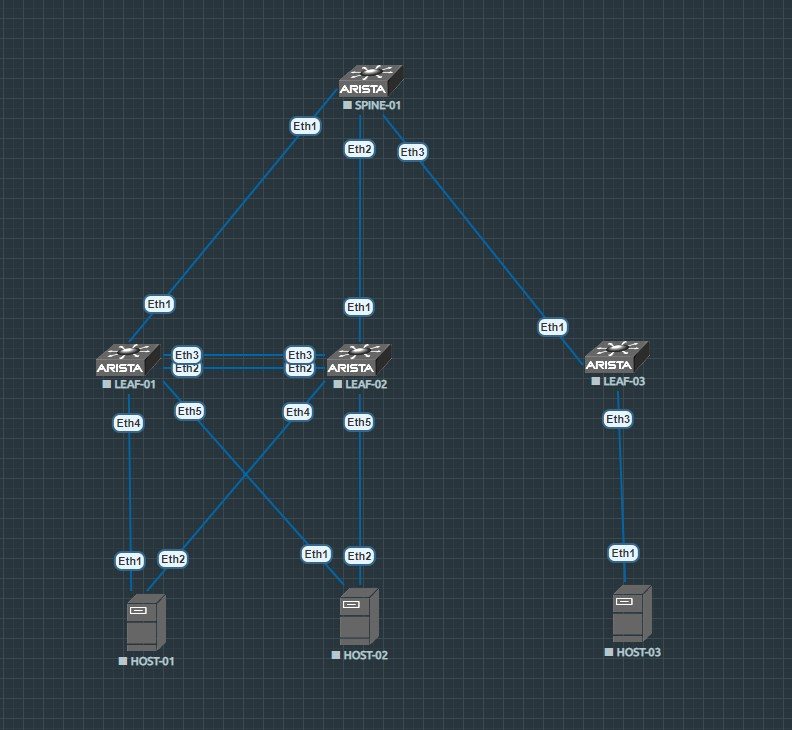

# MLAG. Arista Networks

### _В этой лабораторной работе я буду рассматривать построение VxLAN EVPN фабрики с использованием технологии MLAG для резервирования лифов, а также для увеличения пропускной способности канала до хостов и L2 балансировки по протоколу LACP_

## Схема



_На этой схеме лифы слева будут работать в одном MLAG домене, в качестве серверов внизу слева я также использую Arista vEOS, правую часть будут представлять один лиф и один сервер (в рамках лаборатрной работы нет смысла усложнять работу одинаковыми настройками, поэтому MLAG будет представлен лишь с одной стороны)_

_На серверах внизу слева будут настроены SVI интерфейсы в соответствующих вланах, с них же будет проверяться связность до сервера справа_

_Схема работы напоминает рассмотрение VPC в домашней [работе](https://github.com/dontmesswithnets/study_otus/tree/main/home_work_7) №7_

_Сервер 1 и сервер 2 находятся в разных вланах и разных широковещательных доменах, однако, за счет того, что leaf-01 и leaf-02 представляют собой один логический свитч, и на них обоих будут созданы SVI интерфейсы в обоих вланах, то маршрутизация между ними будет осуществляться прямо на этих лифах_

_В этой работе я буду делать основной упор на изучение технологии MLAG, так как VxLAN EVPN я описываю уже на протяжении всего курса обучения, и ничего нового в этом направлении здесь не будет_

<br/>

## _Настройки MLAG выполнял по официальной [документации](https://www.arista.com/en/um-eos/eos-multi-chassis-link-aggregation#xx1152196) на сайте Arista.com_

_Перед тем, как приступить к настройке MLAG между leaf-01 и leaf-02 необходимо настроить между ними port-channel и определить его в trunk-group. И да, перед этим необходимо этот самый vlan-group создать. По рекомендации от Arista, возьмем для этого vlan 4094_

* Настройка vlan на leaf-01 (на leaf-02 один в один)

```
leaf-01(config)#vlan 4094
leaf-01(config-vlan-4094)#name for_MLAG
leaf-01(config-vlan-4094)#trunk group MLAG
```

_Теперь соберем port-channel из двух ethernet интерфейсов_

* Настройка port-channel на leaf-01 (на leaf-02 один в один)

```
leaf-01(config)#interface ethernet 2-3
leaf-01(config-if-Et2-3)#switchport
leaf-01(config-if-Et2-3)#channel-group 10 mode active
```

```
leaf-01(config)#interface port-Channel 10
leaf-01(config-if-Po10)#no shutdown
leaf-01(config-if-Po10)#switchport mode trunk
leaf-01(config-if-Po10)#switchport trunk group MLAG
```

_После этого нужно создать SVI в этом влане_

* Настройка SVI на leaf-01 (на leaf-02 один в один)

```
leaf-01(config)#interface vlan 4094
leaf-01(config-if-Vl4094)#no shutdown
leaf-01(config-if-Vl4094)#ip address 10.0.0.1/30
```

## _После этого можно переходить к настройке MLAG_

* Настройка mlag на leaf-01

```
leaf-01(config)#mlag
leaf-01(config-mlag)#?
  domain-id           Unique identifier for the MLAG domain
  dual-primary        Configure dual-primary parameters
  heartbeat-interval  Time in milliseconds between MLAG heartbeat messages
  local-interface     VLAN interface for accepting connections from MLAG peer
  peer-address        IP address of MLAG peer
  peer-link           Interface connecting to MLAG peer
  reload-delay        Delay (seconds) after reboot until all non peer-link ports
                      are enabled
  shutdown            Disable the MLAG feature
  ----------------------------------------
  comment             Up to 240 characters, comment for this mode
  default             Set a command to its defaults
  exit                Leave MLAG configuration mode
  no                  Disable the command that follows
  show                Display details of switch operation
  !!                  Append to comment
```

_Выше показано какие команды мне доступны внутри mlag configuration_

* domain-id - уникальный идентификатор домена MLAG. Должен быть одинаковым на обоих свитчах

```
leaf-01(config-mlag)#domain-id test
```

* dual-primary - настройки таймеров и действий, в случае обнаружения состояния, при котором оба свитча считают себя primary (так может произойти в случае падении peer-link'а)

```
leaf-01(config-mlag)#dual-primary detection delay 100 action errdisable all-interfaces

leaf-01(config-mlag)#dual-primary recovery delay mlag 60 non-mlag 0
```

* heartbeat-interval - настройка интервала heartbeat пакетов на 4432 UDP порт management интерфейса пира (задается в миллисекундах)

```
leaf-01(config-mlag)#heartbeat-interval 5000
```

* local-interface - назначение SVI интерфейса в качестве локально используемого в MLAG конфигурации. В дальнейшем будет использоваться для коммуникаций с пиром ( ВАЖНО - в команде указывается номер vlan, а не сам vlan-интерфейс, поэтому соответствующий SVI к этому моменту уже должен быть создан)

```
leaf-01(config-mlag)#local-interface vlan 4094
```

* peer-address - назначение IP адреса пира для обмена heartbeat пакетами

```
leaf-01(config-mlag)#peer-address 10.0.0.2
leaf-01(config-mlag)#peer-address heartbeat 10.0.0.2
```

* peer-link - интерфейс, который будет использоваться для связи с пиром (можно указывать и ethernet, и port-channel)

```
leaf-01(config-mlag)#peer-link port-Channel 10
```

* reload-delay - задание времени в секундах, в течение которого все интерфейсы, кроме peer-link будут в состоянии err-disabled в случае, если, например, нода ребутнется

```
leaf-01(config-mlag)#reload-delay mlag 120
leaf-01(config-mlag)#reload-delay non-mlag 0
```

* shutdown - выключение MLAG состояния (сама конфигурация при этом не удаляется)

_На leaf-02 я проделал ровно такие же настройки, за исключением того, что в peer-address используется IP адрес leaf-01, то есть 10.0.0.1_

## _После этого можно проверить состояние MLAG_

* leaf-01

```
leaf-01(config-mlag)#show mlag
MLAG Configuration:
domain-id                          :                test
local-interface                    :            Vlan4094
peer-address                       :            10.0.0.2
peer-link                          :      Port-Channel10
hb-peer-address                    :            10.0.0.2
peer-config                        :          consistent

MLAG Status:
state                              :              Active
negotiation status                 :           Connected
peer-link status                   :                  Up
local-int status                   :                  Up
system-id                          :   52:10:00:5e:08:2b
dual-primary detection             :          Configured
dual-primary interface errdisabled :               False

MLAG Ports:
Disabled                           :                   0
Configured                         :                   0
Inactive                           :                   0
Active-partial                     :                   0
Active-full                        :                   0
```

* leaf-02

```
leaf-02(config-mlag)#show mlag
MLAG Configuration:
domain-id                          :                test
local-interface                    :            Vlan4094
peer-address                       :            10.0.0.1
peer-link                          :      Port-Channel10
hb-peer-address                    :            10.0.0.1
peer-config                        :          consistent

MLAG Status:
state                              :              Active
negotiation status                 :           Connected
peer-link status                   :                  Up
local-int status                   :                  Up
system-id                          :   52:10:00:5e:08:2b
dual-primary detection             :          Configured
dual-primary interface errdisabled :               False

MLAG Ports:
Disabled                           :                   0
Configured                         :                   0
Inactive                           :                   0
Active-partial                     :                   0
Active-full                        :                   0
```

## _Теперь можно настроить MLAG линки до хостов_

* _Забыл создать вланы, сделаю это сейчас_

```
leaf-01(config)#vlan 10
leaf-01(config-vlan-10)#name PROD

leaf-01(config)#vlan 20
leaf-01(config-vlan-20)#name DEV
```

* настройка MLAG до хостов

```
leaf-01(config-mlag)#interface ethernet 4
leaf-01(config-if-Et4)#channel-group 4 mode active
leaf-01(config-if-Et4)#interface port-Channel 4
leaf-01(config-if-Po4)#no shutdown
leaf-01(config-if-Po4)#switchport mode trunk
leaf-01(config-if-Po4)#switchport trunk allowed vlan 10
leaf-01(config-if-Po4)#mlag 4
leaf-01(config-if-Po4)#interface ethernet 5
leaf-01(config-if-Et5)#channel-group 5 mode active
leaf-01(config-if-Et5)#interface port-Channel 5
leaf-01(config-if-Po5)#no shutdown
leaf-01(config-if-Po5)#switchport mode trunk
leaf-01(config-if-Po5)#switchport trunk allowed vlan 20
leaf-01(config-if-Po5)#mlag 5
```

_Настройка вланов и MLAG портов на leaf-02 точно такая же_

* настройка со стороны хостов

```
host-01(config-if-Et1-2)#vlan 10
host-01(config-vlan-10)#name PROD
host-01(config)#interface ethernet 1-2
host-01(config-if-Et1-2)#channel-group 1 mode active
host-01(config-vlan-10)#interface port-Channel 1
host-01(config-if-Po1)#no shutdown
host-01(config-if-Po1)#switchport mode trunk
host-01(config-if-Po1)#switchport trunk allowed vlan 10

host-02(config)#vlan 20
host-02(config-vlan-20)#name DEV
host-02(config-vlan-20)#interface ethernet 1-2
host-02(config-if-Et1-2)#channel-group 1 mode active
host-02(config-if-Et1-2)#interface port-Channel 1
host-02(config-if-Po1)#no shutdown
host-02(config-if-Po1)#switchport mode trunk
host-02(config-if-Po1)#switchport trunk allowed vlan 20
```

_После этого можно проверять на лифах_

```
leaf-01#show mlag interfaces
                                                                 local/remote
   mlag       desc             state       local       remote          status
---------- ---------- ----------------- ----------- ------------ ------------
      4                  active-full         Po4          Po4           up/up
      5                  active-full         Po5          Po5           up/up
```

<br/>

## _Теперь на лифах и хостах нужно настроть SVI интерфейсы, а на хостах еще и задать маршрут по умолчанию в сторону лифов_

* host-01

```
interface Vlan10
   ip address 192.168.0.10/24

ip routing

ip route 0.0.0.0/0 192.168.0.1
```

* host-02

```
interface Vlan20
   ip address 192.168.1.10/24

ip routing

ip route 0.0.0.0/0 192.168.1.1
```

* leaf-01

```
interface Vlan10
   ip address virtual 192.168.0.1/24
!
interface Vlan20
   ip address virtual 192.168.1.1/24
```

* leaf-02

```
interface Vlan10
   ip address virtual 192.168.0.1/24

interface Vlan20
   ip address virtual 192.168.1.1/24
```

_Теперь можно проверять связность хостов как с их "шлюзами по умолчанию", так и между собой. В этой схеме работает ассиметричная модель IRB_

```
host-01#sh ip int bri
                                                                        Address
Interface       IP Address          Status      Protocol         MTU    Owner
--------------- ------------------- ----------- ------------- --------- -------
Management1     unassigned          up          up              1500
Vlan10          192.168.0.10/24     up          up              1500

host-01#ping 192.168.1.10
PING 192.168.1.10 (192.168.1.10) 72(100) bytes of data.
80 bytes from 192.168.1.10: icmp_seq=1 ttl=63 time=18.1 ms
80 bytes from 192.168.1.10: icmp_seq=2 ttl=63 time=12.1 ms
80 bytes from 192.168.1.10: icmp_seq=3 ttl=63 time=9.51 ms
80 bytes from 192.168.1.10: icmp_seq=4 ttl=63 time=8.61 ms
80 bytes from 192.168.1.10: icmp_seq=5 ttl=63 time=9.06 ms

--- 192.168.1.10 ping statistics ---
5 packets transmitted, 5 received, 0% packet loss, time 60ms
rtt min/avg/max/mdev = 8.617/11.500/18.190/3.559 ms, pipe 2, ipg/ewma 15.108/14.663 ms

host-02#sh ip int bri
                                                                        Address
Interface       IP Address          Status      Protocol         MTU    Owner
--------------- ------------------- ----------- ------------- --------- -------
Management1     unassigned          up          up              1500
Vlan20          192.168.1.10/24     up          up              1500

host-02#ping 192.168.0.10
PING 192.168.0.10 (192.168.0.10) 72(100) bytes of data.
80 bytes from 192.168.0.10: icmp_seq=1 ttl=63 time=11.2 ms
80 bytes from 192.168.0.10: icmp_seq=2 ttl=63 time=9.07 ms
80 bytes from 192.168.0.10: icmp_seq=3 ttl=63 time=8.61 ms
80 bytes from 192.168.0.10: icmp_seq=4 ttl=63 time=8.41 ms
80 bytes from 192.168.0.10: icmp_seq=5 ttl=63 time=8.17 ms

--- 192.168.0.10 ping statistics ---
5 packets transmitted, 5 received, 0% packet loss, time 45ms
rtt min/avg/max/mdev = 8.178/9.097/11.205/1.096 ms, ipg/ewma 11.321/10.095 ms
```

<br/>

## _Порты в сторону spine-01 настроим в режиме L3 и без применения port-channel_

* leaf-01

```
interface Ethernet1
   description spine-01
   no switchport
   ip address 169.254.0.1/31
```

* leaf-02

```
interface Ethernet1
   description spine-01
   no switchport
   ip address 169.254.0.3/31
```

* leaf-03

```
interface Ethernet1
   description spine-01
   no switchport
   ip address 169.254.0.5/31
```

* spine-01

```
interface Ethernet1
   description leaf-01
   no switchport
   ip address 169.254.0.0/31
interface Ethernet2
   description leaf-02
   no switchport
   ip address 169.254.0.2/31
interface Ethernet3
   description leaf-03
   no switchport
   ip address 169.254.0.4/31

```

_Связность есть_

```
spine-01#ping 169.254.0.1
PING 169.254.0.1 (169.254.0.1) 72(100) bytes of data.
80 bytes from 169.254.0.1: icmp_seq=1 ttl=64 time=7.60 ms
80 bytes from 169.254.0.1: icmp_seq=2 ttl=64 time=4.06 ms
80 bytes from 169.254.0.1: icmp_seq=3 ttl=64 time=2.65 ms
80 bytes from 169.254.0.1: icmp_seq=4 ttl=64 time=2.06 ms
80 bytes from 169.254.0.1: icmp_seq=5 ttl=64 time=2.10 ms

--- 169.254.0.1 ping statistics ---
5 packets transmitted, 5 received, 0% packet loss, time 28ms
rtt min/avg/max/mdev = 2.065/3.699/7.607/2.084 ms, ipg/ewma 7.000/5.543 ms

spine-01#ping 169.254.0.3
PING 169.254.0.3 (169.254.0.3) 72(100) bytes of data.
80 bytes from 169.254.0.3: icmp_seq=1 ttl=64 time=7.26 ms
80 bytes from 169.254.0.3: icmp_seq=2 ttl=64 time=3.12 ms
80 bytes from 169.254.0.3: icmp_seq=3 ttl=64 time=1.73 ms
80 bytes from 169.254.0.3: icmp_seq=4 ttl=64 time=1.81 ms
80 bytes from 169.254.0.3: icmp_seq=5 ttl=64 time=2.09 ms

--- 169.254.0.3 ping statistics ---
5 packets transmitted, 5 received, 0% packet loss, time 26ms
rtt min/avg/max/mdev = 1.733/3.207/7.266/2.090 ms, ipg/ewma 6.621/5.147 ms

spine-01#ping 169.254.0.5
PING 169.254.0.5 (169.254.0.5) 72(100) bytes of data.
80 bytes from 169.254.0.5: icmp_seq=1 ttl=64 time=6.91 ms
80 bytes from 169.254.0.5: icmp_seq=2 ttl=64 time=2.37 ms
80 bytes from 169.254.0.5: icmp_seq=3 ttl=64 time=1.80 ms
80 bytes from 169.254.0.5: icmp_seq=4 ttl=64 time=1.88 ms
80 bytes from 169.254.0.5: icmp_seq=5 ttl=64 time=1.75 ms

--- 169.254.0.5 ping statistics ---
5 packets transmitted, 5 received, 0% packet loss, time 24ms
rtt min/avg/max/mdev = 1.753/2.947/6.917/1.997 ms, ipg/ewma 6.049/4.851 ms
```

## _Пора настраивать Underlay_

_В этой схеме я решил настраивать OSPF в качестве Underlay и IBGP в качестве Overlay_

_После всех настроек можем проверить результат на spine-01_

```
spine-01#sh ip route ospf

VRF: default
Codes: C - connected, S - static, K - kernel,
       O - OSPF, IA - OSPF inter area, E1 - OSPF external type 1,
       E2 - OSPF external type 2, N1 - OSPF NSSA external type 1,
       N2 - OSPF NSSA external type2, B - Other BGP Routes,
       B I - iBGP, B E - eBGP, R - RIP, I L1 - IS-IS level 1,
       I L2 - IS-IS level 2, O3 - OSPFv3, A B - BGP Aggregate,
       A O - OSPF Summary, NG - Nexthop Group Static Route,
       V - VXLAN Control Service, M - Martian,
       DH - DHCP client installed default route,
       DP - Dynamic Policy Route, L - VRF Leaked,
       G  - gRIBI, RC - Route Cache Route

 O        10.0.1.1/32 [110/20] via 169.254.0.1, Ethernet1
 O        10.0.1.2/32 [110/20] via 169.254.0.3, Ethernet2
 O        10.0.1.10/32 [110/20] via 169.254.0.1, Ethernet1
 O        10.0.1.20/32 [110/20] via 169.254.0.3, Ethernet2
 O        10.0.3.1/32 [110/20] via 169.254.0.5, Ethernet3
 O        10.0.3.10/32 [110/20] via 169.254.0.5, Ethernet3
```

_Теперь он видит оба лупбека каждого из лифов_

## _Далее можно переходить к настройкам Overlay_

_Смотрим на результат_

```
spine-01#sh bgp evpn summary
BGP summary information for VRF default
Router identifier 10.0.2.1, local AS number 65000
Neighbor Status Codes: m - Under maintenance
  Neighbor V AS           MsgRcvd   MsgSent  InQ OutQ  Up/Down State   PfxRcd PfxAcc
  10.0.1.1 4 65000            107       123    0    0 00:52:22 Estab   0      0
  10.0.1.2 4 65000            105       119    0    0 00:51:14 Estab   0      0
  10.0.3.1 4 65000             38        71    0    0 00:25:43 Estab   0      0
```

## _Выполним настройку VxLAN_

_Проверим связность хостов_

* host-03

```
host-03#sh ip arp
Address         Age (sec)  Hardware Addr   Interface
192.168.2.1       0:04:39  0000.1111.2222  Vlan30, Port-Channel1
host-03#sh ip int bri
                                                                        Address
Interface       IP Address          Status      Protocol         MTU    Owner
--------------- ------------------- ----------- ------------- --------- -------
Management1     unassigned          up          up              1500
Vlan30          192.168.2.10/24     up          up              1500


host-03#ping 192.168.1.10
PING 192.168.1.10 (192.168.1.10) 72(100) bytes of data.
80 bytes from 192.168.1.10: icmp_seq=1 ttl=62 time=61.6 ms
80 bytes from 192.168.1.10: icmp_seq=2 ttl=62 time=49.7 ms
80 bytes from 192.168.1.10: icmp_seq=3 ttl=62 time=42.2 ms
80 bytes from 192.168.1.10: icmp_seq=4 ttl=62 time=34.9 ms
80 bytes from 192.168.1.10: icmp_seq=5 ttl=62 time=27.6 ms

--- 192.168.1.10 ping statistics ---
5 packets transmitted, 5 received, 0% packet loss, time 46ms
rtt min/avg/max/mdev = 27.696/43.259/61.622/11.760 ms, pipe 5, ipg/ewma 11.500/51.618 ms

host-03#ping 192.168.0.10
PING 192.168.0.10 (192.168.0.10) 72(100) bytes of data.
80 bytes from 192.168.0.10: icmp_seq=1 ttl=62 time=23.1 ms
80 bytes from 192.168.0.10: icmp_seq=2 ttl=62 time=18.3 ms
80 bytes from 192.168.0.10: icmp_seq=3 ttl=62 time=17.2 ms
80 bytes from 192.168.0.10: icmp_seq=4 ttl=62 time=17.7 ms
80 bytes from 192.168.0.10: icmp_seq=5 ttl=62 time=20.0 ms

--- 192.168.0.10 ping statistics ---
5 packets transmitted, 5 received, 0% packet loss, time 78ms
rtt min/avg/max/mdev = 17.209/19.322/23.176/2.153 ms, pipe 2, ipg/ewma 19.592/21.224 ms

```

## _Так как в этой лабораторной работе я делал упор на настройку MLAG, то решил подробно не останавливаться на настройке всего остального_

<br/>

### _Конфиги [здесь](https://github.com/dontmesswithnets/study_otus/tree/main/mlag.lab/configs)_