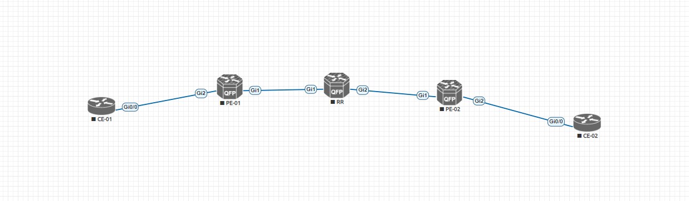

# MPLS EVPN L3VPN

### Symmetric IRB via BDI Interfaces

_В этой работе будет рассмотрена возможность построения L3VPN средствами MPLS, но не в Address-Family VPNv4, а через EVPN. Настройки выполняются схожим образом, но есть и кардинальные различия_

_Схема подключения:_



_На старте имеем следующую конфигурацию:_

* PE01, PE02 и RR дружат по OSPF и LDP
* PE-01 и PE-02 дружат по BGP в Address-Family EVPN
* на СЕ-01 и СЕ-02 настроены ipv4 интерфейсы без dot1q

_На RR: (на самом деле функции RR он не выполняет, просто Provider router)_

```
RR#show ip ospf neighbor

Neighbor ID     Pri   State           Dead Time   Address         Interface
3.3.3.3           0   FULL/  -        00:00:31    169.254.0.6     GigabitEthernet2
2.2.2.2           0   FULL/  -        00:00:37    169.254.0.2     GigabitEthernet1
```

```
RR#show mpls forwarding-table
Local      Outgoing   Prefix           Bytes Label   Outgoing   Next Hop
Label      Label      or Tunnel Id     Switched      interface
16         Pop Label  2.2.2.2/32       8184          Gi1        169.254.0.2
17         Pop Label  3.3.3.3/32       8131          Gi2        169.254.0.6
```

_На PE-01/02:_

```
PE-01#show bgp l2vpn evpn summary
BGP router identifier 2.2.2.2, local AS number 1
BGP table version is 3, main routing table version 3
2 network entries using 688 bytes of memory
2 path entries using 416 bytes of memory
2/2 BGP path/bestpath attribute entries using 560 bytes of memory
1 BGP extended community entries using 24 bytes of memory
0 BGP route-map cache entries using 0 bytes of memory
0 BGP filter-list cache entries using 0 bytes of memory
BGP using 1688 total bytes of memory
BGP activity 12/8 prefixes, 13/9 paths, scan interval 60 secs

Neighbor        V           AS MsgRcvd MsgSent   TblVer  InQ OutQ Up/Down  State/PfxRcd
3.3.3.3         4            1      18      17        3    0    0 00:12:07        0
```

```
PE-02#show bgp l2vpn evpn summary
*Oct 31 12:31:47.847: %SYS-5-CONFIG_I: Configured from console by console
BGP router identifier 3.3.3.3, local AS number 1
BGP table version is 18, main routing table version 18
2 network entries using 688 bytes of memory
2 path entries using 416 bytes of memory
2/2 BGP path/bestpath attribute entries using 560 bytes of memory
1 BGP extended community entries using 24 bytes of memory
0 BGP route-map cache entries using 0 bytes of memory
0 BGP filter-list cache entries using 0 bytes of memory
BGP using 1688 total bytes of memory
BGP activity 12/8 prefixes, 12/8 paths, scan interval 60 secs

Neighbor        V           AS MsgRcvd MsgSent   TblVer  InQ OutQ Up/Down  State/PfxRcd
2.2.2.2         4            1      17      18       18    0    0 00:12:46        0
```

_Теперь нужно настроить:_ 

* порты в сторону CE

```
interface GigabitEthernet2
 no ip address
 service instance 10 ethernet
  encapsulation untagged
```

* bridge домен на каждом из PE

```
bridge-domain 10
 member GigabitEthernet2 service-instance 10
```

* VRF с одинаковыми route-target на каждом из PE

```
vrf definition RED
 rd 2.2.2.2:10
 address-family ipv4
  route-target export 100:100
  route-target import 100:100
  route-target export 100:100 stitching
  route-target import 100:100 stitching
```

* создать BDI и положить его в VRF

```
interface BDI10
 mac-address 0000.0000.0010
 vrf forwarding RED
 ip address 10.0.0.254 255.255.255.0
```

_На данном этапе можно проверить ссвязность между PE и CE_

```
PE-01#ping vrf RED 10.0.0.1 source bdI 10
Type escape sequence to abort.
Sending 5, 100-byte ICMP Echos to 10.0.0.1, timeout is 2 seconds:
Packet sent with a source address of 10.0.0.254
!!!!!
Success rate is 100 percent (5/5), round-trip min/avg/max = 2/3/5 ms
```

```
PE-02#ping vrf RED 20.0.0.1 source bdI 20
Type escape sequence to abort.
Sending 5, 100-byte ICMP Echos to 20.0.0.1, timeout is 2 seconds:
Packet sent with a source address of 20.0.0.254
!!!!!
Success rate is 100 percent (5/5), round-trip min/avg/max = 2/4/7 ms
```

_Осталось поделиться route-type 5 маршрутами между PE_

* на этот момент полный конфиг процесса BGP выглядит так (на PE-01)

```
router bgp 1
 bgp router-id 2.2.2.2
 bgp log-neighbor-changes
 no bgp default ipv4-unicast
 neighbor 3.3.3.3 remote-as 1
 neighbor 3.3.3.3 update-source Loopback0
 !
 address-family l2vpn evpn
  neighbor 3.3.3.3 activate
  neighbor 3.3.3.3 send-community both
 exit-address-family
 !
 address-family ipv4 vrf RED
  advertise l2vpn evpn
  redistribute connected
 exit-address-family
```

* на PE-02

```
router bgp 1
 bgp router-id 3.3.3.3
 bgp log-neighbor-changes
 no bgp default ipv4-unicast
 neighbor 2.2.2.2 remote-as 1
 neighbor 2.2.2.2 update-source Loopback0
 !
 address-family l2vpn evpn
  neighbor 2.2.2.2 activate
  neighbor 2.2.2.2 send-community both
 exit-address-family
 !
 address-family ipv4 vrf RED
  advertise l2vpn evpn
  redistribute connected
 exit-address-family
```

* Теперь смотрим что прилетело (на PE-01)

```
PE-01#show bgp l2vpn evpn
BGP table version is 3, local router ID is 2.2.2.2
Status codes: s suppressed, d damped, h history, * valid, > best, i - internal,
              r RIB-failure, S Stale, m multipath, b backup-path, f RT-Filter,
              x best-external, a additional-path, c RIB-compressed,
              t secondary path, L long-lived-stale,
Origin codes: i - IGP, e - EGP, ? - incomplete
RPKI validation codes: V valid, I invalid, N Not found

     Network          Next Hop            Metric LocPrf Weight Path
Route Distinguisher: 2.2.2.2:10 (default for vrf RED)
 *>   [5][2.2.2.2:10][0][24][10.0.0.0]/17
                      0.0.0.0                  0         32768 ?
Route Distinguisher: 3.3.3.3:20
 *>i  [5][3.3.3.3:20][0][24][20.0.0.0]/17
                      3.3.3.3                  0    100      0 ?
```

* на PE-02

```
PE-02#show bgp l2vpn evpn
BGP table version is 18, local router ID is 3.3.3.3
Status codes: s suppressed, d damped, h history, * valid, > best, i - internal,
              r RIB-failure, S Stale, m multipath, b backup-path, f RT-Filter,
              x best-external, a additional-path, c RIB-compressed,
              t secondary path, L long-lived-stale,
Origin codes: i - IGP, e - EGP, ? - incomplete
RPKI validation codes: V valid, I invalid, N Not found

     Network          Next Hop            Metric LocPrf Weight Path
Route Distinguisher: 2.2.2.2:10
 *>i  [5][2.2.2.2:10][0][24][10.0.0.0]/17
                      2.2.2.2                  0    100      0 ?
Route Distinguisher: 3.3.3.3:20 (default for vrf RED)
 *>   [5][3.3.3.3:20][0][24][20.0.0.0]/17
                      0.0.0.0                  0         32768 ?
```

_Видим route-type 5 (ip-prefix) маршруты_

* а хосты теперь могут пропинговать друг друга

```
CE-01#show ip int bri
Interface                  IP-Address      OK? Method Status                Protocol
GigabitEthernet0/0         10.0.0.1        YES manual up                    up
GigabitEthernet0/1         unassigned      YES unset  administratively down down
GigabitEthernet0/2         unassigned      YES unset  administratively down down
GigabitEthernet0/3         unassigned      YES unset  administratively down down
CE-01#ping 20.0.0.1
Type escape sequence to abort.
Sending 5, 100-byte ICMP Echos to 20.0.0.1, timeout is 2 seconds:
!!!!!
Success rate is 100 percent (5/5), round-trip min/avg/max = 3/6/16 ms
```

```
CE-02#show ip int bri
Interface                  IP-Address      OK? Method Status                Protocol
GigabitEthernet0/0         20.0.0.1        YES manual up                    up
GigabitEthernet0/1         unassigned      YES unset  administratively down down
GigabitEthernet0/2         unassigned      YES unset  administratively down down
GigabitEthernet0/3         unassigned      YES unset  administratively down down
CE-02#ping 10.0.0.1
Type escape sequence to abort.
Sending 5, 100-byte ICMP Echos to 10.0.0.1, timeout is 2 seconds:
!!!!!
Success rate is 100 percent (5/5), round-trip min/avg/max = 4/7/19 ms
```

_Принцип взаимодействия и Packet-walk точно такой же, как и при VxLAN L3VNI, только в случае MPLS роль L3VNI играют BDI интерфейсы, которые точно также кладутся внутрь VRF и осуществляют симметричный IRB, рассмотренный мной в лабе VxLAN L3VPN_

_[Ссылка](https://github.com/dontmesswithnets/study_otus/tree/main/mpls-evpn-l3vpn/configs) на конфиги_
