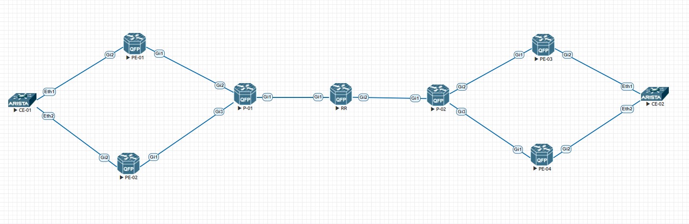

# MPLS EVPN. Multihoming

</br>

_В этой работе будет настроен L2VPN при помощи MPLS EVPN_

_В качестве топологии используется следующая схема:_



* все устройства кроме CE-01/02 дружат по OSPF и LDP
* все устройства из пункта выше кроме P-01/02 дружат по BGP в Address-Family EVPN

_На момент начала я уже настроил OSPF + LDP_

```
Route-Reflector#show ip route ospf 1
Codes: L - local, C - connected, S - static, R - RIP, M - mobile, B - BGP
       D - EIGRP, EX - EIGRP external, O - OSPF, IA - OSPF inter area
       N1 - OSPF NSSA external type 1, N2 - OSPF NSSA external type 2
       E1 - OSPF external type 1, E2 - OSPF external type 2
       i - IS-IS, su - IS-IS summary, L1 - IS-IS level-1, L2 - IS-IS level-2
       ia - IS-IS inter area, * - candidate default, U - per-user static route
       o - ODR, P - periodic downloaded static route, H - NHRP, l - LISP
       a - application route
       + - replicated route, % - next hop override, p - overrides from PfR

Gateway of last resort is not set

      1.0.0.0/32 is subnetted, 1 subnets
O        1.1.1.1 [110/3] via 169.254.0.1, 00:12:16, GigabitEthernet1
      2.0.0.0/32 is subnetted, 1 subnets
O        2.2.2.2 [110/3] via 169.254.0.1, 00:12:15, GigabitEthernet1
      3.0.0.0/32 is subnetted, 1 subnets
O        3.3.3.3 [110/2] via 169.254.0.1, 00:12:16, GigabitEthernet1
      5.0.0.0/32 is subnetted, 1 subnets
O        5.5.5.5 [110/2] via 169.254.0.3, 00:12:06, GigabitEthernet2
      6.0.0.0/32 is subnetted, 1 subnets
O        6.6.6.6 [110/3] via 169.254.0.3, 00:11:24, GigabitEthernet2
      7.0.0.0/32 is subnetted, 1 subnets
O        7.7.7.7 [110/3] via 169.254.0.3, 00:10:59, GigabitEthernet2
      169.254.0.0/16 is variably subnetted, 10 subnets, 2 masks
O        169.254.1.0/31 [110/2] via 169.254.0.1, 00:12:16, GigabitEthernet1
O        169.254.1.2/31 [110/2] via 169.254.0.1, 00:12:16, GigabitEthernet1
O        169.254.2.0/31 [110/2] via 169.254.0.3, 00:11:33, GigabitEthernet2
O        169.254.2.2/31 [110/2] via 169.254.0.3, 00:11:09, GigabitEthernet2
```

```
Route-Reflector#show mpls forwarding-table
Local      Outgoing   Prefix           Bytes Label   Outgoing   Next Hop
Label      Label      or Tunnel Id     Switched      interface
16         Pop Label  3.3.3.3/32       0             Gi1        169.254.0.1
17         16         1.1.1.1/32       0             Gi1        169.254.0.1
18         Pop Label  169.254.1.2/31   0             Gi1        169.254.0.1
19         Pop Label  169.254.1.0/31   0             Gi1        169.254.0.1
20         19         2.2.2.2/32       0             Gi1        169.254.0.1
21         Pop Label  5.5.5.5/32       0             Gi2        169.254.0.3
22         Pop Label  169.254.2.0/31   0             Gi2        169.254.0.3
23         23         6.6.6.6/32       0             Gi2        169.254.0.3
24         Pop Label  169.254.2.2/31   0             Gi2        169.254.0.3
25         24         7.7.7.7/32       0             Gi2        169.254.0.3
```

_То есть каждый участник MPLS домена знает Loopback адреса других участников и транспортные метки для них_

_Самое время настроить BGP_

```
Route-Reflector#show run | s bgp
router bgp 1
 template peer-session MPLS
  remote-as 1
  update-source Loopback0
 exit-peer-session
 !
 bgp router-id 4.4.4.4
 bgp log-neighbor-changes
 no bgp default ipv4-unicast
 neighbor 1.1.1.1 inherit peer-session MPLS
 neighbor 2.2.2.2 inherit peer-session MPLS
 neighbor 6.6.6.6 inherit peer-session MPLS
 neighbor 7.7.7.7 inherit peer-session MPLS
 !
 address-family l2vpn evpn
  neighbor 1.1.1.1 activate
  neighbor 1.1.1.1 send-community both
  neighbor 1.1.1.1 route-reflector-client
  neighbor 2.2.2.2 activate
  neighbor 2.2.2.2 send-community both
  neighbor 2.2.2.2 route-reflector-client
  neighbor 6.6.6.6 activate
  neighbor 6.6.6.6 send-community both
  neighbor 6.6.6.6 route-reflector-client
  neighbor 7.7.7.7 activate
  neighbor 7.7.7.7 send-community both
  neighbor 7.7.7.7 route-reflector-client
 exit-address-family
```

_Выше я помимо очевидных настроек создаю шаблон для будущих BGP пиров, активирую их в нужном адресном семействе, а также задаю их в качестве клиентов RR (так как в моей топологии используется IBGP)_

_На стороне клиентов настройка выглядит похоже_

```
PE-01#show run | s bgp
router bgp 1
 bgp router-id 1.1.1.1
 bgp log-neighbor-changes
 no bgp default ipv4-unicast
 neighbor 4.4.4.4 remote-as 1
 neighbor 4.4.4.4 update-source Loopback0
 !
 address-family l2vpn evpn
  neighbor 4.4.4.4 activate
  neighbor 4.4.4.4 send-community both
 exit-address-family
```

_После этого можно проверить состояние сессий_

```
Route-Reflector#show bgp l2vpn evpn summary
BGP router identifier 4.4.4.4, local AS number 1
BGP table version is 41, main routing table version 41
16 network entries using 5504 bytes of memory
16 path entries using 3328 bytes of memory
8/8 BGP path/bestpath attribute entries using 2240 bytes of memory
4 BGP extended community entries using 112 bytes of memory
0 BGP route-map cache entries using 0 bytes of memory
0 BGP filter-list cache entries using 0 bytes of memory
BGP using 11184 total bytes of memory
BGP activity 16/0 prefixes, 28/12 paths, scan interval 60 secs

Neighbor        V           AS MsgRcvd MsgSent   TblVer  InQ OutQ Up/Down  State/PfxRcd
1.1.1.1         4            1      37     104       41    0    0 00:19:09        0
2.2.2.2         4            1      36     108       41    0    0 00:19:08        0
6.6.6.6         4            1      35     108       41    0    0 00:18:16        0
7.7.7.7         4            1      34     106       41    0    0 00:17:56        0
```

_Теперь очередь за настройкой Multihoming. Этим самым я повышаю:_

* отказоустойчивость подключения CE
* общую пропускную способность канала до СЕ

_А также появляется возможность балансировки трафика не только засчет встроенных возможностей LAG, но и за счет появления маршрутной информации типов 1 и 4_

_На PE-01:_

```
interface GigabitEthernet2
 no ip address
 channel-group 1
```

```
interface Port-channel1
 no ip address
 evpn ethernet-segment 1
  identifier type 3 system-mac 0011.0011.0011
  redundancy all-active
 service instance 1 ethernet
  encapsulation dot1q 100
```

_На PЕ-02:_

```
interface GigabitEthernet2
 no ip address
 channel-group 1
```

```
interface Port-channel1
 no ip address
 evpn ethernet-segment 1
  identifier type 3 system-mac 0011.0011.0011
  redundancy all-active
 service instance 1 ethernet
  encapsulation dot1q 100
```

_Теперь осталось настроить следующие пункты и связать их с Port-channel 1:_

* Bridge-domain
* EVI

```
l2vpn evpn
 replication-type ingress
 mpls label mode per-ce
 router-id Loopback0
```

_Использую тип vlan-based_

```
l2vpn evpn instance 1 vlan-based
 rd 1.1.1.1:100
 route-target export 100:100
 route-target import 100:100
 no auto-route-target
```

```
bridge-domain 1
 member Port-channel1 service-instance 1
 member evpn-instance 1
```

_На клиентах достаточно создать vlan, SVI в нем и разрешить его транком на Port-channel и можно проверить связность по L2_

```
CE-01#show ip int bri
                                                                        Address
Interface       IP Address          Status      Protocol         MTU    Owner
--------------- ------------------- ----------- ------------- --------- -------
Management1     unassigned          up          up              1500
Vlan100         192.168.0.1/24      up          up              1500
```

```
CE-01#ping 192.168.0.2
PING 192.168.0.2 (192.168.0.2) 72(100) bytes of data.
80 bytes from 192.168.0.2: icmp_seq=1 ttl=64 time=44.2 ms
80 bytes from 192.168.0.2: icmp_seq=2 ttl=64 time=32.6 ms
80 bytes from 192.168.0.2: icmp_seq=3 ttl=64 time=25.0 ms
80 bytes from 192.168.0.2: icmp_seq=4 ttl=64 time=17.5 ms
80 bytes from 192.168.0.2: icmp_seq=5 ttl=64 time=14.8 ms

--- 192.168.0.2 ping statistics ---
5 packets transmitted, 5 received, 0% packet loss, time 73ms
rtt min/avg/max/mdev = 14.808/26.870/44.261/10.681 ms, pipe 4, ipg/ewma 18.329/34.851 ms
```

_А Route-Reflector тем временем получил новуе маршруты_

```
Route-Reflector#show bgp l2vpn evpn summary
BGP router identifier 4.4.4.4, local AS number 1
BGP table version is 43, main routing table version 43
18 network entries using 6192 bytes of memory
18 path entries using 3744 bytes of memory
8/8 BGP path/bestpath attribute entries using 2240 bytes of memory
4 BGP extended community entries using 112 bytes of memory
0 BGP route-map cache entries using 0 bytes of memory
0 BGP filter-list cache entries using 0 bytes of memory
BGP using 12288 total bytes of memory
BGP activity 18/0 prefixes, 30/12 paths, scan interval 60 secs

Neighbor        V           AS MsgRcvd MsgSent   TblVer  InQ OutQ Up/Down  State/PfxRcd
1.1.1.1         4            1      55     124       43    0    0 00:35:39        4
2.2.2.2         4            1      55     127       43    0    0 00:35:38        5
6.6.6.6         4            1      54     128       43    0    0 00:34:46        5
7.7.7.7         4            1      52     126       43    0    0 00:34:26        4
```

_От PE-01-04 он получил:_

* по 2 auto-discovery (так как они генерируются per EVI и per ESI)
* по 1 ethernet-segment (так как они генерируются per ESI)
* по 1 inclusive-multicast-ethernet-tag (так как они генерируются per EVI)
* по одному mac-advertisement, но только от двух PE (Так как именно через них прошли пакеты при ICMP)

_Я также могу посмотреть, кто из PE пары является Designated-Forwarder для конкретного EVI_

```
PE-01#show l2vpn evpn evi 1 detail
EVPN instance:    1 (VLAN Based)
  RD:             1.1.1.1:100 (cfg)
  Import-RTs:     100:100
  Export-RTs:     100:100
  Per-EVI Label:  none
  State:          Established
  Encapsulation:  mpls
  Bridge Domain:  1
    Ethernet-Tag: 0
    BUM Label:    16
    Per-BD Label: none
    State:        Established
    Pseudoports (Labels):
      Port-channel1 service instance 1 (28) (DF state: forwarding)
```

```
PE-02#show l2vpn evpn evi 1 detail
EVPN instance:    1 (VLAN Based)
  RD:             2.2.2.2:100 (cfg)
  Import-RTs:     100:100
  Export-RTs:     100:100
  Per-EVI Label:  none
  State:          Established
  Encapsulation:  mpls
  Bridge Domain:  1
    Ethernet-Tag: 0
    BUM Label:    16
    Per-BD Label: none
    State:        Established
    Pseudoports (Labels):
      Port-channel1 service instance 1 (28) (DF state: PE-to-CE BUM blocked)
```

_Как видно, PE-01 может отправлять BUM трафик в сторону Ethernet сегмента, в отличие от PE-02_

_Как работает Loop prevention в технологии EVPN Multihoming? Все дело в Split Horizon Label. В случае, если BUM трафик попадает на non DF PE и он видит, что пакет пришел с того же линка, откуда он получил route-type 4 от других PE, которые смотрят в этот же ESI - он дропнет такой пакет. Если же пакет пришел со стороны ESI или какого-то Orphan порта, он отправит этот пакет дальше, но в сторону DF такой пакет полетит вместе со Split Horizon Label, по которой DF поймет, что пакет уже был на non DF и не будет дальше рассылать этот пакет_

_[Ссылка](https://github.com/dontmesswithnets/study_otus/tree/main/mpls-evpn-multihoming.lab/configs) на конфиги_