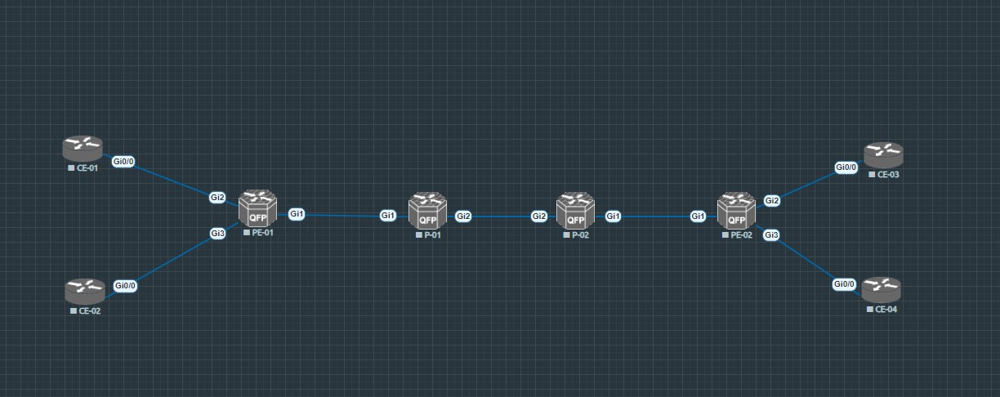

# L3VPN средствами MPLS + LDP

_В рамках этого урока настрою L3VPN с примерами конфигурации и своими личными заметками_

_В моей топологии будут следующие устройства:_

* CE (Customer Edge) в количестве 4 устройств
* PE (Provider Edge) в количестве 2 устройств
* P (Provider Router) в количестве 2 устройств

_Схема сети выглядит так:_



### Базовые настройки IGP и LDP

_Во многом эта лаба повторяет настройки вот этой лабы, где я настраиваю L2VPN VPLS. Отличия начинаются с того момента, когда все участники MPLS домена подружились по IGP (OSPF) и LDP. То есть на текущий момент на PE устройствах видно следующее:_

```
PE-01#show ip route ospf 1
Codes: L - local, C - connected, S - static, R - RIP, M - mobile, B - BGP
       D - EIGRP, EX - EIGRP external, O - OSPF, IA - OSPF inter area
       N1 - OSPF NSSA external type 1, N2 - OSPF NSSA external type 2
       E1 - OSPF external type 1, E2 - OSPF external type 2
       i - IS-IS, su - IS-IS summary, L1 - IS-IS level-1, L2 - IS-IS level-2
       ia - IS-IS inter area, * - candidate default, U - per-user static route
       o - ODR, P - periodic downloaded static route, H - NHRP, l - LISP
       a - application route
       + - replicated route, % - next hop override, p - overrides from PfR

Gateway of last resort is not set

      10.0.0.0/32 is subnetted, 4 subnets
O        10.0.0.2 [110/2] via 169.254.0.2, 1d18h, GigabitEthernet1
O        10.0.0.3 [110/3] via 169.254.0.2, 1d18h, GigabitEthernet1
O        10.0.0.4 [110/4] via 169.254.0.2, 1d18h, GigabitEthernet1
      169.254.0.0/16 is variably subnetted, 4 subnets, 2 masks
O        169.254.0.0/31 [110/2] via 169.254.0.2, 1d18h, GigabitEthernet1
O        169.254.0.4/31 [110/3] via 169.254.0.2, 1d18h, GigabitEthernet1
```

_PE-01 знает адреса loopback интерфейсов всех остальных участников через протокол OSPF, равно как и другие участники_

```
PE-01#show mpls forwarding-table
Local      Outgoing   Prefix           Bytes Label   Outgoing   Next Hop
Label      Label      or Tunnel Id     Switched      interface
16         18         10.0.0.4/32      0             Gi1        169.254.0.2
17         16         10.0.0.3/32      0             Gi1        169.254.0.2
18         Pop Label  10.0.0.2/32      0             Gi1        169.254.0.2
19         17         169.254.0.4/31   0             Gi1        169.254.0.2
20         Pop Label  169.254.0.0/31   0             Gi1        169.254.0.2
21         No Label   1.1.1.1/32[V]    0             Gi2        169.254.100.1
22         No Label   2.2.2.2/32[V]    0             Gi3        169.254.200.1
```

_Также, все участники обменялись известными им FEC'ами и метками для них_

### Настройка BGP в Address Family VPNv4 Unicast

_Теперь на очереди настройка BGP. P-router'ы в этом процессе не участвуют, их задача лишь коммутировать трафик на основе транспортных меток. Настроим MP-BGP между PE-01 и PE-02_

```
router bgp 1
 bgp router-id 10.0.0.1
 bgp log-neighbor-changes
 no bgp default ipv4-unicast
 neighbor 10.0.0.4 remote-as 1
 neighbor 10.0.0.4 update-source Loopback0
 neighbor 10.0.0.4 timers 5 15
!
 address-family vpnv4
  neighbor 10.0.0.4 activate
  neighbor 10.0.0.4 send-community both
 exit-address-family
```

_С другой стороны_

```
router bgp 1
 bgp router-id 10.0.0.4
 bgp log-neighbor-changes
 no bgp default ipv4-unicast
 neighbor 10.0.0.1 remote-as 1
 neighbor 10.0.0.1 update-source Loopback0
 neighbor 10.0.0.1 timers 5 15
 !
 address-family vpnv4
  neighbor 10.0.0.1 activate
  neighbor 10.0.0.1 send-community both
 exit-address-family
```

_После этого можно проверить состояние сессий_

```
PE-01#show bgp vpnv4 unicast all summary
BGP router identifier 10.0.0.1, local AS number 1
BGP table version is 15, main routing table version 15
4 network entries using 1024 bytes of memory
4 path entries using 544 bytes of memory
6/2 BGP path/bestpath attribute entries using 1776 bytes of memory
4 BGP AS-PATH entries using 96 bytes of memory
2 BGP extended community entries using 48 bytes of memory
0 BGP route-map cache entries using 0 bytes of memory
0 BGP filter-list cache entries using 0 bytes of memory
BGP using 3488 total bytes of memory
BGP activity 8/2 prefixes, 8/4 paths, scan interval 60 secs

Neighbor        V           AS MsgRcvd MsgSent   TblVer  InQ OutQ Up/Down  State/PfxRcd
10.0.0.4        4            1   29834   29836       15    0    0 1d18h           0
```

_Теперь нужно настроить соседства с CE маршрутизаторами. Можно быть для них шлюзом по умолчанию, но гораздо интересенее будет подключить их по Option A или Back-to-back VRF. Для этого настроим с ними EBGP сессии в Address Family ipv4 unicast_

```
router bgp 1
 address-family ipv4 vrf ONE
  neighbor 169.254.100.1 remote-as 100
  neighbor 169.254.100.1 activate
 exit-address-family
 !
 address-family ipv4 vrf QWERTY
  neighbor 169.254.200.1 remote-as 200
  neighbor 169.254.200.1 activate
 exit-address-family
```

_На клиенте можно без VRF, а также проанонсирую loopback_

```
router bgp 100
 bgp router-id 1.1.1.1
 bgp log-neighbor-changes
 network 1.1.1.1 mask 255.255.255.255
 neighbor 169.254.100.0 remote-as 1
```

_Проверяю_

```
client-01#show ip bgp summary
BGP router identifier 1.1.1.1, local AS number 100
BGP table version is 5, main routing table version 5
2 network entries using 288 bytes of memory
2 path entries using 160 bytes of memory
2/2 BGP path/bestpath attribute entries using 304 bytes of memory
1 BGP AS-PATH entries using 24 bytes of memory
0 BGP route-map cache entries using 0 bytes of memory
0 BGP filter-list cache entries using 0 bytes of memory
BGP using 776 total bytes of memory
BGP activity 3/1 prefixes, 3/1 paths, scan interval 60 secs

Neighbor        V           AS MsgRcvd MsgSent   TblVer  InQ OutQ Up/Down  State/PfxRcd
169.254.100.0   4            1       8       8        5    0    0 00:03:01        0
```

_Теперь после того, как проделаю аналогичные настройки со второй стороны, должен появиться префикс, который пролетел через L3VPN_

```
client-01#show ip bgp
BGP table version is 5, local router ID is 1.1.1.1
Status codes: s suppressed, d damped, h history, * valid, > best, i - internal,
              r RIB-failure, S Stale, m multipath, b backup-path, f RT-Filter,
              x best-external, a additional-path, c RIB-compressed,
Origin codes: i - IGP, e - EGP, ? - incomplete
RPKI validation codes: V valid, I invalid, N Not found

     Network          Next Hop            Metric LocPrf Weight Path
 *>  1.1.1.1/32       0.0.0.0                  0         32768 i
 *>  3.3.3.3/32       169.254.100.0                          0 1 300 i
```

_Проверю, что все работает_

```
client-01#ping 3.3.3.3 source 1.1.1.1
Type escape sequence to abort.
Sending 5, 100-byte ICMP Echos to 3.3.3.3, timeout is 2 seconds:
Packet sent with a source address of 1.1.1.1
!!!!!
Success rate is 100 percent (5/5), round-trip min/avg/max = 3/4/5 ms
```

### Как это работает?

_Рассмотрим внимательнее, как этот префикс видит PE-01, который получил его от PE-02, который в свою очередь, получил его от CE-03_

```
PE-01#show bgp vpnv4 unicast all 3.3.3.3/32
BGP routing table entry for 10.0.0.1:123:3.3.3.3/32, version 13
Paths: (1 available, best #1, table ONE)
  Advertised to update-groups:
     4
  Refresh Epoch 6
  300, imported path from 10.0.0.4:123:3.3.3.3/32 (global)
    10.0.0.4 (metric 4) (via default) from 10.0.0.4 (10.0.0.4)
      Origin IGP, metric 0, localpref 100, valid, internal, best
      Extended Community: RT:8765:4321
      mpls labels in/out nolabel/23
      rx pathid: 0, tx pathid: 0x0
BGP routing table entry for 10.0.0.4:123:3.3.3.3/32, version 12
Paths: (1 available, best #1, no table)
  Not advertised to any peer
  Refresh Epoch 6
  300
    10.0.0.4 (metric 4) (via default) from 10.0.0.4 (10.0.0.4)
      Origin IGP, metric 0, localpref 100, valid, internal, best
      Extended Community: RT:8765:4321
      mpls labels in/out nolabel/23
      rx pathid: 0, tx pathid: 0x0
```

_Видим, что что получает этот NLRI от пира с Router-id 10.0.0.4, в котором также указано, что для того, чтобы отправить пакет в его сторону, нужно подставить исходящуюю сервисную метку 23. Теперь смотрим, какую транспортную метку нужно навесить для отправки в сторону 10.0.0.4_

```
PE-01#show mpls forwarding-table 10.0.0.4 32
Local      Outgoing   Prefix           Bytes Label   Outgoing   Next Hop
Label      Label      or Tunnel Id     Switched      interface
16         18         10.0.0.4/32      0             Gi1        169.254.0.2
```

_То есть сначала чистый IP пакет попадет от CE-01 к PE-01, тот увидит, что данный пир находится у него в VRF, посмотрит RIB этого VRF для определния next-hop, увидит там 10.0.0.4 и исходящую метку. Навесит эту сервисную метку и перейдет к шагу поиска транспортной метки для 10.0.0.4, затем, навесив транспортную метку, отправит в интерфейс Gi1_

_На участке PE-01 -- P-01 -- P-02 -- PE-02 пакет будет коммутироваться исключительно по транспортной метке, а к PE-02 пакет уже придет без транспортной метке, так как ее снимет предпоследний хоп, и PE-02 останется по сервисной метке понять, в RIB какого VRF нужно сделать lookup для поиска next-hop_

_Таким образом пакет достигнет CE-03 и обратно по такой же схеме_

_[Ссылка](https://github.com/dontmesswithnets/study_otus/tree/main/mpls-l3vpn.lab/configs) на конфиги CSR_