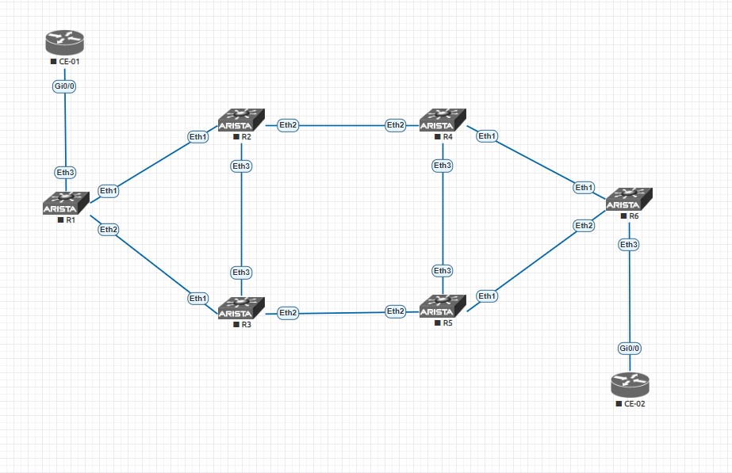
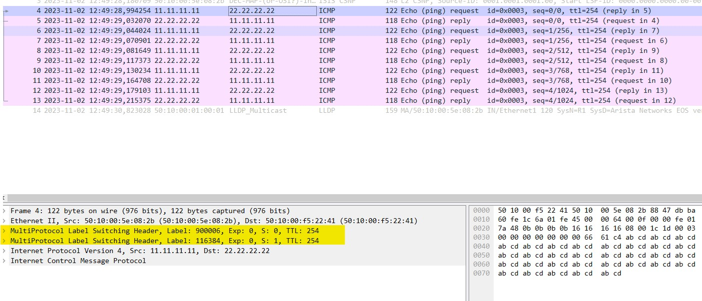
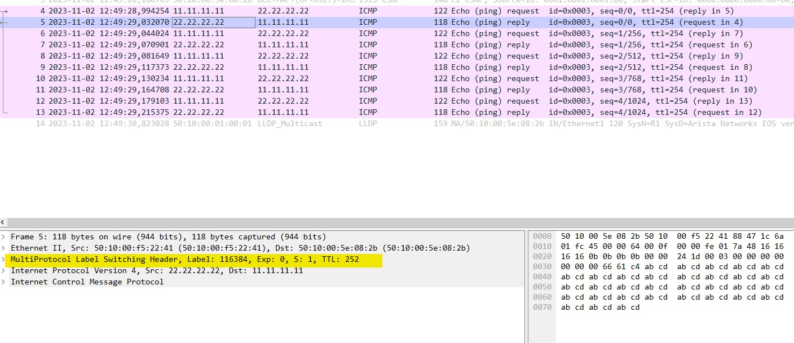

# MPLS Segment-Routing with IS-IS. Arista Networks

_Без лишних слов - топология:_



_На схеме R1 и R6 являются PE устройствами, R2-R5 - P устройства, слева и справа СЕ-01 и СЕ-02_

_Для связи по Underlay между свитчами используется следующая адресация. Линк между R1 и R2 будет строиться на адресах 10.1.2.1/24 и 10.1.2.2/24. Линк между R3 и R5 - 10.3.5.3/24 и 10.3.5.5/24, соответственно_

После того, как со стыковочными подсетями все выполнено, можно переходить к созданию loopback интерфейсов и настройке IGP. В качестве IGP в этой лабе использую IS-IS_

* настройка loopback на R1 (на остальных аналогично по номеру устройства)

```
interface Loopback0
   ip address 1.1.1.1/32
```

* включаю ip routing и mpls ip

```
ip routing
mpls ip
```

### Настройка IS-IS

```
router isis UNDERLAY
   net 49.0001.0001.0001.0001.00
   is-type level-2
   log-adjacency-changes
   !
   address-family ipv4 unicast
   !
```

* включение интерфейсов в IS-IS

```
interface Ethernet1
   isis enable UNDERLAY
   isis network point-to-point
!
interface Ethernet2
   isis enable UNDERLAY
   isis network point-to-point
!
interface Loopback0
   isis enable UNDERLAY
   isis passive
```

_На этом моменте можно проверить, что все loopback адреса разлетелись между всеми устройствами_

```
R1#show ip route isis

VRF: default
Codes: C - connected, S - static, K - kernel,
       O - OSPF, IA - OSPF inter area, E1 - OSPF external type 1,
       E2 - OSPF external type 2, N1 - OSPF NSSA external type 1,
       N2 - OSPF NSSA external type2, B - Other BGP Routes,
       B I - iBGP, B E - eBGP, R - RIP, I L1 - IS-IS level 1,
       I L2 - IS-IS level 2, O3 - OSPFv3, A B - BGP Aggregate,
       A O - OSPF Summary, NG - Nexthop Group Static Route,
       V - VXLAN Control Service, M - Martian,
       DH - DHCP client installed default route,
       DP - Dynamic Policy Route, L - VRF Leaked,
       G  - gRIBI, RC - Route Cache Route

 I L2     2.2.2.2/32 [115/20] via 10.1.2.2, Ethernet1
 I L2     3.3.3.3/32 [115/20] via 10.1.3.3, Ethernet2
 I L2     4.4.4.4/32 [115/30] via 10.1.2.2, Ethernet1
 I L2     5.5.5.5/32 [115/30] via 10.1.3.3, Ethernet2
 I L2     6.6.6.6/32 [115/40] via 10.1.2.2, Ethernet1
                              via 10.1.3.3, Ethernet2
 I L2     10.2.3.0/24 [115/20] via 10.1.2.2, Ethernet1
                               via 10.1.3.3, Ethernet2
 I L2     10.2.4.0/24 [115/20] via 10.1.2.2, Ethernet1
 I L2     10.3.5.0/24 [115/20] via 10.1.3.3, Ethernet2
 I L2     10.4.5.0/24 [115/30] via 10.1.2.2, Ethernet1
                               via 10.1.3.3, Ethernet2
 I L2     10.4.6.0/24 [115/30] via 10.1.2.2, Ethernet1
 I L2     10.5.6.0/24 [115/30] via 10.1.3.3, Ethernet2
```

### Настройка BGP vpn-ipv4 между PE

_Для настройки BGP использую следующие команды_

* на PE-01

```
router bgp 100
   router-id 1.1.1.1
   no bgp default ipv4-unicast
   neighbor 6.6.6.6 remote-as 100
   neighbor 6.6.6.6 update-source Loopback0
   neighbor 6.6.6.6 send-community extended
   !
   address-family vpn-ipv4
      neighbor 6.6.6.6 activate
```

* на PE-02

```
router bgp 100
   router-id 6.6.6.6
   no bgp default ipv4-unicast
   neighbor 1.1.1.1 remote-as 100
   neighbor 1.1.1.1 update-source Loopback0
   neighbor 1.1.1.1 send-community extended
   !
   address-family vpn-ipv4
      neighbor 1.1.1.1 activate
```

_Теперь можно проверить, что соседство поднялось_

```
R1#show bgp vpn-ipv4 summary
BGP summary information for VRF default
Router identifier 1.1.1.1, local AS number 100
Neighbor Status Codes: m - Under maintenance
  Neighbor V AS           MsgRcvd   MsgSent  InQ OutQ  Up/Down State   PfxRcd PfxAcc
  6.6.6.6  4 100               77        78    0    0 00:57:57 Estab   0      0
```

_Теперь нужно настроить ipv4 сессии с CE по option A_

* типовой конфиг со стороны СЕ-01 выглядит так

```
interface GigabitEthernet0/0
 ip address 10.0.0.2 255.255.255.252
 duplex auto
 speed auto
 media-type rj45
end
!
interface Loopback0
 ip address 11.11.11.11 255.255.255.255
end
!
ip prefix-list LOOPBACK: 1 entries
   seq 5 permit 11.11.11.11/32
!
route-map RM, permit, sequence 10
  Match clauses:
    ip address prefix-lists: LOOPBACK
  Set clauses:
  Policy routing matches: 0 packets, 0 bytes
!
router bgp 1
 bgp router-id 11.11.11.11
 bgp log-neighbor-changes
 neighbor 10.0.0.1 remote-as 100
 !
 address-family ipv4
  redistribute connected route-map RM
  neighbor 10.0.0.1 activate
 exit-address-family
```

* со стороны PE-01

```
vrf instance RED

interface Ethernet3
   no switchport
   vrf RED
   ip address 10.0.0.1/30

ip routing vrf RED

router bgp 100
   vrf RED
      rd 1.1.1.1:100
      route-target import vpn-ipv4 100:100
      route-target export vpn-ipv4 100:100
      neighbor 10.0.0.2 remote-as 1
      !
      address-family ipv4
         neighbor 10.0.0.2 activate
```

_На этот моменте должно произойти следующее:_

```
R1#show ip bgp summary vrf RED
BGP summary information for VRF RED
Router identifier 10.0.0.1, local AS number 100
Neighbor Status Codes: m - Under maintenance
  Neighbor V AS           MsgRcvd   MsgSent  InQ OutQ  Up/Down State   PfxRcd PfxAcc
  10.0.0.2 4 1                 76        80    0    0 01:03:06 Estab   1      1
```

```
R1#show bgp vpn-ipv4 summary
BGP summary information for VRF default
Router identifier 1.1.1.1, local AS number 100
Neighbor Status Codes: m - Under maintenance
  Neighbor V AS           MsgRcvd   MsgSent  InQ OutQ  Up/Down State   PfxRcd PfxAcc
  6.6.6.6  4 100               88        88    0    0 01:06:40 Estab   1      1
```

_В таблице BGP в address-family vpn-ipv4 и в ipv4 unicast vrf RED появились следующие маршруты_

```
R1#show bgp vpn-ipv4
BGP routing table information for VRF default
Router identifier 1.1.1.1, local AS number 100
Route status codes: s - suppressed, * - valid, > - active, E - ECMP head, e - ECMP
                    S - Stale, c - Contributing to ECMP, b - backup, L - labeled-unicast
                    % - Pending BGP convergence
Origin codes: i - IGP, e - EGP, ? - incomplete
AS Path Attributes: Or-ID - Originator ID, C-LST - Cluster List, LL Nexthop - Link Local Nexthop

          Network                Next Hop              Metric  LocPref Weight  Path
 * >     RD: 1.1.1.1:100 IPv4 prefix 11.11.11.11/32
                                 -                     0       100     0       1 ?
 * >     RD: 6.6.6.6:100 IPv4 prefix 22.22.22.22/32
                                 6.6.6.6               0       100     0       2 ?
```

```
R1#show ip bgp vrf RED
BGP routing table information for VRF RED
Router identifier 10.0.0.1, local AS number 100
Route status codes: s - suppressed, * - valid, > - active, E - ECMP head, e - ECMP
                    S - Stale, c - Contributing to ECMP, b - backup, L - labeled-unicast
                    % - Pending BGP convergence
Origin codes: i - IGP, e - EGP, ? - incomplete
RPKI Origin Validation codes: V - valid, I - invalid, U - unknown
AS Path Attributes: Or-ID - Originator ID, C-LST - Cluster List, LL Nexthop - Link Local Nexthop

          Network                Next Hop              Metric  AIGP       LocPref Weight  Path
 * >      11.11.11.11/32         10.0.0.2              0       -          100     0       1 ?
 * >      22.22.22.22/32         6.6.6.6               0       -          100     0       2 ?
```

### Настройка Segment Routing

* В конфигурации IS-IS нужно включить segment-routing (на всех устройствах MPLS домена)

```
router isis UNDERLAY
   segment-routing mpls
      no shutdown
```

* В настройках loopback интерфейса нужно задать индекс для node-segment (для R6 индекс будет 6)

```
interface Loopback0
   node-segment ipv4 index 1
```

_...И на этом все. Если в данный момент не нужен Traffic-Engineering, то этой настройки более чем достаточно_

* Проверю MPLS метки (они же сегменты) для адресов loopback

```
R1#show mpls segment-routing bindings ipv4
1.1.1.1/32
   Local binding:  Label: imp-null
   Remote binding: Peer ID: R2, Label: 900001
   Remote binding: Peer ID: R3, Label: 900001
2.2.2.2/32
   Local binding:  Label: 900002
   Remote binding: Peer ID: R2, Label: imp-null
   Remote binding: Peer ID: R3, Label: 900002
3.3.3.3/32
   Local binding:  Label: 900003
   Remote binding: Peer ID: R2, Label: 900003
   Remote binding: Peer ID: R3, Label: imp-null
4.4.4.4/32
   Local binding:  Label: 900004
   Remote binding: Peer ID: R2, Label: 900004
   Remote binding: Peer ID: R3, Label: 900004
5.5.5.5/32
   Local binding:  Label: 900005
   Remote binding: Peer ID: R2, Label: 900005
   Remote binding: Peer ID: R3, Label: 900005
6.6.6.6/32
   Local binding:  Label: 900006
   Remote binding: Peer ID: R2, Label: 900006
   Remote binding: Peer ID: R3, Label: 900006
```

_Для каждого FEC были сгенерированы метки, причем эти метки одинаковые на всех свитчах_

* для MPLS есть своя FIB - labelFIB

```R1#show mpls lfib route
MPLS forwarding table (Label [metric] Vias) - 8 routes
MPLS next-hop resolution allow default route: False
Via Type Codes:
          M - MPLS via, P - Pseudowire via,
          I - IP lookup via, V - VLAN via,
          VA - EVPN VLAN aware via, ES - EVPN ethernet segment via,
          VF - EVPN VLAN flood via, AF - EVPN VLAN aware flood via,
          NG - Nexthop group via, MI - Multicast IP lookup via
Source Codes:
          G - gRIBI, S - Static MPLS route,
          B2 - BGP L2 EVPN, B3 - BGP L3 VPN,
          R - RSVP, LP - LDP pseudowire,
          L - LDP, M - MLDP,
          IP - IS-IS SR prefix segment, IA - IS-IS SR adjacency segment,
          I>L - IS-IS SR to LDP, L>I - LDP to IS-IS SR,
          BL - BGP LU, BL>L - BGP LU to LDP,
          L>BL - LDP to BGP LU, ST - SR TE policy,
          SMP - SRP2MP, BL>I - BGP LU to IS-IS SR,
          I>BL - IS-IS SR to BGP LU, DE - Debug LFIB

 IA    100000   [1]
                via M, 10.1.3.3, pop
                 payload autoDecide, ttlMode uniform, apply egress-acl
                 interface Ethernet2
 IA    100001   [1]
                via M, 10.1.2.2, pop
                 payload autoDecide, ttlMode uniform, apply egress-acl
                 interface Ethernet1
 B3    116384   [0]
                via I, ipv4, vrf RED
 IP    900002   [1], 2.2.2.2/32
                via M, 10.1.2.2, pop
                 payload autoDecide, ttlMode uniform, apply egress-acl
                 interface Ethernet1
 IP    900003   [1], 3.3.3.3/32
                via M, 10.1.3.3, pop
                 payload autoDecide, ttlMode uniform, apply egress-acl
                 interface Ethernet2
 IP    900004   [1], 4.4.4.4/32
                via M, 10.1.2.2, swap 900004
                 payload autoDecide, ttlMode uniform, apply egress-acl
                 interface Ethernet1
 IP    900005   [1], 5.5.5.5/32
                via M, 10.1.3.3, swap 900005
                 payload autoDecide, ttlMode uniform, apply egress-acl
                 interface Ethernet2
 IP    900006   [1], 6.6.6.6/32
                via M, 10.1.3.3, swap 900006
                 payload autoDecide, ttlMode uniform, apply egress-acl
                 interface Ethernet2
                via M, 10.1.2.2, swap 900006
                 payload autoDecide, ttlMode uniform, apply egress-acl
                 interface Ethernet1
```

* теперь если посмотреть RIB для vrf RED, можно увидеть и стек меток

```
R1#show ip route vrf RED

VRF: RED
Codes: C - connected, S - static, K - kernel,
       O - OSPF, IA - OSPF inter area, E1 - OSPF external type 1,
       E2 - OSPF external type 2, N1 - OSPF NSSA external type 1,
       N2 - OSPF NSSA external type2, B - Other BGP Routes,
       B I - iBGP, B E - eBGP, R - RIP, I L1 - IS-IS level 1,
       I L2 - IS-IS level 2, O3 - OSPFv3, A B - BGP Aggregate,
       A O - OSPF Summary, NG - Nexthop Group Static Route,
       V - VXLAN Control Service, M - Martian,
       DH - DHCP client installed default route,
       DP - Dynamic Policy Route, L - VRF Leaked,
       G  - gRIBI, RC - Route Cache Route

Gateway of last resort is not set

 C        10.0.0.0/30 is directly connected, Ethernet3
 B E      11.11.11.11/32 [200/0] via 10.0.0.2, Ethernet3
 B I      22.22.22.22/32 [200/0] via 6.6.6.6/32, IS-IS SR tunnel index 5, label 116384
                                    via 10.1.2.2, Ethernet1, label 900006
                                    via 10.1.3.3, Ethernet2, label 900006
```

_То есть когда R1 (он же PE, который терминирует VPN) нужно отправить пакет в сторону IP адреса 22.22.22.22/32 внутри vrf RED, он должен навесить сервисную метку 116384, затем транспортную метку 900006 и отправить пакет в любой из Eth 1-2_

_Запущу пинг с СЕ-01 до СЕ-02 и отловлю в Wireshark_



_На ответном пакете по понятным причинам видим лишь сервисную метку и bottom of label stack бит, выставленный в 1. Ведь R2 выполнил операцию POP label при отправке пакет в сторону R1_



_В целом, можно проверить и с самого R1 следующими способами_

* ping mpls segment-routing

```
R1#ping mpls segment-routing ip 6.6.6.6/32 source 1.1.1.1 repeat 3
LSP ping to Segment-Routing route 6.6.6.6/32
   timeout is 5000ms, interval is 1000ms
Via 10.1.2.2, Ethernet1, label stack: [900006]
   Reply from 10.4.6.6: seq=1, time=28ms, success: egress ok
Via 10.1.2.2, Ethernet1, label stack: [900006]
   Reply from 10.4.6.6: seq=2, time=21ms, success: egress ok
Via 10.1.2.2, Ethernet1, label stack: [900006]
   Reply from 10.4.6.6: seq=3, time=24ms, success: egress ok

--- Segment-Routing target fec 6.6.6.6/32 : lspping statistics ---
Via 10.1.2.2, Ethernet1, label stack: [900006]
   3 packets transmitted, 3 received, 0% packet loss, time 2379ms
   3 received from 10.4.6.6, rtt min/max/avg 21/28/24 ms
```

* traceroute mpls segment-routing

```
R1#traceroute mpls segment-routing ip 6.6.6.6/32 source 1.1.1.1
LSP traceroute to 6.6.6.6/32
  via 10.1.2.2, label stack: [900006]
  1  10.1.2.2          MTU 1500  8ms       success: label switched
     downstream information (DSMAP) 1:
        interface address: 10.2.4.4
        IP address: 10.2.4.4
        label stack: [900006]
  2  10.2.4.4          MTU 1500  15ms      success: label switched
     downstream information (DSMAP) 1:
        interface address: 10.4.6.6
        IP address: 10.4.6.6
        label stack: [implicit-null]
  3  10.4.6.6          28ms      success: egress ok
  via 10.1.3.3, label stack: [900006]
  1  10.1.3.3          MTU 1500  12ms      success: label switched
     downstream information (DSMAP) 1:
        interface address: 10.3.5.5
        IP address: 10.3.5.5
        label stack: [900006]
  2  10.3.5.5          MTU 1500  22ms      success: label switched
     downstream information (DSMAP) 1:
        interface address: 10.5.6.6
        IP address: 10.5.6.6
        label stack: [implicit-null]
  3  10.5.6.6          27ms      success: egress ok
```

_В дальнейшем планирую прикрутить на эту лабу Traffic Engineering_

_[Ссылка](https://github.com/dontmesswithnets/study_otus/tree/main/mpls-sr.lab/configs) на конфиги_