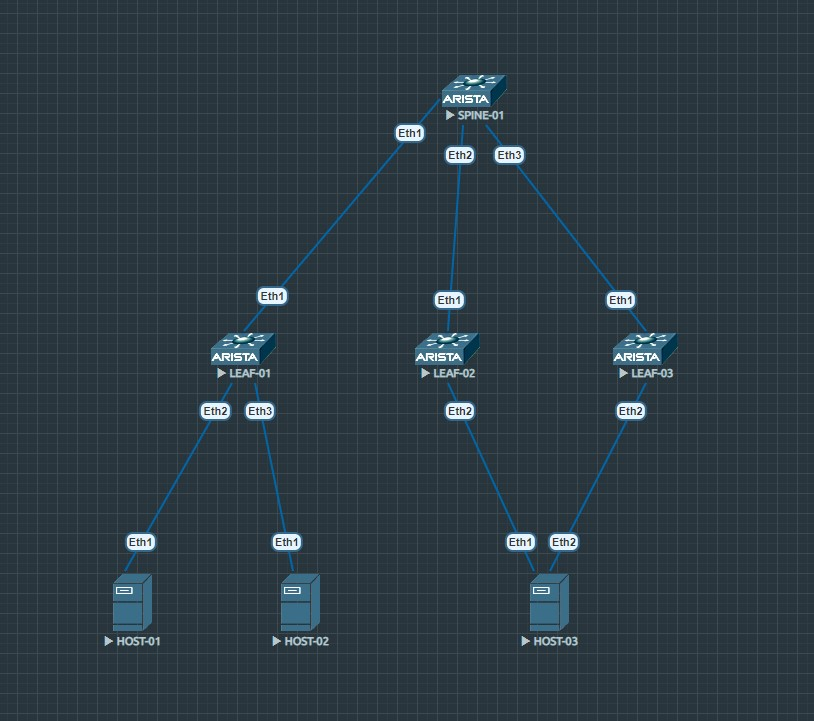

# EVPN Multihoming. Arista Networks

### _В этой лабораторной работе я займусь построением VxLAN EVPN фабрики с применением технологии Multihoming. Данная технология представляет собой альтернативу таким технологиям, как VPC/MLAG_

### _Как и VPC/MLAG, Multihoming позволяет подключать хосты более чем к одному лифу, организуя таким образом отказоустойчивость и более эффективное использование линков_

### _Применение Multihoming позволяет решить следующие задачи:_

* защита от петель
* балансировка трафика
* конвергенция

_А решает эти задачи Multihoming с помощью применения route-type 1 и 4, которые я еще не рассматривал в рамках лабораторных работ_

* route-type 1 - Ethernet Auto-Discovery route
* route-type 4 - Ethernet Segment route

_Далее рассмотрим их применение поподробнее_

### _В лабораторной работе буду использовать следующую схему_



_Выше представлены спайн, три лифа и три хоста. Host-01 и host-02 подключены к leaf-01, а тот к spine-01. Host-03 подключен сразу к двум лифам leaf-02 и leaf-03, которые представлены для него одним логическим устройством, а сами подключены к spine-01, который, разумеется, видит их как два отдельных устройства_

### _Настройка Port-Channel на leaf-02 и leaf-03 в сторону host-03_

* leaf-02

```
interface Ethernet2
   description host-03
   channel-group 1 mode active

interface Port-Channel1
   switchport trunk allowed vlan 10-11
   switchport mode trunk
   !
   evpn ethernet-segment
      identifier 0000:1111:1111:1111:0000
      route-target import 11:11:11:11:11:11
   lacp system-id 1111.1111.1111
```

* leaf-03

```
interface Ethernet2
   description host-03
   channel-group 1 mode active

interface Port-Channel1
   switchport trunk allowed vlan 10-11
   switchport mode trunk
   !
   evpn ethernet-segment
      identifier 0000:1111:1111:1111:0000
      route-target import 11:11:11:11:11:11
   lacp system-id 1111.1111.1111
```

_Выше я применил одинаковые конфиги на лифах leaf-02 и leaf-03. Разберу подробнее, что этот конфиг из себя представляет. На интерфейсе Ethernet 2 я всего лишь указываю принадлежность к Port-Channel 1, а на нем самом, помимо того, что я задаю trunk mode и allowed vlans я говорю лифу, что этим интерфейсом он смотрит на ES с идентификатором 0000:1111:1111:1111:0000. Это значение я придумываю сам. Также я указываю RT import 11:11:11:11:11:11. На самом деле, это значение автоматически формируется из поля ESI, заимствуя из него биты с 5-ого по 16-ый. Это поле будет играть роль только для тех VTEP'ов, которые подключены в этот же ESI и имеют идентичный route-target import. Таким образом они будут импортировать маршрутную информацию для данного ESI, исходя из этого значения. Ну и в конце задаю LACP system-id, нужно это для того, чтобы host-03 видел в "show lacp peer" оба лифа как одно устройство. Если этого не сделать - и leaf-02, и leaf-03 подставят в это значение свой МАС адрес. Проверим это_

* host-03

```
interface Port-Channel1
   switchport trunk allowed vlan 10-11
   switchport mode trunk

host-03#show lacp peer
State: A = Active, P = Passive; S=ShortTimeout, L=LongTimeout;
       G = Aggregable, I = Individual; s+=InSync, s-=OutOfSync;
       C = Collecting, X = state machine expired,
       D = Distributing, d = default neighbor state
                 |                        Partner
 Port    Status  | Sys-id                    Port#   State     OperKey  PortPri
------ ----------|------------------------- ------- --------- --------- -------
Port Channel Port-Channel1:
 Et1     Bundled | 8000,11-11-11-11-11-11        2   ALGs+CD    0x0001    32768
 Et2     Bundled | 8000,11-11-11-11-11-11        2   ALGs+CD    0x0001    32768
```

_Рассмотрим, как route-type 4 решает проблемы с петлями_

### _Route-type 4_

* Ethernet Segment route
* один для всех EVI (EVPN instance)
* используется для обнаружения VTEP'ов, подключенных к одному ES (Ethernet Segment)
* Используется для выбора DF (Designated Forwarder)
    * DF отвечает за BUM трафик в сторону ES
    * DF выбирается per EVI

_Пример того, как был выбран DF в EVI 10 и 11_

```
leaf-02#show bgp evpn instance vlan 10
EVPN instance: VLAN 10
  Route distinguisher: 10.0.1.20:100
  Route target import: Route-Target-AS:100:10
  Route target export: Route-Target-AS:100:10
  Service interface: VLAN-based
  Local IP address: 10.0.1.20
  Encapsulation type: VXLAN
  Local ethernet segment:
    ESI: 0000:1111:1111:1111:0000
      Interface: Port-Channel1
      Mode: all-active
      State: up
      ES-Import RT: 11:11:11:11:11:11
      DF election algorithm: modulus
      Designated forwarder: 10.0.1.20
      Non-Designated forwarder: 10.0.1.30
```

```
leaf-02#show bgp evpn instance vlan 11
EVPN instance: VLAN 11
  Route distinguisher: 10.0.1.20:110
  Route target import: Route-Target-AS:110:11
  Route target export: Route-Target-AS:110:11
  Service interface: VLAN-based
  Local IP address: 10.0.1.20
  Encapsulation type: VXLAN
  Local ethernet segment:
    ESI: 0000:1111:1111:1111:0000
      Interface: Port-Channel1
      Mode: all-active
      State: up
      ES-Import RT: 11:11:11:11:11:11
      DF election algorithm: modulus
      Designated forwarder: 10.0.1.20
      Non-Designated forwarder: 10.0.1.30
```

_Как я написал выше, route-type 4 используется для выбора DF в каждом EVI. А так как DF отвечает за рассылку широковещательного трафика в сторону сегмента, то только один из VTEP'ов будет слать BUM трафик в сторону хоста_

_Теперь рассмотрим, как route-type 1 решает задачи балансировки и конвергенции_

### _Route-type 1_

* Ethernet Auto Discovery
* используется для быстрой конвергенции и балансировки
    * один общий маршрут для всех EVI (для конвергенции)
    * отдельный маршрут для каждого EVI (для балансировки)

_В тот момент, когда мы назначаем ESI для линка на VTEP'е, он тут же отправляет update в фабрику с route-type 1, в котором он сообщает, что подключен к данному ES. В случае, если он теряет линк до хоста с этим ES, то по такой же схеме он отправляет Withdrwaw. Смысл в том, что даже если за хостом были тысячи МАС адресов, достаточно одного route-type 1 с Withdraw, чтобы все VTEP'ы в фабрике, получившие этот update, удалили IP адрес VTEP'а, приславшего этот Withdraw из списка next-hop для этого ES. Таким образом достигается более эффективная конвергенция_

_В описании выше, нужно также подметить, что таким же образом VTEP'ы фабрике заносят в список next-hop IP адреса других VTEP'ов в тот момент, когда получают от них route-type 1. То есть они могут при отправке пакетов балансировать трафик на основании нескольких next-hop'ов, которые ведут к одному и тому же MAC адресу. Таким образом решается вопрос балансировки_

### _Как это все работает наглядно?_

_На host-03 у меня два SVI интерфейса в разных VRF, настроено это так:_

```
vlan 10
   name PROD
!
vlan 11
   name DEV
!
vrf instance VLAN10
!
vrf instance VLAN11
!
interface Port-Channel1
   switchport trunk allowed vlan 10-11
   switchport mode trunk
!
interface Ethernet1
   description uplink
   channel-group 1 mode active
!
interface Ethernet2
   description uplink
   channel-group 1 mode active
!
interface Vlan10
   vrf VLAN10
   ip address 192.168.0.3/24
!
interface Vlan11
   vrf VLAN11
   ip address 192.168.1.3/24
```

_На host-01 и host-2 настроено по одному SVI интерфейсу_

```
vlan 10
   name PROD
!
interface Port-Channel1
   switchport trunk allowed vlan 10
   switchport mode trunk
!
interface Ethernet1
   channel-group 1 mode active
!
interface Vlan10
   ip address 192.168.0.2/24
```

```
vlan 11
   name DEV
!
interface Port-Channel2
   switchport trunk allowed vlan 11
   switchport mode trunk
!
interface Ethernet1
   channel-group 2 mode active
!
interface Vlan11
   ip address 192.168.1.2/24
```

_Во всем остальном это классическая VxLAN фабрика с использованием симметричной IRB и L3VNI. На всех трех лифах настроено по два L2VNI и по одному L3VNI в одном VRF_

_И так, связность конечных хостов через VxLAN фабрику настроена, обмена трафиком еще не было, однако по фабрике уже разлетелись маршруты типа 1, 2, 3 и 4. Если посмотреть на leaf-01, то выглядит это так:_

```
leaf-01#sh bgp evpn
BGP routing table information for VRF default
Router identifier 10.0.1.1, local AS number 65000
Route status codes: s - suppressed, * - valid, > - active, E - ECMP head, e - ECMP
                    S - Stale, c - Contributing to ECMP, b - backup
                    % - Pending BGP convergence
Origin codes: i - IGP, e - EGP, ? - incomplete
AS Path Attributes: Or-ID - Originator ID, C-LST - Cluster List, LL Nexthop - Link Local Nexthop

          Network                Next Hop              Metric  LocPref Weight  Path
 * >     RD: 10.0.1.20:100 auto-discovery 0 0000:1111:1111:1111:0000
                                 10.0.1.20             -       100     0       i Or-ID: 10.0.1.2 C-LST: 10.0.2.1
 * >     RD: 10.0.1.20:110 auto-discovery 0 0000:1111:1111:1111:0000
                                 10.0.1.20             -       100     0       i Or-ID: 10.0.1.2 C-LST: 10.0.2.1
 * >     RD: 10.0.1.30:100 auto-discovery 0 0000:1111:1111:1111:0000
                                 10.0.1.30             -       100     0       i Or-ID: 10.0.1.3 C-LST: 10.0.2.1
 * >     RD: 10.0.1.30:110 auto-discovery 0 0000:1111:1111:1111:0000
                                 10.0.1.30             -       100     0       i Or-ID: 10.0.1.3 C-LST: 10.0.2.1
 * >     RD: 10.0.1.20:1 auto-discovery 0000:1111:1111:1111:0000
                                 10.0.1.20             -       100     0       i Or-ID: 10.0.1.2 C-LST: 10.0.2.1
 * >     RD: 10.0.1.30:1 auto-discovery 0000:1111:1111:1111:0000
                                 10.0.1.30             -       100     0       i Or-ID: 10.0.1.3 C-LST: 10.0.2.1
 * >     RD: 10.0.1.30:100 mac-ip 5010.002b.766c
                                 10.0.1.30             -       100     0       i Or-ID: 10.0.1.3 C-LST: 10.0.2.1
 * >     RD: 10.0.1.30:110 mac-ip 5010.002b.766c
                                 10.0.1.30             -       100     0       i Or-ID: 10.0.1.3 C-LST: 10.0.2.1
 * >     RD: 10.0.1.20:100 mac-ip 5010.002b.766c 192.168.0.3
                                 10.0.1.20             -       100     0       i Or-ID: 10.0.1.2 C-LST: 10.0.2.1
 * >     RD: 10.0.1.30:100 mac-ip 5010.002b.766c 192.168.0.3
                                 10.0.1.30             -       100     0       i Or-ID: 10.0.1.3 C-LST: 10.0.2.1
 * >     RD: 10.0.1.20:110 mac-ip 5010.002b.766c 192.168.1.3
                                 10.0.1.20             -       100     0       i Or-ID: 10.0.1.2 C-LST: 10.0.2.1
 * >     RD: 10.0.1.30:110 mac-ip 5010.002b.766c 192.168.1.3
                                 10.0.1.30             -       100     0       i Or-ID: 10.0.1.3 C-LST: 10.0.2.1
 * >     RD: 10.0.1.20:100 imet 10.0.1.20
                                 10.0.1.20             -       100     0       i Or-ID: 10.0.1.2 C-LST: 10.0.2.1
 * >     RD: 10.0.1.20:110 imet 10.0.1.20
                                 10.0.1.20             -       100     0       i Or-ID: 10.0.1.2 C-LST: 10.0.2.1
 * >     RD: 10.0.1.30:100 imet 10.0.1.30
                                 10.0.1.30             -       100     0       i Or-ID: 10.0.1.3 C-LST: 10.0.2.1
 * >     RD: 10.0.1.30:110 imet 10.0.1.30
                                 10.0.1.30             -       100     0       i Or-ID: 10.0.1.3 C-LST: 10.0.2.1
 * >     RD: 10.0.1.10:100 imet 10.0.1.10
                                 -                     -       -       0       i
 * >     RD: 10.0.1.10:110 imet 10.0.1.10
                                 -                     -       -       0       i
 * >     RD: 10.0.1.20:1 ethernet-segment 0000:1111:1111:1111:0000 10.0.1.20
                                 10.0.1.20             -       100     0       i Or-ID: 10.0.1.2 C-LST: 10.0.2.1
 * >     RD: 10.0.1.30:1 ethernet-segment 0000:1111:1111:1111:0000 10.0.1.30
                                 10.0.1.30             -       100     0       i Or-ID: 10.0.1.3 C-LST: 10.0.2.1

```

_Но нас в этой лабоараторной интересуют именно маршруты типа 1 и 4. Посмотрим на них детальнее_

```
leaf-01#show bgp evpn route-type auto-discovery
BGP routing table information for VRF default
Router identifier 10.0.1.1, local AS number 65000
Route status codes: s - suppressed, * - valid, > - active, E - ECMP head, e - ECMP
                    S - Stale, c - Contributing to ECMP, b - backup
                    % - Pending BGP convergence
Origin codes: i - IGP, e - EGP, ? - incomplete
AS Path Attributes: Or-ID - Originator ID, C-LST - Cluster List, LL Nexthop - Link Local Nexthop

          Network                Next Hop              Metric  LocPref Weight  Path
 * >     RD: 10.0.1.20:100 auto-discovery 0 0000:1111:1111:1111:0000
                                 10.0.1.20             -       100     0       i Or-ID: 10.0.1.2 C-LST: 10.0.2.1
 * >     RD: 10.0.1.20:110 auto-discovery 0 0000:1111:1111:1111:0000
                                 10.0.1.20             -       100     0       i Or-ID: 10.0.1.2 C-LST: 10.0.2.1
 * >     RD: 10.0.1.30:100 auto-discovery 0 0000:1111:1111:1111:0000
                                 10.0.1.30             -       100     0       i Or-ID: 10.0.1.3 C-LST: 10.0.2.1
 * >     RD: 10.0.1.30:110 auto-discovery 0 0000:1111:1111:1111:0000
                                 10.0.1.30             -       100     0       i Or-ID: 10.0.1.3 C-LST: 10.0.2.1
 * >     RD: 10.0.1.20:1 auto-discovery 0000:1111:1111:1111:0000
                                 10.0.1.20             -       100     0       i Or-ID: 10.0.1.2 C-LST: 10.0.2.1
 * >     RD: 10.0.1.30:1 auto-discovery 0000:1111:1111:1111:0000
                                 10.0.1.30             -       100     0       i Or-ID: 10.0.1.3 C-LST: 10.0.2.1
```

_Здесь мы видим как общие route-type 1 (это нижние два), их можно отличить по цифре 1 в RD, так и per EVI (верхние 4). Рассмотрим один из них еще подробнее_

```
leaf-01#show bgp evpn route-type auto-discovery rd 10.0.1.20:100 detail
BGP routing table information for VRF default
Router identifier 10.0.1.1, local AS number 65000
BGP routing table entry for auto-discovery 0 0000:1111:1111:1111:0000, Route Distinguisher: 10.0.1.20:100
 Paths: 1 available
  Local
    10.0.1.20 from 10.0.2.1 (10.0.2.1)
      Origin IGP, metric -, localpref 100, weight 0, valid, internal, best
      Originator: 10.0.1.2, Cluster list: 10.0.2.1
      Extended Community: Route-Target-AS:100:10 TunnelEncap:tunnelTypeVxlan
      VNI: 100
```

_Тут можно видеть, что этот update прислал VTEP 10.0.1.20, в котором он сообщает, что подключен к ES 0000:1111:1111:1111:0000 и том, что он знает про VNI 100. Именно из такого маршрута IP адрес этого VTEP'а будет проинсталлирован в таблицу маршрутизации leaf-01 для VNI 100_

_Теперь про route-type 4_

```
leaf-01#show bgp evpn route-type ethernet-segment
BGP routing table information for VRF default
Router identifier 10.0.1.1, local AS number 65000
Route status codes: s - suppressed, * - valid, > - active, E - ECMP head, e - ECMP
                    S - Stale, c - Contributing to ECMP, b - backup
                    % - Pending BGP convergence
Origin codes: i - IGP, e - EGP, ? - incomplete
AS Path Attributes: Or-ID - Originator ID, C-LST - Cluster List, LL Nexthop - Link Local Nexthop

          Network                Next Hop              Metric  LocPref Weight  Path
 * >     RD: 10.0.1.20:1 ethernet-segment 0000:1111:1111:1111:0000 10.0.1.20
                                 10.0.1.20             -       100     0       i Or-ID: 10.0.1.2 C-LST: 10.0.2.1
 * >     RD: 10.0.1.30:1 ethernet-segment 0000:1111:1111:1111:0000 10.0.1.30
                                 10.0.1.30             -       100     0       i Or-ID: 10.0.1.3 C-LST: 10.0.2.1
```

_По одному от каждого из лифов. По сути для leaf-01 эти маршруты не представляют никакой ценности. А вот для leaf-02 или leaf-03 это позволит узнать, что они подключены к одному ES_

### _Важное отличие в route-type 2 при Multihoming_

_В случае, если хост подключен сразу к двум и более VTEP'ам, он будет известен как хост за Ethernet сегментом. Например, если посмотреть на leaf-02 маршруты route-type 2, известные от leaf-01, то мы увидим_

```
leaf-02#show bgp evpn route-type mac-ip rd 10.0.1.10:100 detail
BGP routing table information for VRF default
Router identifier 10.0.1.2, local AS number 65000
BGP routing table entry for mac-ip 5010.0005.0894, Route Distinguisher: 10.0.1.10:100
 Paths: 1 available
  Local
    10.0.1.10 from 10.0.2.1 (10.0.2.1)
      Origin IGP, metric -, localpref 100, weight 0, valid, internal, best
      Originator: 10.0.1.1, Cluster list: 10.0.2.1
      Extended Community: Route-Target-AS:100:10 TunnelEncap:tunnelTypeVxlan
      VNI: 100 ESI: 0000:0000:0000:0000:0000
```

_Если присмотреться, то можно увидеть ESI: 0000:0000:0000:0000:0000, так происходит потому, что значение ESI присутствует и в route-type 2, однако, в случае single-home подключения здесь проставляются нули_

_Теперь на leaf-01 посмотрим маршруты route-type 2 от leaf-02_

```
leaf-01#show bgp evpn route-type mac-ip rd 10.0.1.20:110 detail
BGP routing table information for VRF default
Router identifier 10.0.1.1, local AS number 65000
BGP routing table entry for mac-ip 5010.002b.766c, Route Distinguisher: 10.0.1.20:110
 Paths: 1 available
  Local
    10.0.1.20 from 10.0.2.1 (10.0.2.1)
      Origin IGP, metric -, localpref 100, weight 0, valid, internal, best
      Originator: 10.0.1.2, Cluster list: 10.0.2.1
      Extended Community: Route-Target-AS:110:11 TunnelEncap:tunnelTypeVxlan
      VNI: 110 ESI: 0000:1111:1111:1111:0000
BGP routing table entry for mac-ip 5010.002b.766c 192.168.1.3, Route Distinguisher: 10.0.1.20:110
```

_Здесь уже можем видеть, что значение ESI соответствует настроенному ранее значению в port-channel 1 на leaf-02 и leaf-03_

### _Таким образом мне удалось рассмотреть на практике применение route-type 1 и 4 в EVPN Multihoming_

<br/>

_По традиции конфиги устройств будут лежать [здесь](https://github.com/dontmesswithnets/study_otus/tree/main/multihoming.lab/configs)_