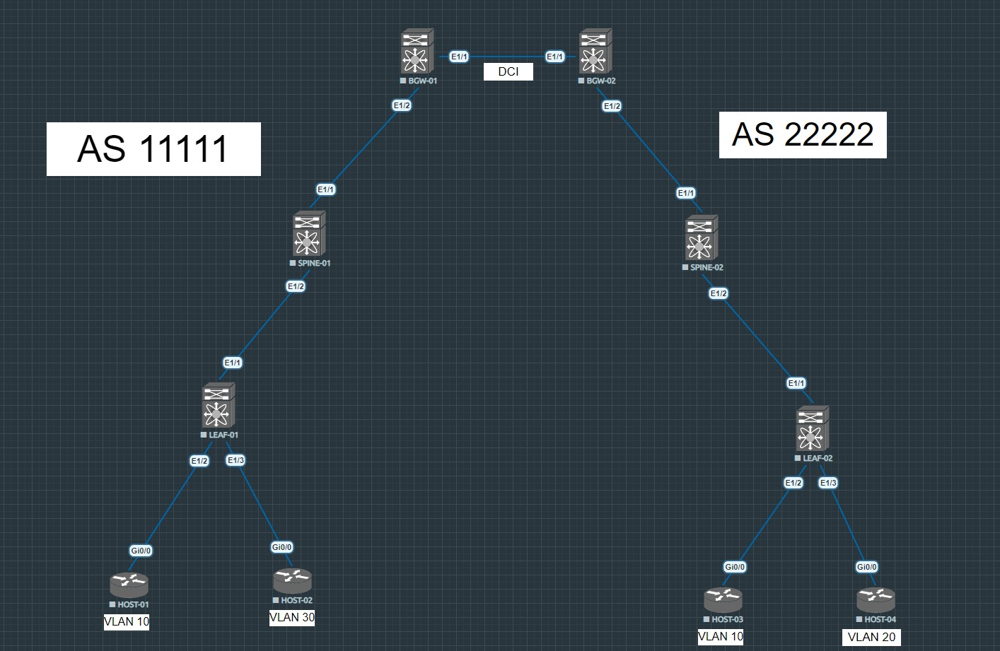

# VxLAN EVPN Multisite. Cisco NXOS 9K

### _В этой лабораторной работе я буду настраивать связность двух независимых VxLAN фабрик при помощи технолонии Cisco Multisite_

### _[!] Спойлер - у меня ничего не заработало. Есть основания полагать, что это особенности виртуализации NXOS в EVE-NG, но знаю случаи, когда у коллег это все же работало_

### _Для чего применять Multisite при объединении VxLANфабрик? Почему не обойтись подключением по Multipod и одним большим VxLAN доменом?_

_Multisite дает следующие преимущества:_

* каждая VxLAN фабрика работает независимо от остальных

_То есть проблемы, возникшие при эксплуатации одной фабрики, не оказывают влияние на другие. Сюда еще можно добавить, что если в одной из фабрик резко возрастет нагрузка на CPU устройств в результате работы динамической маршрутизации, это никак не затронет остальные фабрики_

* сокращение BUM трафика в виду деления одного большого broadcast домена на части

_Так как каждая фабрика будет заканчиваться там, где стоит border gateway, то и BUM трафик также закончится на нем (за исключением растянутого между фабриками L2VNI)_

* возможность использовать в каждой фабрике разные протоколы для Underlay и разные способы репликации BUM трафика

_Здесь идет речь о том, что в одной фабрике для связности в Underlay мы можем использовать OSPF, во второй IS-IS и так далее. А еще, можно, например, для репликации BUM трафика в одной фабрике использовать ingress replication, а в другой Multicast. В некоторых случаях это может быть удобно_

* простота объединения нескольких VxLAN фабрик через глобальный интернет (3 способа)
    * BGW подключены между собой через L3VPN облако
    * BGW подключены между собой через Super-Spine (SS должны работать в режиме RS)
    * BGW подключены между собой Back-to-Back (то бишь full-mesh топология)

### _Как это все работает?_

<br/>



_У нас появляется BGW - Border Gateway, по его роли очевидно, что он стоит на границе фабрики. Он строит VxLAN туннели до VTEP'ов в своей фабрике, а также до других BGW (то есть до других фабрик)_

_В моей лабораторной я использую 2 BGW (две независимые VxLAN фабрики). Конфигурация выглядит следующим образом_

### BGW-01

* необходимые фичи 

```
nv overlay evpn
feature ospf
feature bgp
feature fabric forwarding
feature interface-vlan
feature vn-segment-vlan-based
feature nv overlay
```

* говорю BGW, что он относится к фабрике с номером 100

```
evpn multisite border-gateway 100
```

* базовые настройки для VTEP'а (а BGW им тоже является)

```
fabric forwarding anycast-gateway-mac 0000.0011.1111

ip route 2.2.2.0/24 169.254.100.2

vlan 1,10,30,99

vlan 10
  name PROD
  vn-segment 100
vlan 30
  name STAGE
  vn-segment 300
vlan 99
  name VNI
  vn-segment 999

vrf context CLIENTS
  vni 999
  rd 1.1.1.100:999
  address-family ipv4 unicast
    route-target import 999:99
    route-target import 999:99 evpn
    route-target export 999:99
    route-target export 999:99 evpn

interface Vlan99
  no shutdown
  vrf member CLIENTS
  ip forward

interface nve1
  no shutdown
  host-reachability protocol bgp
  source-interface loopback1
  multisite border-gateway interface loopback10
  member vni 100
    ingress-replication protocol bgp
  member vni 300
    ingress-replication protocol bgp
  member vni 999 associate-vrf
```

* настройка физических интерфейсов и лупбеков

```
interface Ethernet1/1
  description bgw-02
  no switchport
  mtu 9216
  ip address 169.254.100.1/30
  no shutdown
  evpn multisite dci-tracking

interface Ethernet1/2
  description spine-01
  no switchport
  mtu 9216
  ip address 169.254.0.1/31
  ip router ospf 100 area 0.0.0.0
  no shutdown
  evpn multisite fabric-tracking

interface loopback0
  description router-id
  ip address 1.1.1.1/32
  ip router ospf 100 area 0.0.0.0

interface loopback1
  description vtep
  ip address 1.1.1.10/32
  ip router ospf 100 area 0.0.0.0

interface loopback10
  description dci
  ip address 1.1.1.100/32
  ip router ospf 100 area 0.0.0.0
```

* Поднимаю Underlay и Overlay

```
router ospf 100
  router-id 1.1.1.1
router bgp 11111
  router-id 1.1.1.1
  address-family l2vpn evpn
    retain route-target all
  neighbor 2.2.2.2
    remote-as 22222
    update-source loopback0
    ebgp-multihop 2
    peer-type fabric-external
    address-family l2vpn evpn
      send-community
      send-community extended
  neighbor 10.0.2.1
    remote-as 11111
    update-source loopback0
    peer-type fabric-border-leaf
    address-family l2vpn evpn
      send-community
      send-community extended
```

### _Тоже самое на втором BGW_

```
nv overlay evpn
feature ospf
feature bgp
feature fabric forwarding
feature interface-vlan
feature vn-segment-vlan-based
feature nv overlay

evpn multisite border-gateway 200


fabric forwarding anycast-gateway-mac 0000.0022.2222

ip route 1.1.1.0/24 169.254.100.1

vlan 1,10,20,99

vlan 10
  name PROD
  vn-segment 100
vlan 20
  name DEV
  vn-segment 200
vlan 99
  name VNI
  vn-segment 999

vrf context CLIENTS
  vni 999
  rd 2.2.2.200:999
  address-family ipv4 unicast
    route-target import 999:99
    route-target import 999:99 evpn
    route-target export 999:99
    route-target export 999:99 evpn

interface Vlan99
  no shutdown
  vrf member CLIENTS
  ip forward

interface nve1
  no shutdown
  host-reachability protocol bgp
  source-interface loopback1
  multisite border-gateway interface loopback10
  member vni 100
    ingress-replication protocol bgp
  member vni 200
    ingress-replication protocol bgp
  member vni 999 associate-vrf

interface Ethernet1/1
  description bgw-01
  no switchport
  mtu 9216
  ip address 169.254.100.2/30
  no shutdown
  evpn multisite dci-tracking

interface Ethernet1/2
  description spine-02
  no switchport
  mtu 9216
  ip address 169.254.1.1/31
  ip router ospf 200 area 0.0.0.0
  no shutdown
  evpn multisite fabric-tracking


interface loopback0
  description router-id
  ip address 2.2.2.2/32
  ip router ospf 200 area 0.0.0.0

interface loopback1
  description vtep
  ip address 2.2.2.20/32
  ip router ospf 200 area 0.0.0.0

interface loopback10
  description dci
  ip address 2.2.2.200/32
  ip router ospf 200 area 0.0.0.0


router ospf 200
  router-id 2.2.2.2
router bgp 22222
  router-id 2.2.2.2
  address-family l2vpn evpn
    retain route-target all
  neighbor 1.1.1.1
    remote-as 11111
    update-source loopback0
    ebgp-multihop 2
    peer-type fabric-external
    address-family l2vpn evpn
      send-community
      send-community extended
  neighbor 10.0.4.1
    remote-as 22222
    update-source loopback0
    peer-type fabric-border-leaf
    address-family l2vpn evpn
      send-community
      send-community extended
```

### _В чем особенность настройки BGW? Приведу эти настройки еще раз_

* в каждой независмой фабрике свой домен Multisite (задается на BGW)

```
evpn multisite border-gateway 100

evpn multisite border-gateway 200
```

* BGP l2vpn evpn соседи четко различаются между собой

_Локальная фабрика указывается как fabric-border-leaf, а DCI (data-center interconnect) как fabric-external_

```
peer-type fabric-external

peer-type fabric-border-leaf
```

* Eth интерфейсы также различаются

_Интерфейсы, которые смотрят на локальную фабрику, указываются как fabric-tracking, а те, что смотрят в сторону других BGW, как dci-tracking_

```
evpn multisite dci-tracking

evpn multisite fabric-tracking
```

* отдельный loopback интерфейс, для построения VxLAN туннеля с BGW других фабрик

```
multisite border-gateway interface loopback10
```

### _Настройки Spine_

_Так как я внутри каждой фабрики использую одну AS (как рекомендует Cisco), то спайны у меня выступают в роли Route-Reflector'ов_

* spine-01

```
nv overlay evpn
feature ospf
feature bgp
feature fabric forwarding
feature interface-vlan
feature vn-segment-vlan-based
feature nv overlay


fabric forwarding anycast-gateway-mac 0000.0011.1111


interface Ethernet1/1
  description bgw-01
  no switchport
  mtu 9216
  ip address 169.254.0.0/31
  ip router ospf 100 area 0.0.0.0
  no shutdown

interface Ethernet1/2
  description leaf-01
  no switchport
  mtu 9216
  ip address 169.254.0.2/31
  ip router ospf 100 area 0.0.0.0
  no shutdown


interface loopback0
  description router-id
  ip address 10.0.2.1/32
  ip router ospf 100 area 0.0.0.0


router ospf 100
  router-id 10.0.2.1
router bgp 11111
  router-id 10.0.2.1
  neighbor 1.1.1.1
    remote-as 11111
    update-source loopback0
    address-family l2vpn evpn
      send-community
      send-community extended
      route-reflector-client
  neighbor 10.0.1.1
    remote-as 11111
    update-source loopback0
    address-family l2vpn evpn
      send-community
      send-community extended
      route-reflector-client
```

* spine-02

```
nv overlay evpn
feature ospf
feature bgp
feature fabric forwarding
feature interface-vlan
feature vn-segment-vlan-based
feature nv overlay


fabric forwarding anycast-gateway-mac 0000.0022.2222


interface Ethernet1/1
  description bgw-02
  no switchport
  mtu 9216
  ip address 169.254.1.0/31
  ip router ospf 200 area 0.0.0.0
  no shutdown

interface Ethernet1/2
  description leaf-02
  no switchport
  mtu 9216
  ip address 169.254.1.2/31
  ip router ospf 200 area 0.0.0.0
  no shutdown


interface loopback0
  description router-id
  ip address 10.0.4.1/32
  ip router ospf 200 area 0.0.0.0


router ospf 200
  router-id 10.0.4.1
router bgp 22222
  router-id 10.0.4.1
  neighbor 2.2.2.2
    remote-as 22222
    update-source loopback0
    address-family l2vpn evpn
      send-community
      send-community extended
      route-reflector-client
  neighbor 10.0.3.1
    remote-as 22222
    update-source loopback0
    address-family l2vpn evpn
      send-community
      send-community extended
      route-reflector-client
```

### _На лифах стандартные настройки_

* leaf-01

```
nv overlay evpn
feature ospf
feature bgp
feature fabric forwarding
feature interface-vlan
feature vn-segment-vlan-based
feature nv overlay


fabric forwarding anycast-gateway-mac 0000.0011.1111

vlan 1,10,30,99

vlan 10
  name PROD
  vn-segment 100
vlan 30
  name STAGE
  vn-segment 300
vlan 99
  name VNI
  vn-segment 999

vrf context CLIENTS
  vni 999
  rd 10.0.1.10:999
  address-family ipv4 unicast
    route-target import 999:99
    route-target import 999:99 evpn
    route-target export 999:99
    route-target export 999:99 evpn

interface Vlan30
  no shutdown
  vrf member CLIENTS
  ip address 192.168.1.1/24
  fabric forwarding mode anycast-gateway

interface Vlan99
  no shutdown
  vrf member CLIENTS
  ip forward

interface nve1
  no shutdown
  host-reachability protocol bgp
  source-interface loopback1
  member vni 100
    ingress-replication protocol bgp
  member vni 300
    ingress-replication protocol bgp
  member vni 999 associate-vrf

interface Ethernet1/1
  description spine-01
  no switchport
  mtu 9216
  ip address 169.254.0.3/31
  ip router ospf 100 area 0.0.0.0
  no shutdown

interface Ethernet1/2
  description host-01
  switchport mode trunk
  switchport trunk allowed vlan 10

interface Ethernet1/3
  description host-02
  switchport mode trunk
  switchport trunk allowed vlan 30


interface loopback0
  description router-id
  ip address 10.0.1.1/32
  ip router ospf 100 area 0.0.0.0

interface loopback1
  description vtep
  ip address 10.0.1.10/32
  ip router ospf 100 area 0.0.0.0


router ospf 100
  router-id 10.0.1.1
router bgp 11111
  router-id 10.0.1.1
  neighbor 10.0.2.1
    remote-as 11111
    update-source loopback0
    address-family l2vpn evpn
      send-community
      send-community extended
evpn
  vni 100 l2
    rd 10.0.1.10:100
    route-target import 100:10
    route-target export 100:10
```

* leaf-02

```
nv overlay evpn
feature ospf
feature bgp
feature fabric forwarding
feature interface-vlan
feature vn-segment-vlan-based
feature nv overlay


fabric forwarding anycast-gateway-mac 0000.0022.2222

vlan 1,10,20,99

vlan 10
  name PROD
  vn-segment 100
vlan 20
  name DEV
  vn-segment 200
vlan 99
  name VNI
  vn-segment 999

vrf context CLIENTS
  vni 999
  rd 10.0.3.10:999
  address-family ipv4 unicast
    route-target import 999:99
    route-target import 999:99 evpn
    route-target export 999:99
    route-target export 999:99 evpn


interface Vlan20
  no shutdown
  vrf member CLIENTS
  ip address 192.168.2.1/24
  fabric forwarding mode anycast-gateway

interface Vlan99
  no shutdown
  vrf member CLIENTS
  ip forward

interface nve1
  no shutdown
  host-reachability protocol bgp
  source-interface loopback1
  member vni 100
    ingress-replication protocol bgp
  member vni 200
    ingress-replication protocol bgp
  member vni 999 associate-vrf

interface Ethernet1/1
  description spine-02
  no switchport
  mtu 9216
  ip address 169.254.1.3/31
  ip router ospf 200 area 0.0.0.0
  no shutdown

interface Ethernet1/2
  description host-03
  switchport mode trunk
  switchport trunk allowed vlan 10

interface Ethernet1/3
  description host-04
  switchport mode trunk
  switchport trunk allowed vlan 20


interface loopback0
  description router-id
  ip address 10.0.3.1/32
  ip router ospf 200 area 0.0.0.0

interface loopback1
  description vtep
  ip address 10.0.3.10/32
  ip router ospf 200 area 0.0.0.0


router ospf 200
  router-id 10.0.3.1
router bgp 22222
  router-id 10.0.3.1
  neighbor 10.0.4.1
    remote-as 22222
    update-source loopback0
    address-family l2vpn evpn
      send-community
      send-community extended
evpn
  vni 100 l2
    rd 10.0.3.10:100
    route-target import 100:10
    route-target export 100:10
```

### _Попробуем проверить связность между host-02 и host-04_

* host-02 имеет IP адрес 192.168.1.10/24 и МАС адрес 5010.0008.0000

```
Router#sh int gig 0/0.30 | inc (Ha|Inter)
  Hardware is iGbE, address is 5010.0008.0000 (bia 5010.0008.0000)
  Internet address is 192.168.1.10/24
```

* у него есть связность со шлюзом по умолчанию (SVI на leaf-01)

```
Router#ping 192.168.1.1
Type escape sequence to abort.
Sending 5, 100-byte ICMP Echos to 192.168.1.1, timeout is 2 seconds:
!!!!!
Success rate is 100 percent (5/5), round-trip min/avg/max = 2/2/4 ms
```

* попробуем пропинговать host-04 с IP адресом 192.168.2.10

```
Router#ping 192.168.2.10
Type escape sequence to abort.
Sending 5, 100-byte ICMP Echos to 192.168.2.10, timeout is 2 seconds:
.....
Success rate is 0 percent (0/5)
```

### _Что пошло не так?_

_Проверяем наличие маршрутной информации_

* leaf-01

```
leaf-01# show bgp l2vpn evpn 192.168.1.10
BGP routing table information for VRF default, address family L2VPN EVPN
Route Distinguisher: 10.0.1.1:32797    (L2VNI 300)
BGP routing table entry for [2]:[0]:[0]:[48]:[5010.0008.0000]:[32]:[192.168.1.10
]/272, version 22
Paths: (1 available, best #1)
Flags: (0x000102) (high32 00000000) on xmit-list, is not in l2rib/evpn

  Advertised path-id 1
  Path type: local, path is valid, is best path, no labeled nexthop
  AS-Path: NONE, path locally originated
    10.0.1.10 (metric 0) from 0.0.0.0 (10.0.1.1)
      Origin IGP, MED not set, localpref 100, weight 32768
      Received label 300 999
      Extcommunity: RT:999:99 RT:11111:300 ENCAP:8 Router MAC:5001.0000.1b08

  Path-id 1 advertised to peers:
    10.0.2.1
```

_Видим, что leaf-01 изучил на датаплейне IP адрес и MAC адрес host-02, а также, то, что он анонсирует этот маршрут в сторону 10.0.2.1, это spine-01_

* spine-01

```
spine-01# sh bgp l2vpn evpn 192.168.1.10
BGP routing table information for VRF default, address family L2VPN EVPN
Route Distinguisher: 10.0.1.1:32797
BGP routing table entry for [2]:[0]:[0]:[48]:[5010.0008.0000]:[32]:[192.168.1.10
]/272, version 39
Paths: (1 available, best #1)
Flags: (0x000202) (high32 00000000) on xmit-list, is not in l2rib/evpn, is not i
n HW

  Advertised path-id 1
  Path type: internal, path is valid, is best path, no labeled nexthop
  AS-Path: NONE, path sourced internal to AS
    10.0.1.10 (metric 41) from 10.0.1.1 (10.0.1.1)
      Origin IGP, MED not set, localpref 100, weight 0
      Received label 300 999
      Extcommunity: RT:999:99 RT:11111:300 ENCAP:8 Router MAC:5001.0000.1b08

  Path-id 1 advertised to peers:
    1.1.1.1
```

_Такая же ситуация. Spine-01 выучил этот маршрут от leaf-01 и передал дальше на bgw-01_

* bgw-01

```
bgw-01# sh bgp l2vpn evpn 192.168.1.10
BGP routing table information for VRF default, address family L2VPN EVPN
Route Distinguisher: 1.1.1.1:32797    (L2VNI 300)
BGP routing table entry for [2]:[0]:[0]:[48]:[5010.0008.0000]:[32]:[192.168.1.10
]/272, version 75
Paths: (1 available, best #1)
Flags: (0x000212) (high32 0x000400) on xmit-list, is in l2rib/evpn, is not in HW

  Advertised path-id 1
  Path type: internal, path is valid, is best path, no labeled nexthop, in rib
             Imported from 10.0.1.1:32797:[2]:[0]:[0]:[48]:[5010.0008.0000]:[32]
:[192.168.1.10]/272
  AS-Path: NONE, path sourced internal to AS
    10.0.1.10 (metric 81) from 10.0.2.1 (10.0.2.1)
      Origin IGP, MED not set, localpref 100, weight 0
      Received label 300 999
      Extcommunity: RT:999:99 RT:11111:300 ENCAP:8 Router MAC:5001.0000.1b08
      Originator: 10.0.1.1 Cluster list: 10.0.2.1

  Path-id 1 (dual) advertised to peers:
    2.2.2.2

Route Distinguisher: 10.0.1.1:32797
BGP routing table entry for [2]:[0]:[0]:[48]:[5010.0008.0000]:[32]:[192.168.1.10
]/272, version 39
Paths: (1 available, best #1)
Flags: (0x000202) (high32 00000000) on xmit-list, is not in l2rib/evpn, is not i
n HW

  Advertised path-id 1
  Path type: internal, path is valid, is best path, no labeled nexthop
             Imported to 3 destination(s)
             Imported paths list: CLIENTS L2-300 L3-999
  AS-Path: NONE, path sourced internal to AS
    10.0.1.10 (metric 81) from 10.0.2.1 (10.0.2.1)
      Origin IGP, MED not set, localpref 100, weight 0
      Received label 300 999
      Extcommunity: RT:999:99 RT:11111:300 ENCAP:8 Router MAC:5001.0000.1b08
      Originator: 10.0.1.1 Cluster list: 10.0.2.1

  Path-id 1 not advertised to any peer

Route Distinguisher: 1.1.1.100:999    (L3VNI 999)
BGP routing table entry for [2]:[0]:[0]:[48]:[5010.0008.0000]:[32]:[192.168.1.10
]/272, version 40
Paths: (1 available, best #1)
Flags: (0x000202) (high32 0x000400) on xmit-list, is not in l2rib/evpn, is not i
n HW

  Advertised path-id 1
  Path type: internal, path is valid, is best path, no labeled nexthop
             Imported from 10.0.1.1:32797:[2]:[0]:[0]:[48]:[5010.0008.0000]:[32]
:[192.168.1.10]/272
  AS-Path: NONE, path sourced internal to AS
    10.0.1.10 (metric 81) from 10.0.2.1 (10.0.2.1)
      Origin IGP, MED not set, localpref 100, weight 0
      Received label 300 999
      Extcommunity: RT:999:99 RT:11111:300 ENCAP:8 Router MAC:5001.0000.1b08
      Originator: 10.0.1.1 Cluster list: 10.0.2.1

  Path-id 1 (dual) not advertised to any peer

```

_Здесь кажется, тоже все нормально (но это не точно). Анонсирует в сторону bgw-02, то бишь в другую фабрику_

* bgw-02

```
bgw-02# sh bgp l2vpn evpn 192.168.1.10
BGP routing table information for VRF default, address family L2VPN EVPN
Route Distinguisher: 100:300
BGP routing table entry for [2]:[0]:[0]:[48]:[5010.0008.0000]:[32]:[192.168.1.10
]/272, version 42
Paths: (1 available, best #1)
Flags: (0x000202) (high32 00000000) on xmit-list, is not in l2rib/evpn, is not i
n HW

  Advertised path-id 1
  Path type: external, path is valid, is best path, no labeled nexthop
             Imported to 2 destination(s)
             Imported paths list: CLIENTS L3-999
  AS-Path: 11111 , path sourced external to AS
    1.1.1.100 (metric 0) from 1.1.1.1 (1.1.1.1)
      Origin IGP, MED 2000, localpref 100, weight 0
      Received label 300 999
      Extcommunity: RT:999:99 RT:11111:300 ENCAP:8 Router MAC:0200.0101.0164

  Path-id 1 not advertised to any peer

Route Distinguisher: 2.2.2.200:999    (L3VNI 999)
BGP routing table entry for [2]:[0]:[0]:[48]:[5010.0008.0000]:[32]:[192.168.1.10
]/272, version 43
Paths: (1 available, best #1)
Flags: (0x000202) (high32 0x000400) on xmit-list, is not in l2rib/evpn, is not i
n HW

  Advertised path-id 1
  Path type: external, path is valid, is best path, no labeled nexthop
             Imported from 100:300:[2]:[0]:[0]:[48]:[5010.0008.0000]:[32]:[192.1
68.1.10]/272
  AS-Path: 11111 , path sourced external to AS
    1.1.1.100 (metric 0) from 1.1.1.1 (1.1.1.1)
      Origin IGP, MED 2000, localpref 100, weight 0
      Received label 300 999
      Extcommunity: RT:999:99 RT:11111:300 ENCAP:8 Router MAC:0200.0101.0164

  Path-id 1 (dual) not advertised to any peer
```

_Тут мы и видим, что никуда дальше этот маршрут не уходит. Победить эту ситуацию я так и не смог_

* при том, что bgw-01 видит VTEP'ы, как в локальной фабрике, так и в DCI

```
bgw-01# show nve peers
Interface Peer-IP                                 State LearnType Uptime   Route
r-Mac
--------- --------------------------------------  ----- --------- -------- -----
------------
nve1      2.2.2.200                               Up    CP        06:01:28 0200.
0202.02c8
nve1      10.0.1.10                               Up    CP        06:01:46 5001.
0000.1b08
```

* bgw-02

```
bgw-02# show nve peers
Interface Peer-IP                                 State LearnType Uptime   Route
r-Mac
--------- --------------------------------------  ----- --------- -------- -----
------------
nve1      1.1.1.100                               Up    CP        06:02:43 0200.
0101.0164
nve1      10.0.3.10                               Up    CP        06:02:25 5002.
0000.1b08
```

* leaf-01

```
leaf-01# show nve peers
Interface Peer-IP                                 State LearnType Uptime   Route
r-Mac
--------- --------------------------------------  ----- --------- -------- -----
------------
nve1      1.1.1.10                                Up    CP        06:02:59 n/a
```

* leaf-02

```
leaf-02# sh nve peers
Interface Peer-IP                                 State LearnType Uptime   Route
r-Mac
--------- --------------------------------------  ----- --------- -------- -----
------------
nve1      2.2.2.20                                Up    CP        06:03:04 n/a
```

### _Маршруты в Underlay_

* bgw-01

```
bgw-01# sh ip route static
IP Route Table for VRF "default"
'*' denotes best ucast next-hop
'**' denotes best mcast next-hop
'[x/y]' denotes [preference/metric]
'%<string>' in via output denotes VRF <string>

2.2.2.0/24, ubest/mbest: 1/0
    *via 169.254.100.2, [1/0], 07:00:11, static

bgw-01# sh ip route ospf-100
IP Route Table for VRF "default"
'*' denotes best ucast next-hop
'**' denotes best mcast next-hop
'[x/y]' denotes [preference/metric]
'%<string>' in via output denotes VRF <string>

10.0.1.1/32, ubest/mbest: 1/0
    *via 169.254.0.0, Eth1/2, [110/81], 06:23:07, ospf-100, intra
10.0.1.10/32, ubest/mbest: 1/0
    *via 169.254.0.0, Eth1/2, [110/81], 06:23:07, ospf-100, intra
10.0.2.1/32, ubest/mbest: 1/0
    *via 169.254.0.0, Eth1/2, [110/41], 06:39:42, ospf-100, intra
169.254.0.2/31, ubest/mbest: 1/0
    *via 169.254.0.0, Eth1/2, [110/80], 06:39:42, ospf-100, intra
```

* bgw-02

```
bgw-02# sh ip route static
IP Route Table for VRF "default"
'*' denotes best ucast next-hop
'**' denotes best mcast next-hop
'[x/y]' denotes [preference/metric]
'%<string>' in via output denotes VRF <string>

1.1.1.0/24, ubest/mbest: 1/0
    *via 169.254.100.1, [1/0], 07:00:22, static

bgw-02# sh ip route ospf-200
IP Route Table for VRF "default"
'*' denotes best ucast next-hop
'**' denotes best mcast next-hop
'[x/y]' denotes [preference/metric]
'%<string>' in via output denotes VRF <string>

10.0.3.1/32, ubest/mbest: 1/0
    *via 169.254.1.0, Eth1/2, [110/81], 06:19:28, ospf-200, intra
10.0.3.10/32, ubest/mbest: 1/0
    *via 169.254.1.0, Eth1/2, [110/81], 06:19:28, ospf-200, intra
10.0.4.1/32, ubest/mbest: 1/0
    *via 169.254.1.0, Eth1/2, [110/41], 06:34:43, ospf-200, intra
169.254.1.2/31, ubest/mbest: 1/0
    *via 169.254.1.0, Eth1/2, [110/80], 06:34:51, ospf-200, intra
```

* leaf-01

```
leaf-01# sh ip route ospf-100
IP Route Table for VRF "default"
'*' denotes best ucast next-hop
'**' denotes best mcast next-hop
'[x/y]' denotes [preference/metric]
'%<string>' in via output denotes VRF <string>

1.1.1.1/32, ubest/mbest: 1/0
    *via 169.254.0.2, Eth1/1, [110/81], 06:23:58, ospf-100, intra
1.1.1.10/32, ubest/mbest: 1/0
    *via 169.254.0.2, Eth1/1, [110/81], 06:23:58, ospf-100, intra
1.1.1.100/32, ubest/mbest: 1/0
    *via 169.254.0.2, Eth1/1, [110/81], 06:23:58, ospf-100, intra
10.0.2.1/32, ubest/mbest: 1/0
    *via 169.254.0.2, Eth1/1, [110/41], 06:23:58, ospf-100, intra
169.254.0.0/31, ubest/mbest: 1/0
    *via 169.254.0.2, Eth1/1, [110/80], 06:23:58, ospf-100, intra
```

* leaf-02

```
leaf-02# show ip route ospf-200
IP Route Table for VRF "default"
'*' denotes best ucast next-hop
'**' denotes best mcast next-hop
'[x/y]' denotes [preference/metric]
'%<string>' in via output denotes VRF <string>

2.2.2.2/32, ubest/mbest: 1/0
    *via 169.254.1.2, Eth1/1, [110/81], 06:20:09, ospf-200, intra
2.2.2.20/32, ubest/mbest: 1/0
    *via 169.254.1.2, Eth1/1, [110/81], 06:20:09, ospf-200, intra
2.2.2.200/32, ubest/mbest: 1/0
    *via 169.254.1.2, Eth1/1, [110/81], 06:20:09, ospf-200, intra
10.0.4.1/32, ubest/mbest: 1/0
    *via 169.254.1.2, Eth1/1, [110/41], 06:20:09, ospf-200, intra
169.254.1.0/31, ubest/mbest: 1/0
    *via 169.254.1.2, Eth1/1, [110/80], 06:20:09, ospf-200, intra
```

### _Конфиги в этот раз не сохранял, так как весь конфиг продемонстрировал во время презентации_