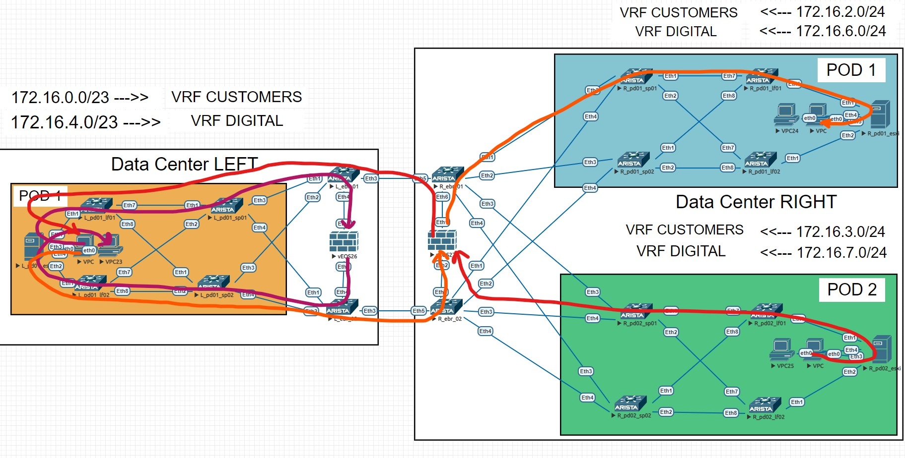

# _Проектная работа_

## _Проектирование сетевой фабрики на основне VxLAN EVPN_

_Цель проекта:_ 
* _спроектировать схему взаимодействия двух независмых друг от друга дата центров_
* _описать предъявляемые требования и применяемые технологии для решения задачи_
* _выполнить конфигурацию оборудования и продемонстрировать работоспособность услуги_

### _Схема взаимодействия (глазами клиента)_

_Для заказчика все выглядит как стандартный L3VPN. То есть у него есть два тенанта и два стыка с оборудованием облачного провайдера. На каждой площадке он получает необходиые маршруты для обмена трафиком со второй площадкой и наоборот. Nexthop во всех случаях - BGP пир со стороны провайдера_

_То есть нам нужно предоставить условному заказчику услугу L3VPN через VxLAN фабрику. Под услугой L3VPN я здесь подразумеваю не MPLS, а тот факт, что зона ответственности клиента заканчивается на ipv4 BGP стыке с облачным провайдером_

### _Требования к проекту_

* _обеспечить сетевую связность между удаленными площадками заказчика_
* _обеспечить заказчику надежный и приватный канал связи_
* _обеспечить отказоустойчивость и балансировку трафика_

### _Как я буду решать второй и третий пункт?_

_Канал связи будет построен таким образом, что трафик не будет выходить за пределы облака. Как это работает? - Не используем публичные адреса для маршрутизации, а значит трафик не может маршрутизироваться через сторонних провайдеров и, соответственно, быть "прослушан" на стороне. На POP площадках подразумевается выделенная линия между портами коммутаторов, размещенных в пределах одного здания, что тоже повышает надежность и конфиденциальность передачи данных_

### _Какие технологии я буду применять?_

* _BGP IPv4 для стыка с клиентом_
* _VxLAN EVPN для маршрутизации через фабрику_
* BGP IPv4 для стыка между ЦОДами

### _Разберем это все на целевой схеме. Если охватывать всю схему, выглядит она так_


_Мы можем видеть два дата центра, по разные стороны друг от друга. Это ЦОД "LEFT и ЦОД "RIGHT" (не благодарите за гениальные названия)_

_Они связаны через публичные POP площадки (можно представить, что это M9 и 3Data). Идея в том, что оба ЦОДа имеют выход на РОР, а значит организовать выделенный канал проще всего. ДЛя этого всего-то нужно настроить по одному интерфейсу на каждой из площадок с обеих сторон_

_Представим, что с каждой из сторон клиенту дали два влана (и даже представим, что они совпадают). Далее на бордерах создаем VRF, создаем SVI в тех самых вланах, связываем их с клиентским VRF'ом и внутри этого VRF'а поднимаем ipv4 BGP соседство. В рамках этой BGP сессии мы обмениваемся маршрутами из одного ЦОДа в другой_

_Но как передать клиентские префиксы от POP площадки до клиентских виртуальных маршрутизаторов на другом конце дата центра?_

### _Тут мы воспользуемся тем, что изучали весь курс - VxLAN EVPN фабрика_

_Для начала рассмотрим поближе каждый из ЦОДов. Начнем с "LEFT"_


_Слева в виде сервера у меня представлен ESXi гипервизор (шучу, это обычная ариста) и работающая "внутри" виртуальная машина_

_Для упрощения я опустил некоторые особенности VMware (например такие, что гипервизоры с виртуальными машинами и гипервизоры с виртуальными роутерами это чаще всего физически разные хосты). Представим, что этот гипервизор с подключенным VPCS это виртуальный клиентский роутер (читай VRF внутри EVM) и тенант с виртуальными машинами в одном лице_

_Этому гипервизору нужно как-то передать префикс 172.16.0.0/23 до двух бордеров, которые затем этот префикс через BGP передадут в другой дата центр_

_Для этого мы поднимаем  ipv4 BGP соседство с двумя лифами внутри VRF. LEAF коммутаторы, получив этот префикс импортируют его в EVPN соседство и через VxLAN фабрику отправляют дальше через L3VNI, примапленный к клиентскому VRF_

_Когда бордеры получат этот префикс, они наоборот импортируют его в ipv4 таблицу BGP и передают бордерам с другой POP площадки. А там мы увидим точно такой же алгоритм_


_Только здесь у меня два POD'а, но схема маршрутизации трафика абсолютно аналогичная. Через VxLAN фабрику префикс 172.16.0.0/23 доходит до LEAF коммутаторов, которые импортируют маршрут из EVPN таблицы в IPv4 и передают на клиентский виртуальный маршрутизатор_

### _Почему внутри POD'а всего два лифа?_

_На этой схеме рассматривается взаимодействие только в рамках конкретного канала связи. В настоящих дата центрах, безусловно, в одном только POD'е может быть несколько десятков лифов и хостов. Однако, в моем случае используется стандартная схема подключения одного хоста через два резервирующих друг друга лифа. Тут надо заметить, что в таких случаях эти лифы находятся либо в VPC\MLAG паре, либо используется EVPN Multihoming (кстати, оба способа я рассматривал здесь же в других лабах). Но в целях демонстрации подключения виртуального клиентского роутера через BGP к провайдерскому L3VPN я специально опустил эти настройки_

### _Вот и все с теорией. Приступаем к настройкам!_

<br/>

## _Настройки хостов (виртуальных маршрутизаторов внутри ESXi гипервизоров)_

_Вначале создаю 3 влана, один я буду использовать в качестве SVI для имитации маршрутизации виртуальных машин в зоне ответственности клиента. Они то и будут конечными хостами (для примера я использую VPCS образы в каждом POD'е)_

_Другие два, предположим, клиенту выделил провайдер (то есть мы), в них тоже будут созданы SVI, но уже для установления BGP сессии с оборудованием провайдера в рамках switchport trunk интерфейса_

_Ах да, еще необходимо, конечно же, создать VRF и все эти SVI положить внутрь. В нашем примере, этот самый VRF будет играть роль тенанта клиента_

```
vlan 100,1110,1120

vrf instance CUSTOMERS

interface Vlan100
   vrf CUSTOMERS
   ip address 172.16.1.254/23

interface Vlan1110
   mtu 9214
   vrf CUSTOMERS
   ip address 169.254.1.1/30

interface Vlan1120
   mtu 9214
   vrf CUSTOMERS
   ip address 169.254.1.5/30
```

_Далее необходимо настроить интерфейсы в сторону фабрики_

```
interface Port-Channel1
   description LEFT-pd01-leaf-01_Po1
   mtu 9214
   switchport trunk allowed vlan 1110
   switchport mode trunk
!
interface Port-Channel2
   description LEFT-pd01-leaf-02_Po1
   switchport trunk allowed vlan 1120
   switchport mode trunk
!
interface Ethernet1
   description LEFT-pd01-leaf-01_Eth1
   mtu 9214
   channel-group 1 mode active
!
interface Ethernet2
   description LEFT-pd01-leaf-02_Eth1
   mtu 9214
   channel-group 2 mode active
```

_Остается поднять BGP сессию с провайдером и отдать ему нужные сети для анонса в другой ЦОД_

```
ip prefix-list CLIENT_NET seq 5 permit 172.16.0.0/23
!
route-map CLIENT_NET permit 10
   match ip address prefix-list CLIENT_NET
!
peer-filter LEAF
   10 match as-range 4200100102 result accept
!
router bgp 4200100101
   no bgp default ipv4-unicast
   neighbor CUSTOMERS peer group
   !
   address-family ipv4
      neighbor CUSTOMERS activate
   !
   vrf CUSTOMERS
      router-id 10.1.0.1
      bgp listen range 169.254.1.0/29 peer-group CUSTOMERS peer-filter LEAF
      redistribute connected route-map CLIENT_NET
```

_На других двух гипервизорах в дата центре RIGHT настройки аналогичные, отличаются IP адреса на интерфейсах, вланы и анонсируемая сеть. С точки зрения всего остального логика та же. Опустим момент их настройки и будем считать, что они уже ждут TCP SYN'ов на 179 порт_

## _Настройки LEAF_

_Согласно нашей архитектуры, на каждом из двух лифов будет выделен один уникальный влан для пиринга с клиентом. Создадим VRF, SVI и пропишем настройки на интерфейсе_

```
vlan 1110

vrf instance CUSTOMERS

interface Port-Channel1
   description LEFT-pd01-esxi_Po1
   switchport trunk allowed vlan 1110
   switchport mode trunk

interface Ethernet1
   description LEFT-pd01-esxi_Eth1
   mtu 9214
   channel-group 1 mode active

interface Vlan1110
   mtu 9214
   vrf CUSTOMERS
   ip address 169.254.1.2/30   
```

_Поднимем BGP сессию с клиентским маршрутизатором, который уже ждет подключений в режиме "bgp listen range"_

```
interface Loopback0
   description router-id
   ip address 10.1.1.1/32

router bgp 4200100102
    router-id 10.1.1.1
    no bgp default ipv4-unicast
    neighbor CUSTOMERS peer group
    neighbor CUSTOMERS remote-as 4200100101
    neighbor CUSTOMERS maximum-routes 1000

    address-family ipv4
      neighbor CUSTOMERS activate
    
    vrf CUSTOMERS
      rd 10.1.1.1:22999
      route-target import evpn 2:22999
      route-target export evpn 2:22999
      neighbor 169.254.1.1 peer group CUSTOMERS
```

_На втором лифе проделаем все то же самое, но с другим vlan id. После этого BGP соседство должно было установиться и мы должны были увидеть анонсируемый со стороны LEFT-pd01-esxi префикс 172.16.0.0/23_

```
LEFT-pd01-leaf-01#sh ip bgp neighbors 169.254.1.1 routes vrf CUSTOMERS
BGP routing table information for VRF CUSTOMERS
Router identifier 169.254.1.2, local AS number 4200100102
Route status codes: s - suppressed, * - valid, > - active, E - ECMP head, e - ECMP
                    S - Stale, c - Contributing to ECMP, b - backup, L - labeled-unicast
                    % - Pending BGP convergence
Origin codes: i - IGP, e - EGP, ? - incomplete
RPKI Origin Validation codes: V - valid, I - invalid, U - unknown
AS Path Attributes: Or-ID - Originator ID, C-LST - Cluster List, LL Nexthop - Link Local Nexthop

          Network                Next Hop              Metric  AIGP       LocPref Weight  Path
 * >      172.16.0.0/23          169.254.1.1           0       -          100     0       4200100101 i
```

_Так и есть. Все работает. Идем дальше. Предположим, что со стороны ЦОДа RIGHT мы выполнили аналогичные настройки и смотрим на результат_

* pd01

```
RIGHT-pd01-leaf-01#show ip bgp neighbors 169.254.1.1 routes vrf CUSTOMERS
BGP routing table information for VRF CUSTOMERS
Router identifier 169.254.1.2, local AS number 4200200102
Route status codes: s - suppressed, * - valid, > - active, E - ECMP head, e - ECMP
                    S - Stale, c - Contributing to ECMP, b - backup, L - labeled-unicast
                    % - Pending BGP convergence
Origin codes: i - IGP, e - EGP, ? - incomplete
RPKI Origin Validation codes: V - valid, I - invalid, U - unknown
AS Path Attributes: Or-ID - Originator ID, C-LST - Cluster List, LL Nexthop - Link Local Nexthop

          Network                Next Hop              Metric  AIGP       LocPref Weight  Path
 * >      172.16.2.0/24          169.254.1.1           0       -          100     0       4200200101 i
```

* pd02

```
RIGHT-pd02-leaf-01#show ip bgp neighbors 169.254.1.1 routes vrf CUSTOMERS
BGP routing table information for VRF CUSTOMERS
Router identifier 169.254.1.2, local AS number 4200200202
Route status codes: s - suppressed, * - valid, > - active, E - ECMP head, e - ECMP
                    S - Stale, c - Contributing to ECMP, b - backup, L - labeled-unicast
                    % - Pending BGP convergence
Origin codes: i - IGP, e - EGP, ? - incomplete
RPKI Origin Validation codes: V - valid, I - invalid, U - unknown
AS Path Attributes: Or-ID - Originator ID, C-LST - Cluster List, LL Nexthop - Link Local Nexthop

          Network                Next Hop              Metric  AIGP       LocPref Weight  Path
 * >      172.16.3.0/24          169.254.1.1           0       -          100     0       4200200201 i
```

_Отлично, теперь нужно заняться тем, чтобы отдать эти префиксы на бордеры ЦОДов. Приступим к настройкам VxLAN EVPN_

_Процедура стандартная, на лифах создаем лупбек под VTEP, интерфейс VxLAN 1, а также устанавливаем EVPN BGP сессию со спайнами_

```
interface Loopback1
   description vtep
   ip address 10.1.1.10/32

interface Vxlan1
   vxlan source-interface Loopback1
   vxlan udp-port 4789
   vxlan vrf CUSTOMERS vni 11999

ip prefix-list LOOPBACKS seq 5 permit 10.1.1.0/24 eq 32

route-map LOOPBACKS permit 10
   match ip address prefix-list LOOPBACKS

router bgp 4200100102
   neighbor SPINE_OVERLAY peer group
   neighbor SPINE_OVERLAY remote-as 4200100103
   neighbor SPINE_OVERLAY update-source Loopback0
   neighbor SPINE_OVERLAY ebgp-multihop 2
   neighbor SPINE_OVERLAY send-community
   neighbor SPINE_UNDERLAY peer group
   neighbor SPINE_UNDERLAY remote-as 4200100103
   neighbor 10.1.2.1 peer group SPINE_OVERLAY
   neighbor 10.1.2.1 description LEFT-pd01-spine-01
   neighbor 10.1.2.2 peer group SPINE_OVERLAY
   neighbor 10.1.2.2 description LEFT-pd01-spine-02
   neighbor 169.254.0.0 peer group SPINE_UNDERLAY
   neighbor 169.254.0.8 peer group SPINE_UNDERLAY
   redistribute connected route-map LOOPBACKS
   !
   address-family evpn
      neighbor SPINE_OVERLAY activate
   !
   address-family ipv4
      neighbor SPINE_UNDERLAY activate
   !
   vrf CUSTOMERS
      rd 10.1.1.1:22999
      route-target import evpn 2:22999
      route-target export evpn 2:22999
```

_Выше я установил BGP сессии в Underlay, затем в рамках него проанонсирова IP адреса лупбеков, а после поднял с них BGP EVPN сессии в Overlay. После того, как сессии в обеих AFI установились, необходимо проэкспортировать полученные от клиента в ipv4 BGP префиксы в EVPN и передать дальше по фабрике - готово_

_Все аналогичные настройки невидимо проделываю еще на пяти лифах и идем дальше_

## _Настройка SPINE_

_Спайны настраиваются проще, им не нужно иметь VxLAN интерфейсы для форвардинга маршрутной информации между VTEP'ами. Достаточно создать по одному лупбеку, настроить интерфейсы в сторону фабрики и поднять BGP сессии в обеих AFI_

```
interface Loopback0
   description router-id
   ip address 10.1.2.1/32

ip prefix-list LOOPBACKS seq 5 permit 10.1.2.0/24 eq 32

route-map LOOPBACKS permit 10
   match ip address prefix-list LOOPBACKS

peer-filter AS_RANGE_UNDERLAY
   10 match as-range 4200100102-4200100199 result accept
   20 match as-range 4200100001 result accept

router bgp 4200100103
   router-id 10.1.2.1
   no bgp default ipv4-unicast
   bgp listen range 169.254.0.0/24 peer-group UNDERLAY peer-filter AS_RANGE_UNDERLAY
   neighbor BORDER_OVERLAY peer group
   neighbor BORDER_OVERLAY remote-as 4200100001
   neighbor BORDER_OVERLAY next-hop-unchanged
   neighbor BORDER_OVERLAY update-source Loopback0
   neighbor BORDER_OVERLAY ebgp-multihop 2
   neighbor BORDER_OVERLAY send-community
   neighbor LEAF_OVERLAY peer group
   neighbor LEAF_OVERLAY next-hop-unchanged
   neighbor LEAF_OVERLAY update-source Loopback0
   neighbor LEAF_OVERLAY ebgp-multihop 2
   neighbor LEAF_OVERLAY send-community
   neighbor UNDERLAY peer group
   neighbor 10.1.1.1 peer group LEAF_OVERLAY
   neighbor 10.1.1.1 remote-as 4200100102
   neighbor 10.1.1.1 description LEFT-pd01-leaf-01
   neighbor 10.1.1.2 peer group LEAF_OVERLAY
   neighbor 10.1.1.2 remote-as 4200100102
   neighbor 10.1.1.2 description LEFT-pd01-leaf-02
   neighbor 10.1.3.1 peer group BORDER_OVERLAY
   neighbor 10.1.3.1 description LEFT-border-01
   neighbor 10.1.3.2 peer group BORDER_OVERLAY
   neighbor 10.1.3.2 description LEFT-border-02
   redistribute connected route-map LOOPBACKS
   
   address-family evpn
      neighbor BORDER_OVERLAY activate
      neighbor LEAF_OVERLAY activate
   
   address-family ipv4
      neighbor UNDERLAY activate
```

_То же самое еще на пяти спайнах и идем проверять установившиеся сессии_

```
LEFT-pd01-spine-01#show bgp evpn summary
BGP summary information for VRF default
Router identifier 10.1.2.1, local AS number 4200100103
Neighbor Status Codes: m - Under maintenance
  Description              Neighbor V AS           MsgRcvd   MsgSent  InQ OutQ  Up/Down State   PfxRcd PfxAcc
  LEFT-pd01-leaf-01        10.1.1.1 4 4200100102      3090      3088    0    0    1d19h Estab   1      1
  LEFT-pd01-leaf-02        10.1.1.2 4 4200100102      3086      3097    0    0    1d19h Estab   1      1
```

_На текущий момент мы получили route-type 5 префиксы от лифов_

```

LEFT-pd01-spine-01#show bgp evpn
BGP routing table information for VRF default
Router identifier 10.1.2.1, local AS number 4200100103
Route status codes: s - suppressed, * - valid, > - active, E - ECMP head, e - ECMP
                    S - Stale, c - Contributing to ECMP, b - backup
                    % - Pending BGP convergence
Origin codes: i - IGP, e - EGP, ? - incomplete
AS Path Attributes: Or-ID - Originator ID, C-LST - Cluster List, LL Nexthop - Link Local Nexthop

          Network                Next Hop              Metric  LocPref Weight  Path
 * >     RD: 10.1.1.1:22999 ip-prefix 172.16.0.0/23
                                 10.1.1.10             -       100     0       4200100102 4200100101 i
 * >     RD: 10.1.1.2:22999 ip-prefix 172.16.0.0/23
                                 10.1.1.20             -       100     0       4200100102 4200100101 i
```

_На спайнах в другом ЦОД все точно так же (просто поверьте)_

## _Настройки BORDER_

_Осталось настроить бордеры на POP площадках. Начнем_

_настройки для установки BGP EVPN сессии мало чем отличаются от лифов_

```
interface Loopback0
   description router-id
   ip address 10.1.3.1/32

interface Loopback1
   description vtep
   ip address 10.1.3.10/32

interface Vxlan1
   vxlan source-interface Loopback1
   vxlan udp-port 4789
   vxlan vrf CUSTOMERS vni 22999

ip prefix-list LOOPBACKS seq 10 permit 10.1.3.0/24 eq 32
!
route-map LOOPBACKS permit 10
   match ip address prefix-list LOOPBACKS

router bgp 4200100001
   router-id 10.1.3.1
   no bgp default ipv4-unicast
   neighbor SPINE_OVERLAY peer group
   neighbor SPINE_OVERLAY update-source Loopback0
   neighbor SPINE_OVERLAY ebgp-multihop 2
   neighbor SPINE_OVERLAY send-community
   neighbor SPINE_UNDERLAY peer group
   neighbor 10.1.2.1 peer group SPINE_OVERLAY
   neighbor 10.1.2.1 remote-as 4200100103
   neighbor 10.1.2.1 description LEFT-pd01-spine-01
   neighbor 10.1.2.2 peer group SPINE_OVERLAY
   neighbor 10.1.2.2 remote-as 4200100103
   neighbor 10.1.2.2 description LEFT-pd01-spine-02
   neighbor 169.254.0.4 peer group SPINE_UNDERLAY
   neighbor 169.254.0.4 remote-as 4200100103
   neighbor 169.254.0.12 peer group SPINE_UNDERLAY
   neighbor 169.254.0.12 remote-as 4200100103
   redistribute connected route-map LOOPBACKS

   address-family evpn
      neighbor SPINE_OVERLAY activate

   address-family ipv4
      neighbor SPINE_UNDERLAY activate

   vrf CUSTOMERS
      rd 10.1.3.1:22999
      route-target import evpn 2:22999
      route-target export evpn 2:22999
```

_Проделываем на еще 3 бордерах и идем проверять сессии на спайн_

```
LEFT-pd01-spine-01#show bgp evpn summary
BGP summary information for VRF default
Router identifier 10.1.2.1, local AS number 4200100103
Neighbor Status Codes: m - Under maintenance
  Description              Neighbor V AS           MsgRcvd   MsgSent  InQ OutQ  Up/Down State   PfxRcd PfxAcc
  LEFT-pd01-leaf-01        10.1.1.1 4 4200100102      3110      3107    0    0    1d19h Estab   1      1
  LEFT-pd01-leaf-02        10.1.1.2 4 4200100102      3106      3117    0    0    1d19h Estab   1      1
  LEFT-border-01           10.1.3.1 4 4200100001      3106      3092    0    0    1d19h Estab   0      0
  LEFT-border-02           10.1.3.2 4 4200100001      3102      3091    0    0    1d19h Estab   0      0
```

_Так и должно быть. Нам нужно еще поднять IPv4 BGP сессию внутри VRF с другим ЦОДом_

## _Настройки DCI_

_Для начала нужно выделить некоторый влан, в рамках которого будет создан SVI для пиринга внутри VRF. С другой стороны он должен быть таким же, либо нужно применять настройку "switchport vlan translation" для маппинга_

_Пусть это будут вланы 3456 на верхней POP площадке и 3457 на нижней_

_Применим необходиые настройки_

```
vlan 3456

vrf instance CUSTOMERS

interface Port-Channel3
   description Data_Center_RIGHT_border-01_Po3
   mtu 9214
   switchport trunk allowed vlan 3456
   switchport mode trunk

interface Ethernet3
   description Data_Center_RIGHT_border-01_Eth3
   mtu 9214
   channel-group 3 mode active

interface Vlan3456
   mtu 9214
   vrf CUSTOMERS
   ip address 169.254.100.1/30

router bgp 4200100001
   neighbor Direct_Connect_Customer peer group
   neighbor Direct_Connect_Customer remote-as 4200200001
   neighbor Direct_Connect_Customer maximum-routes 1000

   address-family ipv4
      neighbor Direct_Connect_Customer activate
   
   vrf CUSTOMERS
      neighbor 169.254.100.2 peer group Direct_Connect_Customer
```

_С другой стороны аналогично на обеих площадках. А вот теперь можно проверить наличие маршрутов из разных фабрик на гипервизорах_

## _Проверка работоспособности_

* _на LEFT-pd01-esxi_

```
LEAF-pd01-esxi#show ip bgp vrf CUSTOMERS
BGP routing table information for VRF CUSTOMERS
Router identifier 10.1.0.1, local AS number 4200100101
Route status codes: s - suppressed, * - valid, > - active, # - not installed, E - ECMP head, e - ECMP
                    S - Stale, c - Contributing to ECMP, b - backup, L - labeled-unicast
Origin codes: i - IGP, e - EGP, ? - incomplete
AS Path Attributes: Or-ID - Originator ID, C-LST - Cluster List, LL Nexthop - Link Local Nexthop

         Network                Next Hop            Metric  LocPref Weight  Path
 * >     172.16.0.0/23          -                     1       0       -       i
 * >     172.16.2.0/24          169.254.1.2           0       100     0       4200100102 4200100103 4200100001 4200200001 4200200103 4200200102 4200200101 i
 *       172.16.2.0/24          169.254.1.6           0       100     0       4200100102 4200100103 4200100001 4200200001 4200200103 4200200102 4200200101 i
 * >     172.16.3.0/24          169.254.1.2           0       100     0       4200100102 4200100103 4200100001 4200200001 4200200203 4200200202 4200200201 i
 *       172.16.3.0/24          169.254.1.6           0       100     0       4200100102 4200100103 4200100001 4200200001 4200200203 4200200202 4200200201 i
```

* _на RIGHT-pd01-esxi_

```
RIGHT-pd01-esxi#show ip bgp vrf CUSTOMERS
BGP routing table information for VRF CUSTOMERS
Router identifier 10.2.0.1, local AS number 4200200101
Route status codes: s - suppressed, * - valid, > - active, # - not installed, E - ECMP head, e - ECMP
                    S - Stale, c - Contributing to ECMP, b - backup, L - labeled-unicast
Origin codes: i - IGP, e - EGP, ? - incomplete
AS Path Attributes: Or-ID - Originator ID, C-LST - Cluster List, LL Nexthop - Link Local Nexthop

         Network                Next Hop            Metric  LocPref Weight  Path
 * >     172.16.0.0/23          169.254.1.2           0       100     0       4200200102 4200200103 4200200001 4200100001 4200100103 4200100102 4200100101 i
 *       172.16.0.0/23          169.254.1.6           0       100     0       4200200102 4200200103 4200200001 4200100001 4200100103 4200100102 4200100101 i
 * >     172.16.2.0/24          -                     1       0       -       i
 * >     172.16.3.0/24          169.254.1.2           0       100     0       4200200102 4200200103 4200200001 4200200203 4200200202 4200200201 i
 *       172.16.3.0/24          169.254.1.6           0       100     0       4200200102 4200200103 4200200001 4200200203 4200200202 4200200201 i
```

* _на RIGHT-pd02-esxi_

```
RIGHT-pd02-esxi#show ip bgp vrf CUSTOMERS
BGP routing table information for VRF CUSTOMERS
Router identifier 10.22.0.1, local AS number 4200200201
Route status codes: s - suppressed, * - valid, > - active, # - not installed, E - ECMP head, e - ECMP
                    S - Stale, c - Contributing to ECMP, b - backup, L - labeled-unicast
Origin codes: i - IGP, e - EGP, ? - incomplete
AS Path Attributes: Or-ID - Originator ID, C-LST - Cluster List, LL Nexthop - Link Local Nexthop

         Network                Next Hop            Metric  LocPref Weight  Path
 * >     172.16.0.0/23          169.254.1.2           0       100     0       4200200202 4200200203 4200200001 4200100001 4200100103 4200100102 4200100101 i
 *       172.16.0.0/23          169.254.1.6           0       100     0       4200200202 4200200203 4200200001 4200100001 4200100103 4200100102 4200100101 i
 * >     172.16.2.0/24          169.254.1.2           0       100     0       4200200202 4200200203 4200200001 4200200103 4200200102 4200200101 i
 *       172.16.2.0/24          169.254.1.6           0       100     0       4200200202 4200200203 4200200001 4200200103 4200200102 4200200101 i
 * >     172.16.3.0/24          -                     1       0       -       i
```

_Как видим все необходимые маршруты появились в таблице маршрутизации vrf CUSTOMERS_

_Можем даже проверить связность между ВМ в LEFT-pd01-esxi с IP адресом 172.16.1.200 и ВМ в RIGHT-pd02-esxi с IP адресом 172.16.3.200_

```
VPCS> show ip

NAME        : VPCS[1]
IP/MASK     : 172.16.1.200/23
GATEWAY     : 172.16.1.254
DNS         :
MAC         : 00:50:79:66:68:16
LPORT       : 20000
RHOST:PORT  : 127.0.0.1:30000
MTU         : 1500

VPCS> ping 172.16.3.200

84 bytes from 172.16.3.200 icmp_seq=1 ttl=58 time=50.370 ms
84 bytes from 172.16.3.200 icmp_seq=2 ttl=58 time=50.954 ms
84 bytes from 172.16.3.200 icmp_seq=3 ttl=58 time=44.520 ms
84 bytes from 172.16.3.200 icmp_seq=4 ttl=58 time=54.716 ms
84 bytes from 172.16.3.200 icmp_seq=5 ttl=58 time=40.779 ms
```

_Как видим, схема взлетела и все работает. Таким образом нам удалось настроить сетевую связность между разными площадками клиента в рамках L3VPN, которая соответствует всем изложенным вначале требованиям_

<br/>

## Больше клиентов

_В дата центрах редко бывает мало клиентов, предположим, что к нам заехал еще один клиент и он тоже хочет L3VPN между ЦОДами. Добавим необходимую конфигурацию для второго заказчика. Пусть это будет VRF "DIGITAL" (мы же тут как бы в IT)_

* _что добавится на "ESXi хостах" (LEFT-pd01-esxi)_

```
vlan 110,120,200

vrf instance DIGITAL

interface Port-Channel1
   switchport trunk allowed vlan add 110

interface Port-Channel2
   switchport trunk allowed vlan add 120

interface Vlan110
   mtu 9214
   vrf DIGITAL
   ip address 169.254.2.1/30
!
interface Vlan120
   mtu 9214
   vrf DIGITAL
   ip address 169.254.2.5/30
!
interface Vlan200
   vrf DIGITAL
   ip address 172.16.5.254/23

ip prefix-list DIGITALS_NET seq 5 permit 172.16.4.0/23

route-map DIGITALS_NET permit 10
   match ip address prefix-list DIGITALS_NET

router bgp 4200100101
   neighbor DIGITAL peer group

   address-family ipv4
         neighbor DIGITAL activate

   vrf DIGITAL
      router-id 10.1.0.1
      bgp listen range 169.254.2.0/29 peer-group DIGITAL peer-filter LEAF
      redistribute connected route-map DIGITALS_NET
```

* _на LEAF'ах (LEFT-pd01-leaf-01)_

```
vlan 110

vrf instance DIGITAL

interface Port-Channel1
   switchport trunk allowed vlan add 110

interface Vlan110
   mtu 9214
   vrf DIGITAL
   ip address 169.254.2.2/30

interface Vxlan1
   vxlan vrf DIGITAL vni 33999

router bgp 4200100102
   neighbor DIGITAL peer group
   neighbor DIGITAL remote-as 4200100101
   neighbor DIGITAL maximum-routes 1000

   address-family ipv4
      neighbor DIGITAL activate
 
   vrf DIGITAL
      rd 10.1.1.1:33999
      route-target import evpn 2:33999
      route-target export evpn 2:33999
      neighbor 169.254.2.1 peer group DIGITAL
```

* _на LEAF'ах (LEFT-pd01-leaf-02)_

```
vlan 120

vrf instance DIGITAL

interface Port-Channel1
   switchport trunk allowed vlan add 120

interface Vlan120
   mtu 9214
   vrf DIGITAL
   ip address 169.254.2.6/30

interface Vxlan1
   vxlan vrf DIGITAL vni 33999

router bgp 4200100102
   neighbor DIGITAL peer group
   neighbor DIGITAL remote-as 4200100101
   neighbor DIGITAL maximum-routes 1000

   address-family ipv4
      neighbor DIGITAL activate
 
   vrf DIGITAL
      rd 10.1.1.2:33999
      route-target import evpn 2:33999
      route-target export evpn 2:33999
      neighbor 169.254.2.5 peer group DIGITAL
```

* _на BORDER'ах (LEFT-border-01)_

```
vlan 3986

vrf instance DIGITAL

interface Port-Channel3
   switchport trunk allowed vlan add 3986

interface Vlan3986
   mtu 9214
   vrf DIGITAL
   ip address 169.254.200.1/30

interface Vxlan1
   vxlan vrf DIGITAL vni 33999

router bgp 4200100001
   neighbor Direct_Connect_Digital peer group
   neighbor Direct_Connect_Digital remote-as 4200200001
   neighbor Direct_Connect_Digital maximum-routes 1000

   address-family ipv4
      neighbor Direct_Connect_Digital activate

   vrf DIGITAL
      rd 10.1.3.1:33999
      route-target import evpn 2:33999
      route-target export evpn 2:33999
      neighbor 169.254.200.2 peer group Direct_Connect_Digital
```
* _на BORDER'ах (LEFT-border-02)_

```
vlan 3987

vrf instance DIGITAL

interface Port-Channel3
   switchport trunk allowed vlan add 3987

interface Vlan3987
   mtu 9214
   vrf DIGITAL
   ip address 169.254.200.5/30

interface Vxlan1
   vxlan vrf DIGITAL vni 33999

router bgp 4200100001
   neighbor Direct_Connect_Digital peer group
   neighbor Direct_Connect_Digital remote-as 4200200001
   neighbor Direct_Connect_Digital maximum-routes 1000

   address-family ipv4
      neighbor Direct_Connect_Digital activate

   vrf DIGITAL
      rd 10.1.3.1:33999
      route-target import evpn 2:33999
      route-target export evpn 2:33999
      neighbor 169.254.200.6 peer group Direct_Connect_Digital
```

_Со стороны ЦОДа "RIGHT" проделаем аналогичные настройки в обоих ПОДах, а также добавим по одной ВМ в каждом ЦОДе и ПОДе. Пусть это будут 172.16.5.200, 172.16.6.200 и 172.16.7.200_

* _Проверим связность_

```
VPCS> show ip

NAME        : VPCS[1]
IP/MASK     : 172.16.5.200/23
GATEWAY     : 172.16.5.254
DNS         :
MAC         : 00:50:79:66:68:17
LPORT       : 20000
RHOST:PORT  : 127.0.0.1:30000
MTU         : 1500

VPCS> ping 172.16.6.200

84 bytes from 172.16.6.200 icmp_seq=1 ttl=58 time=60.666 ms
84 bytes from 172.16.6.200 icmp_seq=2 ttl=58 time=45.526 ms
84 bytes from 172.16.6.200 icmp_seq=3 ttl=58 time=50.198 ms
84 bytes from 172.16.6.200 icmp_seq=4 ttl=58 time=52.024 ms
84 bytes from 172.16.6.200 icmp_seq=5 ttl=58 time=44.035 ms

VPCS> ping 172.16.7.200

84 bytes from 172.16.7.200 icmp_seq=1 ttl=58 time=47.663 ms
84 bytes from 172.16.7.200 icmp_seq=2 ttl=58 time=41.966 ms
84 bytes from 172.16.7.200 icmp_seq=3 ttl=58 time=46.753 ms
84 bytes from 172.16.7.200 icmp_seq=4 ttl=58 time=45.663 ms
84 bytes from 172.16.7.200 icmp_seq=5 ttl=58 time=51.171 ms
```

* _проверим, что клиенты не пересекаются друг с другом_

```
VPCS> ping 172.16.1.200

*172.16.5.254 icmp_seq=1 ttl=64 time=3.840 ms (ICMP type:3, code:0, Destination network unreachable)
*172.16.5.254 icmp_seq=2 ttl=64 time=4.515 ms (ICMP type:3, code:0, Destination network unreachable)
*172.16.5.254 icmp_seq=3 ttl=64 time=3.401 ms (ICMP type:3, code:0, Destination network unreachable)
*172.16.5.254 icmp_seq=4 ttl=64 time=3.074 ms (ICMP type:3, code:0, Destination network unreachable)
*172.16.5.254 icmp_seq=5 ttl=64 time=3.232 ms (ICMP type:3, code:0, Destination network unreachable)
```

* _таблица маршрутизации в новом VRF_

```
LEAF-pd01-esxi#show ip bgp vrf DIGITAL
BGP routing table information for VRF DIGITAL
Router identifier 10.1.0.1, local AS number 4200100101
Route status codes: s - suppressed, * - valid, > - active, # - not installed, E - ECMP head, e - ECMP
                    S - Stale, c - Contributing to ECMP, b - backup, L - labeled-unicast
Origin codes: i - IGP, e - EGP, ? - incomplete
AS Path Attributes: Or-ID - Originator ID, C-LST - Cluster List, LL Nexthop - Link Local Nexthop

         Network                Next Hop            Metric  LocPref Weight  Path
 * >     172.16.4.0/23          -                     1       0       -       i
 * >     172.16.6.0/24          169.254.2.2           0       100     0       4200100102 4200100103 4200100001 4200200001 4200200103 4200200102 4200200101 i
 *       172.16.6.0/24          169.254.2.6           0       100     0       4200100102 4200100103 4200100001 4200200001 4200200103 4200200102 4200200101 i
 * >     172.16.7.0/24          169.254.2.2           0       100     0       4200100102 4200100103 4200100001 4200200001 4200200203 4200200202 4200200201 i
 *       172.16.7.0/24          169.254.2.6           0       100     0       4200100102 4200100103 4200100001 4200200001 4200200203 4200200202 4200200201 i
```

```
RIGHT-pd01-esxi#show ip bgp vrf DIGITAL
BGP routing table information for VRF DIGITAL
Router identifier 10.2.0.1, local AS number 4200200101
Route status codes: s - suppressed, * - valid, > - active, # - not installed, E - ECMP head, e - ECMP
                    S - Stale, c - Contributing to ECMP, b - backup, L - labeled-unicast
Origin codes: i - IGP, e - EGP, ? - incomplete
AS Path Attributes: Or-ID - Originator ID, C-LST - Cluster List, LL Nexthop - Link Local Nexthop

         Network                Next Hop            Metric  LocPref Weight  Path
 * >     172.16.4.0/23          169.254.2.2           0       100     0       4200200102 4200200103 4200200001 4200100001 4200100103 4200100102 4200100101 i
 *       172.16.4.0/23          169.254.2.6           0       100     0       4200200102 4200200103 4200200001 4200100001 4200100103 4200100102 4200100101 i
 * >     172.16.6.0/24          -                     1       0       -       i
 * >     172.16.7.0/24          169.254.2.2           0       100     0       4200200102 4200200103 4200200001 4200200203 4200200202 4200200201 i
 *       172.16.7.0/24          169.254.2.6           0       100     0       4200200102 4200200103 4200200001 4200200203 4200200202 4200200201 i
```

```
RIGHT-pd02-esxi#show ip bgp vrf DIGITAL
BGP routing table information for VRF DIGITAL
Router identifier 10.22.0.1, local AS number 4200200201
Route status codes: s - suppressed, * - valid, > - active, # - not installed, E - ECMP head, e - ECMP
                    S - Stale, c - Contributing to ECMP, b - backup, L - labeled-unicast
Origin codes: i - IGP, e - EGP, ? - incomplete
AS Path Attributes: Or-ID - Originator ID, C-LST - Cluster List, LL Nexthop - Link Local Nexthop

         Network                Next Hop            Metric  LocPref Weight  Path
 * >     172.16.4.0/23          169.254.2.2           0       100     0       4200200202 4200200203 4200200001 4200100001 4200100103 4200100102 4200100101 i
 *       172.16.4.0/23          169.254.2.6           0       100     0       4200200202 4200200203 4200200001 4200100001 4200100103 4200100102 4200100101 i
 * >     172.16.6.0/24          169.254.2.2           0       100     0       4200200202 4200200203 4200200001 4200200103 4200200102 4200200101 i
 *       172.16.6.0/24          169.254.2.6           0       100     0       4200200202 4200200203 4200200001 4200200103 4200200102 4200200101 i
 * >     172.16.7.0/24          -                     1       0       -       i
```

### _Таким образом удалось добавить второго клиента и наладить взаимодействие, при котором один клиент не пересекается с другим_

<br/>

## _Что если мы не ищем легких путей?_

_Настроить L3VPN на VxLAN EVPN фабрике, подключить через DCI два ЦОДа, разнести клиентов по разным VRF, но что, если захочется сделать еще сложнее?_

### _... Внедрим Firewall'ы в фабрику!_

_Все, что сделано до этого - не наш уровень. Поставим два фаервола, каждый в своей фабрике. Настроим route leaking через BGP пиринг бордеров с фаерволами в два dot1q линка. Каждый фаервол будет держать таблицу маршрутов обоих VRF'ов и будет воплощением отказоустойчивости в случае Failover'а второго. Но это тоже не сложно, а что если настроить симметричную маршрутизацию через один фаервол? Предположим, что это будут Stateful фаерволы, а значит нам нужно, чтобы трафик между двумя хостами всегда проходил одним путем, иначе фаервол дропнет пакеты_

### _Итого: задача выглядит так_

_На схеме ниже изображен packet-walk в зависимости от src и dst хостов_



_Проще разобрать по ходу настроек. Смысл следующий - при взаимодействии хостов одного VRF'а с хостами другого VRF'а, локальное (читай не выходя за пределы фабрики) возможно только между 172.16.0.0/23 и 172.16.4.0/23. Во ВСЕХ остальных случаях трафик должен проходить через фаервол в дата центре "RIGHT"_

_Как это сделать? Есть несколько способов, но мы возьмем самый гибкий и масштабируемый - BGP Communities_

* _для начала расставим фаерволы и настроим BGP с бордерами (на примере LEFT-firewall-01)_

```
interface Ethernet1
   description LEFT-border-01
   no switchport
!
interface Ethernet1.100
   encapsulation dot1q vlan 100
   ip address 169.254.10.1/31
!
interface Ethernet1.200
   encapsulation dot1q vlan 200
   ip address 169.254.10.3/31
!
interface Ethernet2
   description LEFT-border-02
   no switchport
!
interface Ethernet2.300
   encapsulation dot1q vlan 300
   ip address 169.254.10.5/31
!
interface Ethernet2.400
   encapsulation dot1q vlan 400
   ip address 169.254.10.7/31
```

```
router bgp 4259905000
   router-id 10.1.4.1
   no bgp default ipv4-unicast
   neighbor BORDER peer group
   neighbor 169.254.10.0 peer group BORDER
   neighbor 169.254.10.0 remote-as 4259840001
   neighbor 169.254.10.0 send-community
   neighbor 169.254.10.2 peer group BORDER
   neighbor 169.254.10.2 remote-as 4259840002
   neighbor 169.254.10.2 send-community
   neighbor 169.254.10.4 peer group BORDER
   neighbor 169.254.10.4 remote-as 4259840003
   neighbor 169.254.10.4 send-community
   neighbor 169.254.10.6 peer group BORDER
   neighbor 169.254.10.6 remote-as 4259840004
   neighbor 169.254.10.6 send-community
   !
   address-family ipv4
      neighbor BORDER activate
```

_Нужно еще сделать так, чтобы при сложной маршрутизации и BGP анонсами не получилось так, что префикс, который прошел через leaking и пришел на другой фаервол, ушел через другой линк в "родной" для него VRF. Для этого запретим фаерволам передавать анонсы префиксов в VRF, в котором они есть изначально_

```
ip prefix-list DENY_VRF_CUSTOMERS seq 5 permit 172.16.0.0/23
ip prefix-list DENY_VRF_CUSTOMERS seq 10 permit 172.16.2.0/24
ip prefix-list DENY_VRF_CUSTOMERS seq 15 permit 172.16.3.0/24
ip prefix-list DENY_VRF_DIGITAL seq 5 permit 172.16.4.0/23
ip prefix-list DENY_VRF_DIGITAL seq 10 permit 172.16.6.0/24
ip prefix-list DENY_VRF_DIGITAL seq 15 permit 172.16.7.0/24
!
route-map DENY_VRF_CUSTOMERS deny 10
   match ip address prefix-list DENY_VRF_CUSTOMERS
!
route-map DENY_VRF_CUSTOMERS permit 20
!
route-map DENY_VRF_DIGITAL deny 10
   match ip address prefix-list DENY_VRF_DIGITAL
!
route-map DENY_VRF_DIGITAL permit 20

router bgp 4259905000
   neighbor 169.254.10.0 route-map DENY_VRF_CUSTOMERS out
   neighbor 169.254.10.2 route-map DENY_VRF_DIGITAL out
   neighbor 169.254.10.4 route-map DENY_VRF_CUSTOMERS out
   neighbor 169.254.10.6 route-map DENY_VRF_DIGITAL out
```

_Второй фаервол настрон аналогично_

_Приступим к настройкам бордеров. Для начала настроим BGP пиринг с фаерволами, и главное, создадим нужные ip community, пометим отправляемые анонсы, а на втором линке по этим самым community вычислим вернувшиеся от фаервола маршруты и навесим на них, скажем, local preference 200. BGP пиринги, кстати, сделаем через locas-as no prepend replace as, чтобы не заморачиваться с allow-as in_

```
interface Ethernet4
   description LEFT-firewall-01
   no switchport

interface Ethernet4.100
   encapsulation dot1q vlan 100
   vrf CUSTOMERS
   ip address 169.254.10.0/31

interface Ethernet4.200
   encapsulation dot1q vlan 200
   vrf DIGITAL
   ip address 169.254.10.2/31

ip prefix-list LEFT_VRF_CUSTOMERS seq 5 permit 172.16.0.0/23
ip prefix-list LEFT_VRF_DIGITAL seq 5 permit 172.16.4.0/23
ip prefix-list RIGHT_VRF_CUSTOMERS seq 5 permit 172.16.2.0/23 le 24
ip prefix-list RIGHT_VRF_DIGITAL seq 5 permit 172.16.6.0/23 le 24

ip community-list LEFT_VRF_CUSTOMERS permit 26:17664
ip community-list LEFT_VRF_DIGITAL permit 26:17704
ip community-list RIGHT_VRF_CUSTOMERS permit 26:17684
ip community-list RIGHT_VRF_DIGITAL permit 26:17724

route-map CUSTOMERS_ACCEPT permit 10
   match community LEFT_VRF_CUSTOMERS
   set local-preference 200

route-map CUSTOMERS_ACCEPT permit 20

route-map CUSTOMERS_SEND permit 10
   match ip address prefix-list LEFT_VRF_CUSTOMERS
   set community community-list LEFT_VRF_CUSTOMERS

route-map CUSTOMERS_SEND permit 20
   match ip address prefix-list RIGHT_VRF_CUSTOMERS

route-map DIGITAL_ACCEPT permit 10
   match community LEFT_VRF_DIGITAL
   set local-preference 200

route-map DIGITAL_ACCEPT permit 20

route-map DIGITAL_SEND permit 10
   match ip address prefix-list LEFT_VRF_DIGITAL
   set community community-list LEFT_VRF_DIGITAL

route-map DIGITAL_SEND permit 20
   match ip address prefix-list RIGHT_VRF_DIGITAL

router bgp 4200100001
   neighbor FIREWALL peer group
   neighbor FIREWALL remote-as 4259905000

   address-family ipv4
      neighbor FIREWALL activate
   
   vrf CUSTOMERS
      neighbor 169.254.10.1 peer group FIREWALL
      neighbor 169.254.10.1 local-as 4259840001 no-prepend replace-as
      neighbor 169.254.10.1 route-map DIGITAL_ACCEPT in
      neighbor 169.254.10.1 route-map CUSTOMERS_SEND out
      neighbor 169.254.10.1 send-community
      aggregate-address 172.16.2.0/23 summary-only
   !
   vrf DIGITAL
      neighbor 169.254.10.3 peer group FIREWALL
      neighbor 169.254.10.3 local-as 4259840002 no-prepend replace-as
      neighbor 169.254.10.3 route-map CUSTOMERS_ACCEPT in
      neighbor 169.254.10.3 route-map DIGITAL_SEND out
      neighbor 169.254.10.3 send-community
      aggregate-address 172.16.6.0/23 summary-only
```

_На остальных трех бордерах логика такая же - передать маршруты на фаервол, получить их обратно через другой линк и навесить local preference выше стандартного. ВАЖНО: на бордерах LEFT-border-01 и LEFT-border-02 это нужно сделать лишь для префиксов 172.16.0.0/23 и 172.16.4.0/23. Иначе не получится реализовать задумку с симметричным traffic flow_

_Теперь осталось применить политики community между анонсами из дата центра RIGHT в дата центр LEFT_

* _отдаем из RIGHT в LEFT_

```
ip prefix-list CUSTOMERS_DC_OUT seq 5 permit 172.16.2.0/23
ip prefix-list CUSTOMERS_DC_OUT seq 10 permit 172.16.6.0/23

ip prefix-list DIGITAL_DC_OUT seq 5 permit 172.16.6.0/23
ip prefix-list DIGITAL_DC_OUT seq 10 permit 172.16.2.0/23

ip community-list RIGHT_VRF_CUSTOMERS permit 26:17684
ip community-list RIGHT_VRF_DIGITAL permit 26:17724

route-map CUSTOMERS_DC_OUT permit 10
   match ip address prefix-list CUSTOMERS_DC_OUT
   set community community-list RIGHT_VRF_CUSTOMERS

route-map CUSTOMERS_DC_OUT permit 20

route-map DIGITAL_DC_OUT permit 10
   match ip address prefix-list DIGITAL_DC_OUT
   set community community-list RIGHT_VRF_DIGITAL

route-map DIGITAL_DC_OUT permit 20

router bgp 4200200001
   neighbor Direct_Connect_Customer route-map CUSTOMERS_DC_OUT out
   neighbor Direct_Connect_Customer send-community
   neighbor Direct_Connect_Customer maximum-routes 1000

   neighbor Direct_Connect_Digital route-map DIGITAL_DC_OUT out
   neighbor Direct_Connect_Digital send-community
   neighbor Direct_Connect_Digital maximum-routes 1000
```

* _принимаем в LEFT из RIGHT_

```
ip community-list RIGHT_VRF_CUSTOMERS permit 26:17684
ip community-list RIGHT_VRF_DIGITAL permit 26:17724

route-map CUSTOMERS_FROM_DC permit 10
   match community RIGHT_VRF_CUSTOMERS
   set local-preference 200

route-map CUSTOMERS_FROM_DC permit 20

route-map DIGITAL_FROM_DC permit 10
   match community RIGHT_VRF_DIGITAL
   set local-preference 200

route-map DIGITAL_FROM_DC permit 20

router bgp 4200100001
   neighbor Direct_Connect_Customer route-map CUSTOMERS_FROM_DC in
   neighbor Direct_Connect_Customer send-community
   neighbor Direct_Connect_Customer maximum-routes 1000

   neighbor Direct_Connect_Digital route-map DIGITAL_FROM_DC in
   neighbor Direct_Connect_Digital send-community
   neighbor Direct_Connect_Digital maximum-routes 1000
```

* _все готово, можем проверять_

_Выполним трассировку с VM в VRF "CUSTOMERS" до ВМ в VRF "DIGITAL", которая находится на этом же "гипервизоре", то есть в этом же ЦОДе_

```
VPCS> show ip

NAME        : VPCS[1]
IP/MASK     : 172.16.1.200/23
GATEWAY     : 172.16.1.254
DNS         :
MAC         : 00:50:79:66:68:16
LPORT       : 20000
RHOST:PORT  : 127.0.0.1:30000
MTU         : 1500

VPCS> trace 172.16.5.200
trace to 172.16.5.200, 8 hops max, press Ctrl+C to stop
 1   172.16.1.254   2.763 ms  3.126 ms  2.806 ms
 2   169.254.1.2   9.109 ms  7.807 ms  7.331 ms
 3   169.254.100.1   20.791 ms  19.003 ms  16.198 ms
 4   169.254.10.1   18.700 ms  20.265 ms  18.721 ms
 5   169.254.10.2   22.358 ms  21.229 ms  20.575 ms
 6   169.254.2.2   32.562 ms  30.162 ms  29.413 ms
 7   169.254.2.1   40.441 ms  31.978 ms  35.266 ms
 8   *172.16.5.200   41.335 ms (ICMP type:3, code:3, Destination port unreachable)
```

_Как видим, трафик идет через 169.254.10.1 и 169.254.10.2. Это интерфейсы LEFT-firewall-01. А теперь попробуем до двух других ВМ в VRF "DIGITAL", но тех, что находятся в другом ЦОДе_

```
VPCS> trace 172.16.6.200
trace to 172.16.6.200, 8 hops max, press Ctrl+C to stop
 1   172.16.1.254   3.190 ms  1.976 ms  2.128 ms
 2   169.254.1.2   8.120 ms  6.560 ms  6.833 ms
 3   169.254.100.5   17.316 ms  15.703 ms  17.411 ms
 4   169.254.100.6   26.570 ms  26.535 ms  24.526 ms
 5   169.254.20.5   31.412 ms  29.054 ms  33.168 ms
 6   169.254.20.2   32.258 ms  33.908 ms  32.840 ms
 7   169.254.2.6   40.370 ms  40.388 ms  53.654 ms
 8   169.254.2.1   50.180 ms  57.490 ms  48.662 ms

VPCS> trace 172.16.7.200
trace to 172.16.7.200, 8 hops max, press Ctrl+C to stop
 1   172.16.1.254   3.352 ms  2.066 ms  1.816 ms
 2   169.254.1.2   10.746 ms  7.030 ms  6.957 ms
 3   169.254.100.5   15.198 ms  15.290 ms  15.438 ms
 4   169.254.100.6   21.679 ms  28.405 ms  28.581 ms
 5   169.254.20.5   39.006 ms  31.420 ms  33.518 ms
 6   169.254.20.2   33.812 ms  30.960 ms  30.533 ms
 7   169.254.2.6   39.822 ms  51.865 ms  43.309 ms
 8   169.254.2.1   50.271 ms  49.321 ms  46.741 ms
```

_Как видим, в этот раз, трафик пошел через 169.254.20.5 и 169.254.20.2, это интерфейсы RIGHT-firewall-01. Чего и следовало ожидать_

_Попробуем с другой стороны. С ВМ в VRF "DIGITAL выполним трассировку в трех вариантах:_

* _до ВМ в VRF "CUSTOMERS" в этом же ЦОДе_
* _до ВМ в VRF "CUSTOMERS" в другом ЦОДе_
* _до ВМ в VRF "DIGITAL" в другом ЦОДе (то есть ожидаем, что трафик минует firewall)_

```
PC1 : 172.16.6.200 255.255.255.0 gateway 172.16.6.254

VPCS> trace 172.16.3.200
trace to 172.16.3.200, 8 hops max, press Ctrl+C to stop
 1   172.16.6.254   2.168 ms  2.423 ms  1.930 ms
 2   169.254.2.2   7.030 ms  7.346 ms  6.728 ms
 3   169.254.200.2   18.360 ms  28.943 ms  15.535 ms
 4   169.254.20.3   19.388 ms  20.227 ms  24.133 ms
 5   169.254.20.0   26.765 ms  26.246 ms  26.957 ms
 6   169.254.1.6   34.105 ms  30.332 ms  46.232 ms
 7   169.254.1.1   46.487 ms  37.311 ms  38.763 ms
 8   *172.16.3.200   47.633 ms (ICMP type:3, code:3, Destination port unreachable)

VPCS> trace 172.16.1.200
trace to 172.16.1.200, 8 hops max, press Ctrl+C to stop
 1   172.16.6.254   3.161 ms  2.037 ms  2.169 ms
 2   169.254.2.2   8.363 ms  8.748 ms  6.392 ms
 3   169.254.200.6   16.801 ms  16.081 ms  17.816 ms
 4   169.254.20.7   20.281 ms  21.517 ms  21.841 ms
 5   169.254.20.0   23.295 ms  22.994 ms  28.260 ms
 6   169.254.100.1   28.392 ms  30.293 ms  29.398 ms
 7   169.254.1.6   39.757 ms  39.605 ms  48.776 ms
 8   169.254.1.1   47.450 ms  50.277 ms  47.027 ms

VPCS> trace 172.16.5.200
trace to 172.16.5.200, 8 hops max, press Ctrl+C to stop
 1   172.16.6.254   2.798 ms  2.085 ms  1.660 ms
 2   169.254.2.2   6.977 ms  6.332 ms  6.189 ms
 3   169.254.200.6   16.127 ms  15.523 ms  15.320 ms
 4   169.254.200.5   23.565 ms  23.704 ms  28.877 ms
 5   169.254.2.2   35.802 ms  31.798 ms  33.389 ms
 6   169.254.2.1   48.185 ms  40.614 ms  42.066 ms
 7   *172.16.5.200   46.884 ms (ICMP type:3, code:3, Destination port unreachable)
```

_Все работает согласно ожиданиям_

_В случае Failover'а RIGHT-firewall-01 трафик без потерь уйдет на оставшийся LEFT-firewall-01 и наоборот, так как на бордерах есть маршруты в оба фаервола, просто один из них с local-preference 200_

```
BGP routing table information for VRF CUSTOMERS
Router identifier 169.254.100.1, local AS number 4200100001
Route status codes: s - suppressed, * - valid, > - active, E - ECMP head, e - ECMP
                    S - Stale, c - Contributing to ECMP, b - backup, L - labeled-unicast
                    % - Pending BGP convergence
Origin codes: i - IGP, e - EGP, ? - incomplete
RPKI Origin Validation codes: V - valid, I - invalid, U - unknown
AS Path Attributes: Or-ID - Originator ID, C-LST - Cluster List, LL Nexthop - Link Local Nexthop

          Network                Next Hop              Metric  AIGP       LocPref Weight  Path
 * >      172.16.0.0/23          10.1.1.20             0       -          100     0       4200100103 4200100102 4200100101 i
 *        172.16.0.0/23          10.1.1.20             0       -          100     0       4200100103 4200100102 4200100101 i
 *        172.16.0.0/23          10.1.1.10             0       -          100     0       4200100103 4200100102 4200100101 i
 *        172.16.0.0/23          10.1.1.10             0       -          100     0       4200100103 4200100102 4200100101 i
 * >      172.16.2.0/23          169.254.100.2         0       -          200     0       4200200001 i
 * >      172.16.4.0/23          169.254.10.1          0       -          200     0       4259905000 4259840002 4200100103 4200100102 4200100101 i
 * >      172.16.6.0/23          169.254.100.2         0       -          200     0       4200200001 4292673500 4292608002 i
 *        172.16.6.0/23          169.254.10.1          0       -          100     0       4259905000 4259840002 4200200001 i
BGP routing table information for VRF DIGITAL
Router identifier 169.254.200.1, local AS number 4200100001
Route status codes: s - suppressed, * - valid, > - active, E - ECMP head, e - ECMP
                    S - Stale, c - Contributing to ECMP, b - backup, L - labeled-unicast
                    % - Pending BGP convergence
Origin codes: i - IGP, e - EGP, ? - incomplete
RPKI Origin Validation codes: V - valid, I - invalid, U - unknown
AS Path Attributes: Or-ID - Originator ID, C-LST - Cluster List, LL Nexthop - Link Local Nexthop

          Network                Next Hop              Metric  AIGP       LocPref Weight  Path
 * >      172.16.0.0/23          169.254.10.3          0       -          200     0       4259905000 4259840001 4200100103 4200100102 4200100101 i
 * >      172.16.2.0/23          169.254.200.2         0       -          200     0       4200200001 4292673500 4292608001 i
 *        172.16.2.0/23          169.254.10.3          0       -          100     0       4259905000 4259840001 4200200001 i
 * >      172.16.4.0/23          10.1.1.10             0       -          100     0       4200100103 4200100102 4200100101 i
 *        172.16.4.0/23          10.1.1.10             0       -          100     0       4200100103 4200100102 4200100101 i
 *        172.16.4.0/23          10.1.1.20             0       -          100     0       4200100103 4200100102 4200100101 i
 *        172.16.4.0/23          10.1.1.20             0       -          100     0       4200100103 4200100102 4200100101 i
 * >      172.16.6.0/23          169.254.200.2         0       -          200     0       4200200001 i
```

## _На этом все!_

<br/>

_[Ссылка](https://github.com/dontmesswithnets/study_otus/tree/main/project.work/configs) на конфиги_
