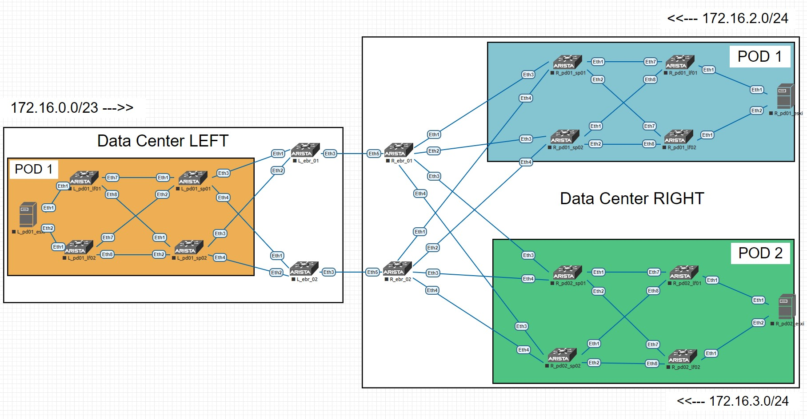
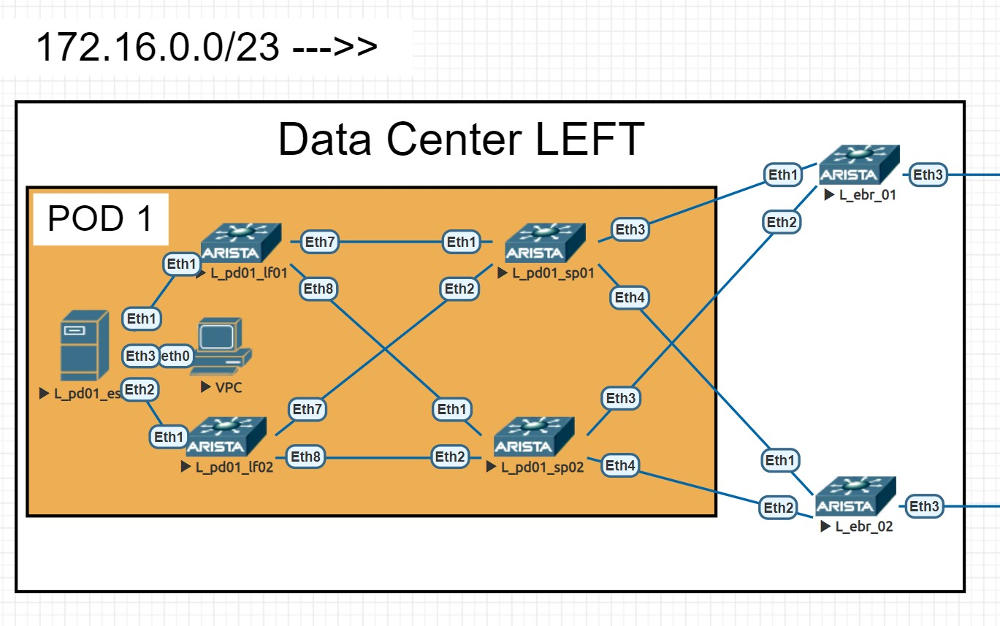
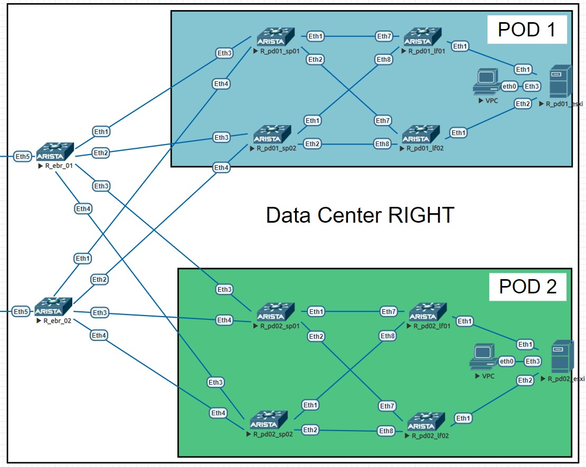

# _Проектная работа_

## _Проектирование сетевой фабрики на основне VxLAN EVPN_

_Цель проекта:_ 
* _спроектировать схему взаимодействия двух независмых друг от друга дата центров_
* _описать предъявляемые требования и применяемые технологии для решения задачи_
* _выполнить конфигурацию оборудования и продемонстрировать работоспособность услуги_

### _Схема взаимодействия (глазами клиента)_

_Для заказчика все выглядит как стандартный L3VPN. То есть у него есть два тенанта и два стыка с оборудованием облачного провайдера. На каждой площадке он получает необходиые маршруты для обмена трафиком со второй площадкой и наоборот. Nexthop во всех случаях - BGP пир со стороны провайдера_

_То есть нам нужно предоставить условному заказчику услугу L3VPN через VxLAN фабрику. Под услугой L3VPN я здесь подразумеваю не MPLS, а тот факт, что зона ответственности клиента заканчивается на ipv4 BGP стыке с облачным провайдером_

### _Требования к проекту_

* _обеспечить сетевую связность между удаленными площадками заказчика_
* _обеспечить заказчику надежный и приватный канал связи_
* _обеспечить отказоустойчивость и балансировку трафика_

### _Как я буду решать второй и третий пункт?_

_Канал связи будет построен таким образом, что трафик не будет выходить за пределы облака. Как это работает? - Не используем публичные адреса для маршрутизации, а значит трафик не может маршрутизироваться через сторонних провайдеров и, соответственно, быть "прослушан" на стороне. На POP площадках подразумевается выделенная линия между портами коммутаторов, размещенных в пределах одного здания, что тоже повышает надежность и конфидицальность передачи данных_

### _Какие технологии я буду применять?_

* _BGP IPv4 для стыка с клиентом_
* _VxLAN EVPN для маршрутизации через фабрику_
* BGP IPv4 для стыка между ЦОДами

### _Разберем это все на целевой схеме. Если охватывать всю схему, выглядит она так_

_Мы можем видеть два дата центра, по разные стороны друг от друга. Это ЦОД "LEFT и ЦОД "RIGHT" (не благодарите за гениальные названия)_

_Они связаны через публичные POP площадки (можно представить, что это M9 и 3Data). Идея в том, что оба ЦОДа имеют выход на РОР, а значит организовать выделенный канал проще всего. ДЛя этого всего-то нужно настроить по одному интерфейсу на каждой из площадок с обеих сторон_

_Представим, что с каждой из сторон клиенту дали два влана (и даже представим, что они совпадают). Далее на бордерах создаем VRF, создаем SVI в тех самых вланах, связываем их с клиентским VRF'ом и внутри этого VRF'а поднимаем ipv4 BGP соседство. В рамках этой BGP сессии мы обмениваемся маршрутами из одного ЦОДа в другой_

_Но как передать клиентские префиксы от POP площадки до клиентских виртуальных маршрутизаторов на другом конце дата центра?_

### _Тут мы воспользуемся тем, что изучали весь курс - VxLAN EVPN фабрика_

_Для начала рассмотрим поближе каждый из ЦОДов. Начнем с "LEFT"_

_Слева в виде сервера у меня представлен ESXi гипервизор (шучу, это обычная ариста) и работающая "внутри" виртуальная машина_

_Для упрощения я опустил некоторые особенности VMware (например такие, что гипервизоры с виртуальными машинами и гипервизоры с виртуальными роутерами это чаще всего физически разные хосты). Представим, что этот гипервизор с подключенным VPCS это виртуальный клиентский роутер (читай VRF внутри EVM) и тенант с виртуальными машинами в одном лице_

_Этому гипервизору нужно как-то передать префикс 172.16.0.0/23 до двух бордеров, которые затем этот префикс через BGP передадут в другой дата центр_

_Для этого мы поднимаем  ipv4 BGP соседство с двумя лифами внутри VRF. LEAF коммутаторы, получив этот префикс импортируют его в EVPN соседство и через VxLAN фабрику отправляют дальше через L3VNI, примапленный к клиентскому VRF_

_Когда бордеры получат этот префикс, они наоборот импортируют его в ipv4 таблицу BGP и передают бордерам с другой POP площадки. А там мы увидим точно такой же алгоритм_

_Только здесь у меня два POD'а, но схема маршрутизации трафика абсолютно аналогичная. Через VxLAN фабрику префикс 172.16.0.0/23 доходит до LEAF коммутаторов, которые импортируют маршрут из EVPN таблицы в IPv4 и передают на клиентский виртуальный маршрутизатор_

### _Почему внутри POD'а всего два лифа?_

_На этой схеме рассматривается взаимодействие только в рамках конкретного канала связи. В настоящих дата центрах, безусловно, в одном только POD'е может быть несколько десятков лифов и хостов. Однако, в моем случае используется стандартная схема подключения одного хоста через два резервирующих друг друга лифа. Тут надо заметить, что в таких случаях эти лифы находятся либо в VPC\MLAG паре, либо используется EVPN Multihoming (кстати, оба способа я рассматривал здесь же в других лабах). Но в целях демонстрации подключения виртуального клиентского роутера через BGP к провайдерскому L3VPN я специально опустил эти настройки_

### _Вот и все с теорией. Приступаем к настройкам!_