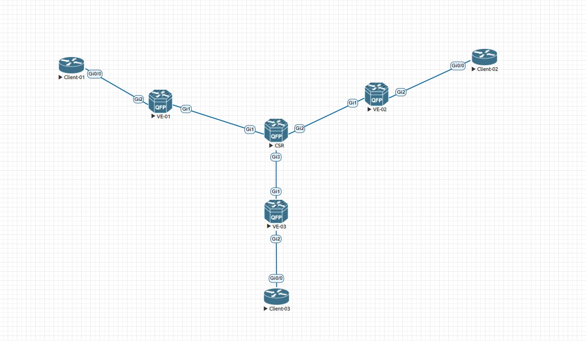

# VPLS. L2VPN на Cisco CSR

### Основные термины:

* VPLS домен - изолированная виртуальная L2-сеть или отдельный  L2VPN (два разных заказчика будут жить в пределах разных VPLS доменов)
* Virtual Switching Instance (VSI) или VFI (Virtual Forwarding Instance) - Это виртуальный коммутатор в пределах одного устройства (аналог MAC-VRF в VxLAN EVPN)
* VPLS Edge (VE) - участник VPLS домена или PE в терминологии MPLS

_В VPLS домене работают те же правила, что и в классическом L2 коммутаторе, а именно:_

* MAC learning
* Split Horizon

### VPLS Kompella или VPLS Auto-Discovery with BGP-Signalling

_В этой лабораторной работе не будут рассмотрен VPLS Martini (LDP Signalling)_

_Для VPLS в секции BGP используется Address Family L2VPN AFI (25) и VPLS SAFI (65)_

_Для динамического обнаружения соседей используются BGP Communities (на основе route-target). Loop prevention в VPLS работает по следующему принципу: если пакет получен через VSI/VFI интерфейс, то он не будет отправлен обратно в VPLS домен, даже в сторону других VE_

_В лабораторной работе буду использовать следующую топологию_



_На этой схеме есть центральный CSR, который выполняет роль Route-Reflector. Как таковых P-router на этой схеме нет, то есть на всех устройствах в сети есть BGP сессии в Address Family L2VPN VPLS. VE-01, VE-02 и VE-03, соответственно, терминируют на себе L2VPN и подключают конечных клиентов. В роли Client-01, Client-02 и Client-03 выступают Cisco vIOS routers._

_В рамках лабораторной работы я не буду усложнять ее подклчением клиентов по 8021q или подключением дополнительных клиентов и разделением их по Bridge Domain, однако, приведу такой конфиг в качестве альтернативы после разбора основного кейса_

### Настройка базовой IP связности между всеми участниками VPLS домена и OSPF

_Как выглядит настройка IGP и интерфейсов на RR CSR?_

```
interface Loopback0
 ip address 10.0.0.1 255.255.255.255
 ip ospf 1 area 0.0.0.0
!
interface GigabitEthernet1
 ip address 169.254.0.0 255.255.255.254
 ip ospf network point-to-point
 ip ospf 1 area 0.0.0.0
 negotiation auto
 mpls ip
!
interface GigabitEthernet2
 ip address 169.254.0.2 255.255.255.254
 ip ospf network point-to-point
 ip ospf 1 area 0.0.0.0
 negotiation auto
 mpls ip
!
interface GigabitEthernet3
 ip address 169.254.0.4 255.255.255.254
 ip ospf network point-to-point
 ip ospf 1 area 0.0.0.0
 negotiation auto
 mpls ip
!
router ospf 1
 router-id 10.0.0.1
 mpls ldp sync
```

_На каждом P2P линке я использую /31 адресацию, все интерфейсы кладу в area 0.0.0.0 OSPF процесса. В данной лабе все устройства будут в одной AS, для связности между loopback интерфейсами используется IGP OSPFv2_

_Помимо задания IP адресов на интерфейсах я настраиваю следующие пункты:_

* ip ospf network point-to-point - для того, чтобы явно указать свитчу, что это P2P линк и здесь не нужно производить выборы DR/BDR в OSPF процессе
* ip ospf 1 area 0.0.0.0 - указываю, что данный интерфейс находится в backbone area
* mpls ip - на Cisco нужно явно включить передачу LDP сообщений на интерфейсах

_В настройках OSPF я задаю Router-id и включаю одну очень важную функцию:_

* mpls ldp sync - данный функционал делает следующее: если на интерфейсе, включенном в OSPF процесс не запущен протокол LDP, то на маршрутах через этот интерфейс автоматически проставляется максимальная метрика стоимости пути (Cost). То есть такой маршрут не должен считаться лучшим с точки зрения IGP

_После того, как аналогичные настройки произвести на трех VE коммутаторах, можно проверить, что OSPF соседство установилось и все участники обменялись адресами loopback, а также, распределили метки для всех FEC_

```
RR#show ip ospf neighbor

Neighbor ID     Pri   State           Dead Time   Address         Interface
10.0.0.4          0   FULL/  -        00:00:38    169.254.0.5     GigabitEthernet3
10.0.0.3          0   FULL/  -        00:00:32    169.254.0.3     GigabitEthernet2
10.0.0.2          0   FULL/  -        00:00:37    169.254.0.1     GigabitEthernet1
```

```
RR#show ip route ospf 1
Codes: L - local, C - connected, S - static, R - RIP, M - mobile, B - BGP
       D - EIGRP, EX - EIGRP external, O - OSPF, IA - OSPF inter area
       N1 - OSPF NSSA external type 1, N2 - OSPF NSSA external type 2
       E1 - OSPF external type 1, E2 - OSPF external type 2
       i - IS-IS, su - IS-IS summary, L1 - IS-IS level-1, L2 - IS-IS level-2
       ia - IS-IS inter area, * - candidate default, U - per-user static route
       o - ODR, P - periodic downloaded static route, H - NHRP, l - LISP
       a - application route
       + - replicated route, % - next hop override, p - overrides from PfR

Gateway of last resort is not set

      10.0.0.0/32 is subnetted, 4 subnets
O        10.0.0.2 [110/2] via 169.254.0.1, 2d17h, GigabitEthernet1
O        10.0.0.3 [110/2] via 169.254.0.3, 2d17h, GigabitEthernet2
O        10.0.0.4 [110/2] via 169.254.0.5, 2d17h, GigabitEthernet3
```

```
RR#show mpls ldp neighbor
    Peer LDP Ident: 10.0.0.2:0; Local LDP Ident 10.0.0.1:0
        TCP connection: 10.0.0.2.18809 - 10.0.0.1.646
        State: Oper; Msgs sent/rcvd: 4508/4512; Downstream
        Up time: 2d17h
        LDP discovery sources:
          GigabitEthernet1, Src IP addr: 169.254.0.1
        Addresses bound to peer LDP Ident:
          169.254.0.1     10.0.0.2
    Peer LDP Ident: 10.0.0.3:0; Local LDP Ident 10.0.0.1:0
        TCP connection: 10.0.0.3.16931 - 10.0.0.1.646
        State: Oper; Msgs sent/rcvd: 4506/4501; Downstream
        Up time: 2d17h
        LDP discovery sources:
          GigabitEthernet2, Src IP addr: 169.254.0.3
        Addresses bound to peer LDP Ident:
          169.254.0.3     10.0.0.3
    Peer LDP Ident: 10.0.0.4:0; Local LDP Ident 10.0.0.1:0
        TCP connection: 10.0.0.4.45650 - 10.0.0.1.646
        State: Oper; Msgs sent/rcvd: 4504/4506; Downstream
        Up time: 2d17h
        LDP discovery sources:
          GigabitEthernet3, Src IP addr: 169.254.0.5
        Addresses bound to peer LDP Ident:
          169.254.0.5     10.0.0.4
```

_А вот какие метки отправялет и получает один из VE для известных ему FEC_

```
VE-01#show mpls ldp bindings
  lib entry: 10.0.0.1/32, rev 6
        local binding:  label: 16
        remote binding: lsr: 10.0.0.1:0, label: imp-null
  lib entry: 10.0.0.2/32, rev 2
        local binding:  label: imp-null
        remote binding: lsr: 10.0.0.1:0, label: 16
  lib entry: 10.0.0.3/32, rev 14
        local binding:  label: 20
        remote binding: lsr: 10.0.0.1:0, label: 18
  lib entry: 10.0.0.4/32, rev 12
        local binding:  label: 19
        remote binding: lsr: 10.0.0.1:0, label: 17
  lib entry: 169.254.0.0/31, rev 4
        local binding:  label: imp-null
        remote binding: lsr: 10.0.0.1:0, label: imp-null
  lib entry: 169.254.0.2/31, rev 10
        local binding:  label: 18
        remote binding: lsr: 10.0.0.1:0, label: imp-null
  lib entry: 169.254.0.4/31, rev 8
        local binding:  label: 17
        remote binding: lsr: 10.0.0.1:0, label: imp-null
```

```
VE-01#show mpls forwarding-table
Local      Outgoing   Prefix           Bytes Label   Outgoing   Next Hop
Label      Label      or Tunnel Id     Switched      interface
16         Pop Label  10.0.0.1/32      0             Gi1        169.254.0.0
17         Pop Label  169.254.0.4/31   0             Gi1        169.254.0.0
18         Pop Label  169.254.0.2/31   0             Gi1        169.254.0.0
19         17         10.0.0.4/32      0             Gi1        169.254.0.0
20         18         10.0.0.3/32      0             Gi1        169.254.0.0
```

_То есть на данный момент мы имеем следующее:_

* все участники VPLS домена подружились по IGP и имеют связность между loopback интерфейсами
* все участники VPLS домена узнали FEC своих соседей и обменялись метками

_Самое время перейти к BGP_

### Настройка BGP в Address Family L2VPN VPLS

```
router bgp 1
 template peer-session VPLS
  remote-as 1
  update-source Loopback0
  timers 5 15
 exit-peer-session
 !
 bgp router-id 10.0.0.1
 bgp log-neighbor-changes
 no bgp default ipv4-unicast
```

_Выше на RR я создал процесс BGP, затем создал шаблон для VE, в котором задал AS 1, src lo0 и таймеры. Затем я указал его собственный Routed-id, а также запретил автоматически поднимать ipv4 сессии_

_Далее нужно применить этот шаблон на VE_

```
 neighbor 10.0.0.2 inherit peer-session VPLS
 neighbor 10.0.0.3 inherit peer-session VPLS
 neighbor 10.0.0.4 inherit peer-session VPLS
 !
 address-family l2vpn vpls
  neighbor 10.0.0.2 activate
  neighbor 10.0.0.2 send-community both
  neighbor 10.0.0.2 route-reflector-client
  neighbor 10.0.0.2 suppress-signaling-protocol ldp
  neighbor 10.0.0.3 activate
  neighbor 10.0.0.3 send-community both
  neighbor 10.0.0.3 route-reflector-client
  neighbor 10.0.0.3 suppress-signaling-protocol ldp
  neighbor 10.0.0.4 activate
  neighbor 10.0.0.4 send-community both
  neighbor 10.0.0.4 route-reflector-client
  neighbor 10.0.0.4 suppress-signaling-protocol ldp
 exit-address-family
```

_Выше я поднял соседства в AFI 25 SAFI 65, где также указал следующие пункты:_

* send-community both - по умолчанию community не отправляются. Нужно указывать явно
* route-reflector-client - отметил данного пира как клиента RR
* suppress-signaling-protocol ldp - указываю, что необходимо подавлять LDP в качестве протолока сигнализации меток

_На VE все настройки идентичны за исключением того, что они ничего не знают про RR и что они являются какими-то клиентами_

_После этого можно проверить состояние сессий в нужном Address Family_

```
RR#show bgp l2vpn vpls all summary
BGP router identifier 10.0.0.1, local AS number 1
BGP table version is 16, main routing table version 16
3 network entries using 792 bytes of memory
3 path entries using 432 bytes of memory
1/1 BGP path/bestpath attribute entries using 280 bytes of memory
1 BGP extended community entries using 40 bytes of memory
0 BGP route-map cache entries using 0 bytes of memory
0 BGP filter-list cache entries using 0 bytes of memory
BGP using 1544 total bytes of memory
BGP activity 7/4 prefixes, 9/6 paths, scan interval 60 secs

Neighbor        V           AS MsgRcvd MsgSent   TblVer  InQ OutQ Up/Down  State/PfxRcd
10.0.0.2        4            1   46127   46132       16    0    0 2d17h           0
10.0.0.3        4            1   46122   46128       16    0    0 2d17h           0
10.0.0.4        4            1   46121   46125       16    0    0 2d17h           0
```

### Настройка VE для L2VPN

_Теперь нужно выполнить заключительные настройки:_

* настроить порты в сторону клиентов
* создать и настроить VFI/VSI
* создать Bridge Domain и указать в нем два предыдущих пункта

```
interface GigabitEthernet2
 no ip address
 negotiation auto
 service instance 10 ethernet
  encapsulation default
```

_Для того, чтобы связать данный интерфейс с VPLS в дальнейшем, необходимо:_

* no ip address - на этом интерфейсе не должно быть IP адреса
* service instance 10 ethernet - указываю тип трафика и номер инстанса
* encapsulation default - указываю стандартную инкапсуляцию, то есть 0x0800

_Если в примере выше мне необходимо принимать 8021q трафик, то нужно создать соответствующий 8021q интерфейс и указать следующее (пример для vlan 100): encapsulation dot1q 100_

```
l2vpn vfi context VPLS
 vpn id 1234
 autodiscovery bgp signaling bgp
  ve id 50
  ve range 99
  rd 10.0.0.2:111
  route-target export 5678:4321
  route-target import 5678:4321
  no auto-route-target
```

* vpn id 100 - должен быть одинаковым для всех VE, которые хотят форвардить трафик этого конкретного "клиента"
* autodiscovery bgp signaling bgp - тут все и так понятно
* ve id 1 - уникальный id этого VE, нужно указывать вручную для каждого VE
* ve range 11 - диапазон id, из которого VE назначают друг другу метки в соответствующем VFI/VSI (это значение должно быть не меньше предполагаемого числа VE в этом VFI/VSI)
* rd 10.0.0.2:100 - route-distinguisher для VE, с которым будет отправляться NLRI
* route-target export/import - VFI/VSI является аналогом VRF, только для L2 сегмента (или правильнее, логического свитча). Поэтому задаем политики маркировки маршрутов

```
bridge-domain 1
 member GigabitEthernet2 service-instance 10
 member vfi VPLS
```

_Выше создаю Bridge домен, в котором достаточно связать между собой клиентский интерфейс и VFI/VSI_

_После этого подключаю клиентов, задаю им IP адреса в одном широковещательном домене и могу проверить связность по ICMP_

### Итоговая проверка

```
Router#show ip int bri
Interface                  IP-Address      OK? Method Status                Protocol
GigabitEthernet0/0         192.168.0.1     YES manual up                    up
GigabitEthernet0/1         unassigned      YES unset  administratively down down
GigabitEthernet0/2         unassigned      YES unset  administratively down down
GigabitEthernet0/3         unassigned      YES unset  administratively down down
Router#ping 192.168.0.2
Type escape sequence to abort.
Sending 5, 100-byte ICMP Echos to 192.168.0.2, timeout is 2 seconds:
!!!!!
Success rate is 100 percent (5/5), round-trip min/avg/max = 3/5/11 ms
Router#ping 192.168.0.3
Type escape sequence to abort.
Sending 5, 100-byte ICMP Echos to 192.168.0.3, timeout is 2 seconds:
!!!!!
Success rate is 100 percent (5/5), round-trip min/avg/max = 4/6/16 ms
```

_На RR в это время появились маршруты в AFI 25 SAFI 65_

```
RR#show bgp l2vpn vpls all summary
BGP router identifier 10.0.0.1, local AS number 1
BGP table version is 16, main routing table version 16
3 network entries using 792 bytes of memory
3 path entries using 432 bytes of memory
1/1 BGP path/bestpath attribute entries using 280 bytes of memory
1 BGP extended community entries using 40 bytes of memory
0 BGP route-map cache entries using 0 bytes of memory
0 BGP filter-list cache entries using 0 bytes of memory
BGP using 1544 total bytes of memory
BGP activity 7/4 prefixes, 9/6 paths, scan interval 60 secs

Neighbor        V           AS MsgRcvd MsgSent   TblVer  InQ OutQ Up/Down  State/PfxRcd
10.0.0.2        4            1   46422   46427       16    0    0 2d18h           1
10.0.0.3        4            1   46418   46423       16    0    0 2d18h           1
10.0.0.4        4            1   46416   46420       16    0    0 2d18h           1
```

```
RR#show bgp l2vpn vpls all
BGP table version is 22, local router ID is 10.0.0.1
Status codes: s suppressed, d damped, h history, * valid, > best, i - internal,
              r RIB-failure, S Stale, m multipath, b backup-path, f RT-Filter,
              x best-external, a additional-path, c RIB-compressed,
              t secondary path, L long-lived-stale,
Origin codes: i - IGP, e - EGP, ? - incomplete
RPKI validation codes: V valid, I invalid, N Not found

     Network          Next Hop            Metric LocPrf Weight Path
Route Distinguisher: 10.0.0.2:111
 *>i  10.0.0.2:111:VEID-50:Blk-1/136
                      10.0.0.2                 0    100      0 ?
Route Distinguisher: 10.0.0.3:222
 *>i  10.0.0.3:222:VEID-51:Blk-1/136
                      10.0.0.3                 0    100      0 ?
Route Distinguisher: 10.0.0.4:333
 *>i  10.0.0.4:333:VEID-52:Blk-1/136
                      10.0.0.4                 0    100      0 ?

```

### Как это вообще работает?

_Как я уже писал выше, при L2VPN VPLS работают такие принципы, как Split Horizon и MAC learning. Когда client-01 с IP адресом 192.168.0.1/24 хочет запинговать client-03 с IP адресом 192.168.0.3/24, происходит следующее:_

* он отправляет ARP запрос в поисках МАС адреса 192.168.0.3
* этот запрос приходит на VE-01, который также не видит у себя этот МАС в качестве изученного
* VE-01 видит, что в l2vpn vfi VPLS с vpn id 1234 есть два псевдо-интерфейса

```
VE-01#show l2vpn vfi
Legend: RT=Route-target, S=Split-horizon, Y=Yes, N=No

VFI name: VPLS, state: up, type: multipoint, signaling: BGP
  VPN ID: 1234, VE-ID: 50, VE-SIZE: 99
  RD: 10.0.0.2:111, RT: 5678:4321,
  Bridge-Domain 1 attachment circuits:
  Pseudo-port interface: pseudowire100004
  Interface          Peer Address    VE-ID  Local Label  Remote Label    S
  pseudowire100006   10.0.0.4        52     83           81              Y
  pseudowire100005   10.0.0.3        51     82           81              Y
```

* VE-01 рассылает этот широковещательный кадр в оба этих псевдо-интерфейса
* от одного их них приходит ARP reply с искомым МАС адресом внутри
* VE-01 записывает этот МАС адрес в таблицу bridge domain 1 и ассоциирует его с нужным псевдо-интерфейсом

```
VE-01#show bridge-domain 1
Bridge-domain 1 (3 ports in all)
State: UP                    Mac learning: Enabled
Aging-Timer: 300 second(s)
    GigabitEthernet2 service instance 10
    vfi VPLS neighbor 10.0.0.3 1234
    vfi VPLS neighbor 10.0.0.4 1234
   AED MAC address    Policy  Tag       Age  Pseudoport
   0   5010.0005.0000 forward dynamic   298  GigabitEthernet2.EFP10
   0   5010.0007.0000 forward dynamic   33   VPLS.404016
```

* VE-01 теперь знает, в какой pseudowire нужно отправлять ICMP пакет

```
VE-01#show l2vpn internal pwtree

Handle           Interface         IP Address           VC ID Unit Number        Active Unit Number
====================================================================================================
4002             pseudowire100004  0.0.0.0                  0     100004          0
4003             pseudowire100005  0.0.0.51              1234     100005     100005
4004             pseudowire100006  0.0.0.52              1234     100006     100006
```

* теперь ему нужно подставить нужную сервисную метку, заглядывает сюда и видит метку 81

```
VE-01#show l2vpn service interface pseudowire 100004 detail
Legend: St=State    XC St=State in the L2VPN Service      Prio=Priority
        UP=Up       DN=Down            AD=Admin Down      IA=Inactive
        SB=Standby  HS=Hot Standby     RV=Recovering      NH=No Hardware
        m=manually selected

  Interface          Group       Encapsulation                   Prio  St  XC St
  ---------          -----       -------------                   ----  --  -----
VPLS name: VPLS, State: UP
  pw100004                       VPLS(VFI)                       0     UP  UP
  pw100006           core_pw     52:1234(MPLS)                   0     UP  UP
                                 Local VC label 83
                                 Remote VC label 81
                                 Next Hop PE 10.0.0.4

  pw100005           core_pw     51:1234(MPLS)                   0     UP  UP
                                 Local VC label 82
                                 Remote VC label 81
                                 Next Hop PE 10.0.0.3
```


* теперь смотрит, какую транспортную метку нужно подставить для отправки в сторону 10.0.0.4

```
VE-01#show mpls forwarding-table 10.0.0.4
Local      Outgoing   Prefix           Bytes Label   Outgoing   Next Hop
Label      Label      or Tunnel Id     Switched      interface
19         17         10.0.0.4/32      0             Gi1        169.254.0.0
```

* видит там метку 17, а заодно и исходящий физический интерфейс Gi1

_Сам пакет в дампе выглядит следующим образом_


_Вот так просто и незатейливо работает VPLS._ [Конфиги](https://github.com/dontmesswithnets/study_otus/tree/main/vpls-l2vpn.lab/configs) CSR